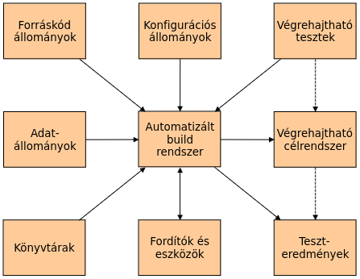
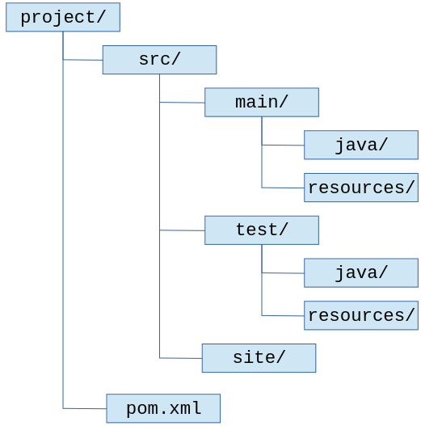
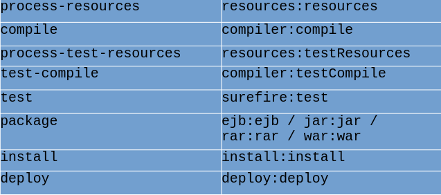
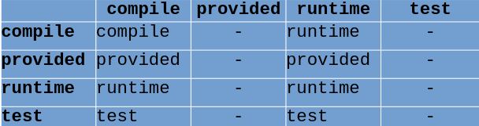
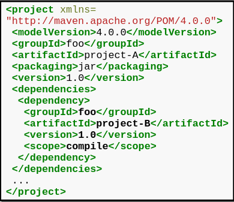
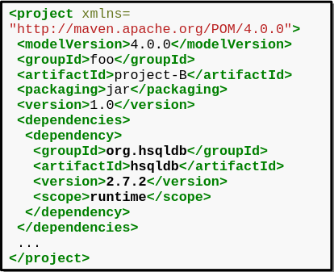
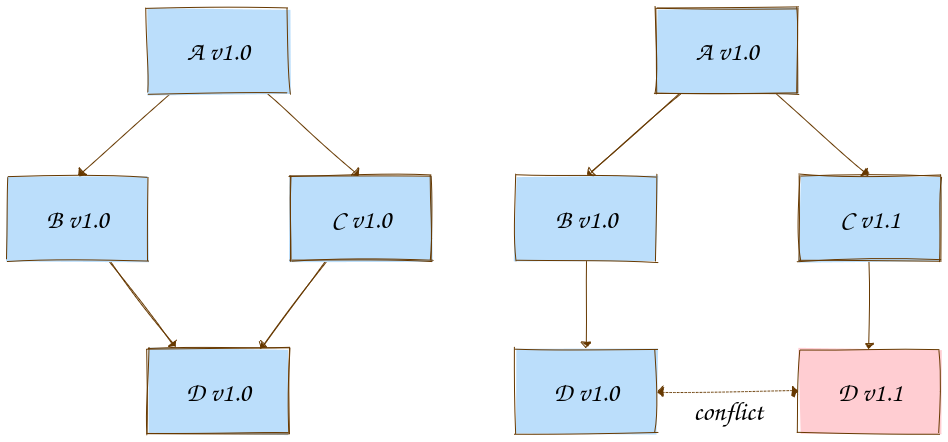

# ZH I.
1. [Szoftverfejlesztés](#szoftverfejlesztés)
2. [Java technológiai áttekintés](#java-technológiai-áttekintés)
3. [Rendszerépítés](#rendszerépítés)
4. [Apache Maven](#apache-maven)
5. [Szoftver sebezhetőségek](#szoftver-sebezhetőségek)
6. [Szoftver verziózás](#szoftver-verziózás)
7. [Annotációk a java programozási nyelvben](#annotációk-a-java-programozási-nyelvben)
8. [A java SE/JDK új lehetőségei](#a-java-sejdk-új-lehetőségei)
9. [A java haladó szintű lehetőségei](#a-java-haladó-szintű-lehetőségei)
10. [Git](#git)


<div style='page-break-after: always;'></div>
<u>

 ## Szoftverfejlesztés

 </u> 

### Programkönyvtár:
Egy programkönyvtár szoftverek és kapcsolódó dokumentáció olyan együttese, melyet abból a célból terveztek, hogy a szoftverfejlesztést, használatot és karbantartást segítse.
Egy könyvtár erőforrásokat tartalmaz, mint adatok és kód, és egy jól meghatározott interfésze (API-ja) van.

### API:
Egy alkalmazásprogramozási interfész (API) egy könyvtár vagy egy keretrendszer által a felhasználók számára alkalmazások írásához exportált és elérhetőszignatúrákat jelenti.
A szignatúrák mellett egy API mindig közléssel kell, hogy szolgáljon a programok hatásáról és/vagy viselkedéséről. Szoftverkomponens, mely lehetővé teszi, hogy szoftveralkalmazások egymással kommunikáljanak.

### Keretrendszer:
Egy keretrendszer egy részlegesen befejezett szoftverrendszer, mely bizonyos kiterjesztések (például plugin-ek) megfelelően történő példányosításával terjeszthető ki.

Egy keretrendszer szoftvertermékek (például osztályok, és komponensek) olyan integrált együttese, melyek abból a célból működnek együtt, hogy egy újrafelhasználható architektúrát biztosítsanak hasonló alkalmazások egy családjához.

Egy keretrendszer egy félkész alkalmazás. A fejlesztők a keretrendszer újrafelhasználható komponenseinek kiterjesztésével és testreszabásával alkotnak teljes alkalmazásokat. A keretrendszerek egy csontváz architektúrát biztosítanak az alkalmazásokhoz. A keretrendszerek jellemzően mintákon alapulnak, mint az architekturális minták és tervezési minták.

Inkább a keretrendszer objektumok felelnek a rendszerben a vezérlésért, nem pedig az alkalmazás-specifikus objektumok.

Hátrányuk, hogy természetüktől fogva bonyolultak és hónapokba telhet a megtanulásuk.
Egy keretrendszer magában foglalhat máskeretrendszereket, ahol minden egyes keretrendszert abból a célból terveztek, hogy az alkalmazás egy részének fejlesztését támogassa.
Egy keretrendszer használható egy teljes alkalmazás létrehozásához vagy annak csupán egy részének, például a grafikus felhasználói felületnek a megvalósításához.

### Platform
Olyan számítógép vagy hardvereszköz és/vagy a hozzá tartozó operációs rendszer, vagy egy virtuális környezet, ahol szoftverek telepíthetők és futtathatók.
A platform kifejezés tehát azt a hardver vagy szoftver környezetet jelenti, melyben egy program fut.

### SDK
Egy szoftverfejlesztő készlet (software development kit, SDK) eszközök egy olyan gyűjteménye, mely alkalmazások egy adott platformra történő fejlesztéséhez szükséges.
Különféle eszközöket és erőforrásokat tartalmaz, mint például fordítók, könyvtárak és/vagy keretrendszerek, dokumentáció és mintakódok.

### IDE
Egy integrált fejlesztői környezet (integrated development environment, IDE) egy egységes keretrendszerben és felhasználói felületen keresztül biztosít szoftvereszközöket a szoftverfejlesztés különböző vonatkozásaihoz.
Az IDE-k általában egy bizonyos programozási nyelven történő fejlesztést támogatnak, mint például Java.
Kódszerkesztők (source-code editors) és IDE-k:
- Például a Notepad++, a Sublime Text és a Visual Studio Code csupán kódszerkesztők.
- Például az Apache NetBeans, az Eclipse IDE-k, az IntelliJ IDEA és a Visual Studio pedig IDE-k.

<div style='page-break-after: always;'></div>
<u>

## Java technológiai áttekintés

</u>

### JVM
Egy saját utasításkészlettel rendelkező és vezérelhető absztrakt számítógép, mely semmit sem tud a Java programozási nyelvről, hanem csak egy speciális bináris formátumot ismer, a class állományformátumot.
Egy class állomány a virtuális gépnek szóló utasításokat (bájtkódokat), egy szimbólumtáblát valamint további járulékos információkat tartalmaz.
A Java virtuális gép a Java platform sarokköve. A technológia ezen komponense felelős a hardver és operációs rendszer függetlenségéért, a lefordított kód kis méretéért és a felhasználók rosszindulatú programoktól való megvédésének képességéért.

**Szabad és nyílt forrású implementációk:**

- HotSpot
- Eclipse OpenJ9
  
**Nem szabad implementációk:**

- Azul Platform Prime
- PTC Perc


### Java platformok
A platform kifejezés azt a hardver vagy szoftver környezetet jelenti, melyben egy program fut.
Például: beágyazott rendszer, operációs rendszer, webböngésző, …
A Java platform egy olyan szoftver platform, mely más hardver platformokon fut, és melynek az alábbi két fő komponense van:

- Java virtuális gép (JVM)
- Java alkalmazásprogramozási interfész (API)

#### Java SE
Java platform asztali és szerver számítógépekre történő alkalmazásfejlesztéshez.
A legutóbbi LTS verzió a Java SE 21, mely 2023. szeptember 19-én jelent meg.
A következő verzió a Java SE 22, melyet a JDK 22 implementál.

**Java SE implementációk két fajtája:**

- Java futtató környezet (Java Runtime Environment) - (JRE)
- Java fejlesztői készlet (Java Development Kit) - (JDK)

A JDK 11-től kezdve nincs önálló JRE!

#### Java EE
API-t és futtató környezetet biztosít többrétegű, skálázható, megbízható és biztonságos szerver oldali alkalmazások fejlesztéséhez és futtatásához.
A Java SE platformra épül
Az utolsó verzió a Java EE 8, mely 2017. szeptember 21-én jelent meg.

#### Jakarta EE
2018 február 26-án bejelentésre került, hogy a korábban Java EE-ként ismert technológia Jakarta EE-re lett átnevezve.
Az aktuális verzió a 2022. szeptember 13-án kiadott Jakarta EE 10.
Nem kompatibilis visszafelé a Jakarta EE 8 és Java EE 8 platformokkal.

### JRE
A Java programozási nyelven írt programok végrehajtásához szükséges állományokat tartalmazza: egy virtuális gépet, osztálykönyvtárakat és további kapcsolódó állományokat.

**Implementációk:**

- OpenJDK

### JDK
Fejlesztői környezet alkalmazások és komponensek a Java programozási nyelven történő készítéséhez.
Tartalmaz egy teljes Java futtató környezetet (JRE), valamint eszközöket Java nyelven írt alkalmazások fejlesztéséhez, teszteléséhez és monitorozásához.

**Nem szabad implementációk:**

- Oracle JDK
- Azul Platform Core

**Szabad és nyílt forrású implementációk:**

- Oracle OpenJDK
- Microsoft Build of OpenJDK

### OpenJDK és Oracle JDK, kapcsolatuk
#### OpenJDK
„Az OpenJDK közösség fejlesztők egy olyan társulása, akik a JCP által definiált Java SE jelenlegi és jövőbeli verzióinak nyílt forrású implementációin és ezekhez szorosan kapcsolódó projekteken működnek együtt.”

Projektek:

- Project Valhalla
- OpenJFX
  
2006 májusában a JavaOne konferencián jelenti be a Sun Microsystems, hogy szabad és nyílt forrású szoftverként teszi elérhetővé a Java technológiát.
Ennek első lépéseként 2006. november 13-án a cég a GPLv2 licenc hatálya alatt teszi közzé a Java HotSpot virtuális gép és a Java fordító (javac) forráskódját.
Végül 2007. május 8-án adja ki a cég a GPLv2 hatálya alatt a JDK közel teljes forráskódját.
A 7-es számúval kezdve valamennyi Java SE verzió hivatalos referencia implementációja és az Oracle JDK-ja is az OpenJDK-n alapul:

- Java SE 7 Reference Implementations
- Java SE 21 Reference Implementations
  
### OracleJDK és OpenJDK kapcsolata
A JDK 11-től:
Az Oracle JDK és az OpenJDK funkcionálisan azonos és egymással felcserélhető.
Néhány különbség van, ezek egy része csupán felületi (eltérő például a java -version parancs kimenete).
Eltérő a csomagolás módja.
A felhasználási feltételek azonban lényegesen eltérőek!

### Java SE aktuális kiadása
A Java SE és a JDK nagy, szabálytalan és eléggé kiszámíthatatlan lépésekben fejlődött.
Egy fő kiadás tipikusan egy vagy néhány jelentős újdonságot tartalmaz.
A jelentős újdonságok kifejlesztése időigényes, miattuk a kisebb újdonságok megjelenése is tolódik.
Hogy a Java versenyképes maradhasson a gyorsabb tempóban fejlődő platformokkal, nem elég fejlődnie, azt szaporábban is kell tennie.
A fejlesztők a gyors ütemű innovációt szeretik, a vállalatok inkább a stabilitást, azonban mindenki szereti a rendszeres és kiszámítható kiadásokat.

Kompromisszumos megoldásként egy olyan fejlesztési modellt javasoltak, melyben kétévente követik egymást a fő kiadások.
Ez a modell nem működött a gyakorlatban, és visszatekintve lassú is.

A javasolt kiadási modellt más platformok és különféle operációs rendszer disztribúciók kiadási modellje ihlette:

**Fő kiadások félévente:**

- A fő kiadások bármilyen újdonságot tartalmazhatnak, az új és továbbfejlesztett API-kon túl akár nyelvi és a Java virtuális géppel kapcsolatos újításokat is.
- A fő kiadások minden év márciusában és szeptemberében jelennek meg.
- Az első 2018 márciusában érkezik.
  
**Frissítések negyedévente:**

- A frissítések kizárólag biztonsági problémák és hibák javításait fogják tartalmazni.
- Minden fő kiadáshoz két frissítés kerül kiadásra a következő fő kiadás előtt.
- Minden év januárjában, áprilisában, júliusában és októberében jelennek meg.

**Hosszú távon támogatott (long term support, LTS) kiadások háromévente:**

- Ezekhez legalább 3 évig lesznek frissítések.
- Az első LTS kiadás (Java SE 11) 2018 szeptemberében jelent meg.
- A három éves ciklust később egy két éves ciklusra cserélték.

Így a változás üteme összességében nagyjából olyan lesz, mint eddig.
A fő kiadások azonban az eddigiekhez képest kevesebb újdonsággal szolgálnak majd, így könnyebb lesz ezekhez alkalmazkodni.
A gyors innovációt kedvelő fejlesztők így a lehető leghamarabb élvezhetik az újdonságokat.
A stabilitást kedvelő vállalatok a hosszú távon támogatott kiadásokat használhatják.
Egy új fő kiadás megjelenésétől elavultnak tekintendő az előző nem LTS kiadás.
Az elavult nem LTS kiadások nem támogatottak többé, tehát nem kapnak további frissítéseket sem.
Az Oracle JDK LTS kiadásaihoz az Oracle legalább 8 évig biztosít frissítéseket.
Ezen frissítések üzleti célú felhasználásához üzleti licenc lehet szükséges!
2021-ben az Oracle megváltoztatta a JDK LTS kiadások ütemét, három év helyett két évente érkeznek.

<div style='page-break-after: always;'></div>

<u>

## Rendszerépítés

</u>

### Mi a rendszerépítés?
A rendszerépítés az a folyamat, melynek során egy teljes végrehajtható rendszer kerül létrehozásra a rendszerkomponensek, külső könyvtárak, konfigurációs állományok és további információk lefordításával és összeszerkesztésével.

### Build automatizálás, automatikus build eszközök, build eszközök funkciói
#### Build automatizálás
A rendszerépítés nagy mennyiségű, a szoftverrel és a működési környezetével kapcsolatos információ összegyűjtésével jár. Emiatt érdemes egy automatikus build eszközt használni a rendszerépítéshez
Ideális esetben egyetlen paranccsal összeállítható egy teljes rendszer.

#### Automatikus build eszközök


#### Build eszközök funkciói
**Build szkript generálás:** A rendszernek elemeznie kell az összeállítandó programot és automatikusan generálnia kell egy build szkriptet (konfigurációs állományt). A rendszernek támogatni kell a build szkriptek kézi létrehozását és szerkesztését.
**Verziókezelő rendszer integráció:** A rendszernek le kell tudni szedni a verziókezelő rendszerből a komponensek szükséges verzióit.
**Minimális újrafordítás:** A rendszernek meg kell határoznia, hogy mely forráskódokat kell újrafordítani és szükség esetén el is kell végeznie a fordítást.
**Végrehajtható rendszer létrehozása:** A rendszernek össze kell szerkesztenie a lefordított tárgykódú állományokat egymással és más szükséges állományokkal, mint például könyvtárakkal és konfigurációs állományokkal egy végrehajtható rendszer létrehozásához.
**Teszt automatizálás:** Bizonyos rendszerek automatikusan tudnak futtatni automatikus teszteket teszt automatizálási eszközökkel, mint például a JUnit. Ezek azt ellenőrzik, hogy a változások miatt nem omlik-e össze a build.
**Jelentéskészítés:** A rendszernek jelentéseket kell adnia az összeállítás sikeréről vagy sikertelenségéről és a lefuttatott tesztekről is.
**Dokumentáció generálás:** A rendszer képes lehet különféle dokumentációk előállítására, mint például kézikönyv oldalak vagy API dokumentáció.
**Függőségkezelés:** A rendszer képes lehet a komponensek (például könyvtárak) szükséges verzióit tárolókból letölteni.

### DevOps fogalma
Alapelvek és gyakorlatok, melyek jobb kommunikációt és együttműködést tesznek lehetővé az érdekelt felek között szoftver és rendszer termékek és szolgáltatások specifikálása, fejlesztése és működtetése céljából

A kifejezés a fejlesztés (Dev) és az üzemeltetés (Ops) kifejezések kombinációja.
A DevOps a fejlesztők és az üzemeltetők összehozásáról szól a csapatokban, hogy szorosan együttműködjenek
A DevOps kifejezés gyakran összekapcsolódik a folyamatos integrációval (CI), a folyamatos szállítással (CD) és az infrastruktúra mint kód (Infrastructure as Code, IAC) gyakorlatával.
A DevOps az agilis szoftverfejlesztési gyakorlatok kiterjesztése.

<div style='page-break-after: always;'></div>
<u>

## Apache Maven

</u>

### Mi az Apache Maven?
**Egy projektkezelő eszköz (software project management and comprehension tool) a következő célkitűzésekkel:**

- Az összeállítási folyamat megkönnyítése
- Egységes rendszer biztosítása az összeállításhoz
- Minőségi projekt információk szolgáltatása
- Irányelvek és legjobb gyakorlatok szolgáltatása a fejlesztéshez


### A szabványos könyvtárszerkezet


### Parancssori használat
A használat módjáról és a megadható parancssori opciókról az ```mvn --help``` vagy ```mvn -h``` parancsok végrehajtásával kaphatunk leírást.


Parancssori argumentumként megadható **életciklus fázis** (pl:```mvn package```) és **előtag:cél** formában bővítmény-cél (pl:```mvn site:run```).
Tetszőleges sok ilyen argumentum adható.
A végrehajtáshoz paramétereket rendszertulajdonságokkal adhatunk meg ```-Dnév=érték``` formában.

Bővítmény-cél megadható **groupId:artifactId:verzió:cél** formában is.
Akkor lehet szükséges így hivatkozni egy bővítmény-célt, ha a bővítmény adott számú verzióját kell használni, vagy a Maven nem tudja, hogy az előtag melyik bővítményhez tartozik.
pl:```mvn org.codehaus.mojo:versions-maven-plugin:2.16.2:help```

### Alafogalmak:
#### Termék
Egy projekt által előállított állomány, mely annak végső termékének tekinthető.
Egy projektben általában egy termék készül (például egy jar csomagolású projektben egyetlen JAR állomány).
A classifier POM elem szolgál az egy projekt által létrehozott termékek megkülönböztetésére.
Tárolókban kerülnek közzétételre, mely lehetővé teszi a más projektekhez függőségként történő felhasználásukat.

#### Project Object Model (POM)
Egy projekt deklaratív leírását tartalmazó XML dokumentum (pom.xml).
Metaadatokat és konfigurációs beállításokat tartalmaz
Egy életciklus fázis vagy bővítmény-cél végrehajtásakor a Maven alapértelmezésben az aktuális könyvtárban keresi a POM-ot
A POM elérési útvonala ```-f``` vagy ```--file``` opcióval adható meg
A projektek között szülő-gyerek kapcsolatok definiálhatóak.
A gyerek projekt megörökli a szülőhöz tartozó POM beállításait, melyeket felülírhat.

#### Szuper POM
A szuper-POM a Maven által alapértelmezésben használt POM.
Ha egy projektnek nincs explicit módon megadott szülője, akkor az úgynevezett szuper-POM beállításait örökli.
A ```3.x.y``` verziók esetén az installáció ```lib/``` alkönyvtára alatt található ```maven-model-builder-3.x.y.jar``` állomány tartalmazza ```pom-4.0.0.xml```

#### Effektív POM
A projekthez tartozó ```POM,``` a felmenő ági projektekhez tartozó POM-ok és a szuper-POM kombinációja.
A futás során a projekthez ténylegesen felhasználásra kerülő beállításokat szolgáltatja.
Az ```mvn help:effective-pom``` parancs jeleníti meg.

#### Maven koordináták
Minden projektet a Maven koordinátái azonosítanak, mely a következő 3 komponensből áll:

- **groupId:csoportazonosító:** Fordított domain-nevek: (például ```org.apache.maven.plugins```, ```com.google.guava```)  Domain-nevek nélkül: (például ```commons-io```, ```junit```)

- **artifactId:** projektnév (például ```maven-site-plugin```, ```guava```)
- **version:** a projekt verziószáma (például ```1.0```, ```1.0-SNAPSHOT```)

A projekt POM-jában megadott **groupId**, **artifactId** és **version** elemek határozzák meg a kimenetként előállított állományok koordinátáit.
Explicit módon megadott szülő esetén a gyerek projekt a koordinátákat is örökli.
Ilyenkor tipikus a groupId és version átvétele, valamint az artifactId felülírása.
A Maven koordinátákat gyakran **groupId:artifactId:version** formában írják (példa: ```org.jsoup:jsoup:1.17.2```)
Lehetővé teszik a függőségként történő hivatkozást, mint például:

```xml
<dependency>
    <groupId>org.jsoup</groupId>
    <artifactId>jsoup</artifactId>
    <version>1.17.2</version>
    <scope>compile</scope>
</dependency>
```

#### Bővítmények
Szinte minden funkciót bővítmények nyújtanak.
A bővítmények egy-egy funkciót megvalósító úgynevezett célokat szolgáltatnak.
A bővítmények is termékek, melyekre a Maven koordinátákkal lehet hivatkozni.
Példa a POM-ban történő hivatkozásra:

```xml
<plugin>
    <groupId>org.apache.maven.plugins</groupId>
    <artifactId>maven-javadoc-plugin</artifactId>
    <version>3.6.3</version>
</plugin>
```
Minden bővítményhez tartozik egy olyan előtag, mely lehetővé teszi az egyes célokra **előtag:cél** formában történő hivatkozást, mint például ```site:deploy```.
##### Névkonvenció:
A hivatalos, azaz az Apache Maven projektben fejlesztett bővítmények neve ```maven-xyz-plugin``` formájú, ahol ```xyz``` az előtag.
Más bővítményeknél tilos ezt a mintát követni.
Más bővítményeknél ```xyz-maven-plugin``` az ajánlott forma, ahol ```xyz``` az előtag.
Az előtagot a bővítmények határozhatják meg a róluk metaadatokat szolgáltató ```plugin.xml``` állományukban
A Maven alapértelmezésben csak az ```org.apache.maven.plugins``` és az ```org.codehaus.mojo``` csoportokba tartozó bővítmények céljaira való hivatkozásokat teszi lehetővé előtagok révén.
Lásd a ```maven-metadata-central.xml``` állományokat a ```$HOME/.m2/repository/org/apache/maven/plugins``` és a ```$HOME/.m2/repository/org/codehaus/mojo``` könyvtárakban.

#### Tárolók (távoli és lokális)
A termékek, köztük a bővítmények elérése tárolókból történik, amelyeknek két fajtája van:
Távoli tárolók tipikusan a weben érhetők el, például HTTP vagy HTTPS protokollon keresztül. Központi tároló (Central Repository)
A lokális tároló a távoli tárolókból a felhasználó számára lokális használatra letöltött termékeket tartalmazza az állományrendszerben, valamint az ```mvn install``` paranccsal lokálisan telepített termékeket.
Gyorsítótár szerepét tölti be.
A felhasználó ```HOME``` könyvtárában található a ```.m2``` alkönyvtárban (Linux rendszerekben a ```~/.m2/repository/``` alkönyvtárban).
A távoli és lokális tárolók azonos felépítésűek.

A tárolókban a csoportazonosító leképezése egy könyvtárszerkezetre.
Példa: ```org.apache.maven.plugins``` → ```/org/apache/maven/plugins/```
A könyvtárszerkezetben további alkönyvtárak, melyek neve az **artifactId** és **version** komponensek értékével egyezik meg (példa: ```org.jsoup:jsoup:1.17.2``` → ```/org/jsoup/jsoup/1.17.2```).
A Maven ```3.x``` verziói külön tárolókat tudnak használni a függőségekhez és a bővítményekhez.
Szoftverek tárolók üzemeltetéséhez (repository managemenet software):
- Szabad és nyílt forrású szoftverek:
  - Apache Archiva
  - Artifactory Open Source
  - Nexus Repository OSS
- Nem szabad szoftverek:
  - Artifactory
  - Nexus Repository

### Életciklusok, életciklus fázisok
#### Életciklusok
Egy életciklus jól meghatározott életciklus fázisok egy sorozatát jelenti.
Minden életciklus fázist egy egyedi név azonosít.
A fázisokhoz bővítmény-célokat lehet hozzárendelni, a hozzárendelést kötésnek nevezik.
Az életciklus fázisok végrehajtása a hozzájuk tartozó bővítmény-célok végrehajtását jelenti.
Adott fázis végrehajtása maga után vonja valamennyi, a sorrendben azt megelőző fázis végrehajtását
Egy fázishoz kötött célok abban a sorrendben kerülnek végrehajtásra, amelyben a POM-ban deklarálására kerülnek.
Három szabványos életciklus: **clean**, **default**, **site**
A csomagolás módjától függően a fázisokhoz alapértelmezésben hozzárendeltek bizonyos célok.

#### Életciklus fázisok
##### Clean életciklus:
A clean életciklus az alábbi három életciklus fázist tartalmazza:

```
(1) pre-clean
(2) clean
(3) post-clean
```
A clean életciklus fázishoz alapértelmezésben a clean:clean cél van hozzákötve.
A cél végrehajtásának eredményeként törlésre kerülnek a projekt munkakönyvtárából az összeállítás során a Maven által létrehozott állományok.

##### Site életciklus:
A site életciklus az alábbi négy életciklus fázist tartalmazza:

```
(1) pre-site
(2) site
(3) post-site
(4) site-deploy
```

A site életciklus fázishoz alapértelmezésben a ```site:site``` cél, a ```site-deploy``` életciklus fázishoz pedig a ```site:deploy``` cél van hozzákötve

### A default életciklus és főbb fázisai (process-resources, compile, package, install, deploy)
```
(1) validate                    (13) test-compile
(2) initialize                  (14) process-test-classes
(3) generate-sources            (15) test
(4) process-sources             (16) prepare-package
(5) generate-resources          (17) package
(6) process-resources           (18) pre-integration-test
(7) compile                     (19) integration-test
(8) process-classes             (20) post-integration-test
(9) generate-test-sources       (21) verify
(10) process-test-sources       (22) install
(11) generate-test-resources    (23) deploy
(12) process-test-resources     
```
Az alapértelmezett kötések **ejb**, **jar**, **rar** és
**war** csomagolás esetén:


### Tulajdonságok, hivatkozás tulajdonságokra
#### hivatkozás tulajdonságokra
A ```${x}``` formájú hivatkozások helyettesítése a POM-ban
```${env.név}``` formájú hivatkozások helyettesítése a megfelelő nevű környezeti változó értékével
Például ```${env.PATH}``` a ```PATH``` környezeti változó értékét szolgáltatja.
A hivatkozásban megadható Java rendszertulajdonság neve.
Példa: ```${java.home}```, ```${line.separator}```
```${project.x}``` formájú hivatkozások helyettesítése a POM megfelelő elemének értékével. Csak egyszerű típusú elemekhez használható!
Példa: ```${project.groupId}```, ```${project.artifactId}```, ```${project.url}```, ```${project.build.outputDirectory}```
```${settings.x}``` formájú hivatkozások helyettesítése a ```settings.xml``` állomány megfelelő elemének értékével.

Ilyen módon hivatkozható bármely, a properties elemben definiált tulajdonság.
Példa:
```xml
<properties>
  <company.name>unideb</company.name>
</properties>
...
${company.name}
```
### Függőségek megadása
A Maven a Maven Artifact Resolver könyvtárat használja a függőségek kezeléséhez.

```xml
<dependencies>
  <dependency>
    <groupId>groupId</groupId>
    <artifactId>artifactId</artifactId>
    <version>version</version>
    <classifier>classifier</classifier>
    <type>type</type>
    <optional>false|true</optional>
    <scope>compile|provided|runtime|system|test</scope>
    <systemPath>path</systemPath>
    <exclusions>
      <exclusion>
        <groupId>groupId</groupId>
        <artifactId>artifactId</artifactId>
      </exclusion>
      ...
    </exclusions>
  </dependency>
  ...
</dependencies>
```

- **groupId**, **artifactId**, **version**: a függőség Maven koordinátáit tartalmazzák
- **classifier**: az egy projekt által létrehozott termékek megkülönböztetésére szolgál
  - Tipikus értéke például a ```javadoc``` és ```sources```.
- **type**: a függőség típusát tartalmazza (alapértelmezés: ```jar```)
  - A típus meghatározza a termék állománynév kiterjesztését és csomagolását, valamint (opcionálisan) az osztályozót is.
- **optional**: a függőség opcionális-e (alapértelmezés: ```false```)
- **scope**: a függőség hatáskörét tartalmazza, lehetővé teszi a különböző összeállítási folyamatokhoz (például fordítás, tesztelés) szükséges ```classpath``` meghatározását és a tranzitivitás korlátozását, lehetséges értékei:
  - **compile**: minden ```classpath``` tartalmazza a függőséget, a függő projekteknek is függősége lesz (ez az alapértelmezés)
  - **provided**: a függőséget a futtató környezet (például az alkalmazásszerver) biztosítja futásidőben, csak a fordításhoz és a tesztekhez használt ```classpath``` tartalmazza, nem tranzitív
  - **runtime**: a függőség csak a végrehajtáshoz szükséges (a programtesztek végrehajtásánál is rendelkezésre áll)
  - **system**: a függőséget nem egy tároló szolgáltatja, hanem a lokális állományrendszerben található
  - **test**: a függőség csak a programtesztek fordításához és végrehajtásához áll rendelkezésre, nem tranzitív
  - **import**: kizárólag ```pom``` típusú függőségekhez adható meg a ```dependencyManagement``` részben, egy ilyen függőség kicserélésére kerül a POM-ja ```dependencyManagement``` részének függőségeire
- **systemPath**: ```system``` hatáskörű függőséghez megengedett és kötelező. A függőség abszolút elérési útvonalát tartalmazza, mint például:

    ```xml
    <systemPath>${java.home}/lib/jfxrt.jar
    </systemPath>
    ```

- **exclusions**: a kizárandó függőségek megadására szolgál

Példa system hatáskörű függőségre: JavaFX használata JDK7 esetén:

```xml
<dependency>
  <groupId>com.oracle</groupId>
  <artifactId>javafx</artifactId>
  <version>2.2</version>
  <scope>system</scope>
  <systemPath>${java.home}/lib/jfxrt.jar</systemPath>
</dependency>
```

### Verziószámok
Példa verziószámokra:
- ```1.2```
- ```4.8.2```
- ```1.6.0-alpha2```
- ```1.0-beta9```

A verziószámok komponensekre történő bontása a ```.``` és ```-``` karaktereknél, valamint a számjegyek és betűk közötti átmeneteknél.
Rendezés értelmezése a verziószámokon (kiterjesztés a szabványos alaktól eltérő formájú verziószámokra is).
A rendezés komponensenként történik, balról jobbra haladva.
A csak számjegyekből áll komponensek rendezése numerikusan történik.
Példa verziószámok rendezésére:
```1.0``` < ```1.5``` < ```1.10``` < ```1.10.1``` < ```2.0```
```1.0-alpha1``` < ```1.0-beta1``` < ```1.0-beta2``` < ```1.0-rc1``` < ```1.0``` < ```1.0-sp1``` 

Verziószámok összehasonlításához használjuk a következő parancsot:
- Linux: ``` java -jar $M2_HOME/lib/maven-artifact-*.jar ```
- Windows: ``` java -jar %M2_HOME%\lib\maven-artifact-*.jar ```

A programnak két verziószámot kell megadni parancssor argumentumokként

### Verzió követelmények
Függőségekben verziószám helyett megadható verziótartomány.
Az alábbi formák mindegyike támogatott: ```(a,b)```, ```(a,b]```, ```[a,b)```, ```[a,b]```
A matematikában az intervallumoknál használt jelölés átvétele
Elhagyható az alsó és felső határ, előbbire az alapértelmezés „negatív végtelen”, utóbbira „pozitív végtelen 
Megadható tartományok egy vessző karakterekkel elválasztott listája is (a tartományok unióját jelent).
Példa: ```(,1.0)```,```(1.0,)```

Például az alábbi függőség esetén a JUnit bármely olyan verziója elfogadható, melynek v verziószámára teljesül, hogy ````3.8 ≤ v < 4.0````

```xml
<dependency>
  <groupId>junit</groupId>
  <artifactId>junit</artifactId>
  <version>[3.8,4.0)</version>
  <scope>test</scope>
</dependency>
```

Ha egy függőséghez a version elemben egyetlen verziószám szerepel, akkor a Maven azt csupán ajánlásnak tekinti, melyet szükség esetén tetszőleges verzióval helyettesíthet.
Adott verzió kényszerítése az alábbi módon lehetséges:

```xml
<dependency>
  <groupId>junit</groupId>
  <artifactId>junit</artifactId>
  <version>[4.13.2]</version>
  <scope>test</scope>
</dependency>
```

### Tranzitív függőségek, tranzitív függőségek kizárása
#### Tranzitív függőségek
Ha *B* függősége *A*-nak, *C* pedig *B*-nek, akkor azt mondjuk, hogy *C* **tranzitív függősége** A-nak
A Maven automatikusan kezeli a tranzitív függőségeket, képes a tranzitív függőségek kapcsán felmerülő konfliktusok kezelésére

Az alábbi táblázat szemlélteti a függőségek tranzitív öröklődését.
Az *A* projekt egy a bal oldali oszlopban feltüntetett hatáskörű *B* függőségének egy a felső sorban feltüntetett hatáskörű *C* függősége a sor és oszlop metszéspontjában szereplő hatáskörű függősége egyben *A*-nak is.



Az alábbi példában a ```hsqldb``` termék a ```project-A``` projektnek is implicit módon runtime hatáskörű függősége.

**Project-A**
```xml
<project xmlns="http://maven.apache.org/POM/4.0.0">
  <modelVersion>4.0.0</modelVersion>
  <groupId>foo</groupId>
  <artifactId>project-A</artifactId>
  <packaging>jar</packaging>
  <version>1.0</version>
  <dependencies>
    <dependency>
      <groupId>foo</groupId>
      <artifactId>project-B</artifactId>
      <version>1.0</version>
      <scope>compile</scope>
    </dependency>
  </dependencies>
  ...
</project>
```

**Project-B**
```xml
<project xmlns="http://maven.apache.org/POM/4.0.0">
  <modelVersion>4.0.0</modelVersion>
  <groupId>foo</groupId>
  <artifactId>project-B</artifactId>
  <packaging>jar</packaging>
  <version>1.0</version>
  <dependencies>
    <dependency>
      <groupId>org.hsqldb</groupId>
      <artifactId>hsqldb</artifactId>
      <version>2.7.2</version>
      <scope>runtime</scope>
    </dependency>
  </dependencies>
  ...
</project>
```

**OR**

|Project-A|Project-B
|---|---|
|||

#### Tranzitív függőségek kizárása
Tranzitív függőségek kizárására szolgál az ```exclusions``` elem
Konfliktus esetén szükséges lehet, de hasznos felesleges függőségek kizárásához is
Példa:
- Az Apache ```HttpClient``` programkönyvtár alapértelmezésben az *Apache Commons Logging* programkönyvtárat használja naplózáshoz. A következő *POM* részlet azt szemlélteti, hogyan helyettesíthető a *Commons Logging* az *SLF4J*-vel
- A ```httpclient``` függőség hozzáadása a ```commons-logging``` függősége kizárásával:
  
  ```xml
  <dependencies>
    <dependency>
      <groupId>org.apache.httpcomponents</groupId>
      <artifactId>httpclient</artifactId>
      <version>4.5.14</version>
      <scope>compile</scope>
      <exclusions>
        <exclusion>
          <groupId>commons-logging</groupId>
          <artifactId>commons-logging</artifactId>
        </exclusion>
      </exclusions>
    </dependency>
  ```
  A commons-logging-ot helyettesítő függőségekhozzáadása:

  ```xml
    <dependency>
      <groupId>org.slf4j</groupId>
      <artifactId>jcl-over-slf4j</artifactId>
      <version>2.0.12</version>
      <scope>runtime</scope>
    </dependency>
    <dependency>
      <groupId>ch.qos.logback</groupId>
      <artifactId>logback-classic</artifactId>
      <version>1.5.0</version>
      <scope>runtime</scope>
    </dependency>
    ...
  </dependencies>
  ```

- Függőség összes tranzitív függőségének kizárása:
  ```xml
  <dependency>
    ...
    <exclusions>
      <exclusion>
        <groupId>*</groupId>
        <artifactId>*</artifactId>
      <exclusion>
    </exclusions>
  </dependency>
  ```

### Öröklés
Olyan projekt lehet szülő, melynél a csomagolás módja ```pom```:

```xml
<project xmlns="http://maven.apache.org/POM/4.0.0">
  <modelVersion>4.0.0</modelVersion>
  <groupId>hu.unideb.inf</groupId>
  <artifactId>parent</artifactId>
  <packaging>pom</packaging>
  <version>1.0</version>
  ...
</project>
```

Szülő projekt megadása gyerek projektben:

```xml
<project xmlns="http://maven.apache.org/POM/4.0.0">
  <modelVersion>4.0.0</modelVersion>
  <parent>
    <groupId>hu.unideb.inf</groupId>
    <artifactId>parent</artifactId>
    <version>1.0</version>
  </parent>
  <artifactId>child</artifactId>
  <packaging>jar</packaging>
  ...
</project>
```

A gyerek projekt a szülő projekthez tartozó POM-ból automatikusan örököl bizonyos beállításokat az effektív POM előállítása során.
- Bizonyos elemek csak akkor lesznek átvéve a szülő POM-ból, ha azok a gyerek POM-ban nincsenek explicit módon megadva
Így történik például a ```ciManagement```, ```contributors```, ```developers```, ```groupId```, ```issueManagement```, ```licenses```, ```mailingLists```, ```organization```, ```scm```, ```url``` és ```version``` elemek kezelése
- Bizonyos elemek esetén a tartalom kombinálása történik, ha a szülő és a gyerek *POM*-ban is szerepelnek
Így történik például a ```plugins``` és ```repositories``` elemek kezelése.

### Bővítmények használata

```xml
<build>
  <plugins>
    <plugin>
      <groupId>groupId</groupId>
      <artifactId>artifactId</artifactId>
      <version>version</version>
      <configuration>beállítások</configuration>
      <dependencies>függőségek</dependencies>
      <executions>cél végrehajtások</executions>
      <extensions>false|true</extensions>
      <inherited>false|true</inherited>
    </plugin>
    ...
  </plugins>
  ...
</build>
```

A plugin elemben rendelkezésre álló elemek:
- **groupId**, **artifactId**, **version**: a bővítmény Maven koordinátái
- **configuration**: konfigurációs paramétereket tartalmaz a célok végrehajtásához
   - Az ```XML``` séma a tartalomra nem tesz semmilyen megszorítást.
   - Ezek a konfigurációs paraméterek valamennyi bővítmény-célra vonatkoznak.
- **dependencies**: a bővítményhez szükséges függőségeket tartalmazza
  - A függőségek megadása a korábban tárgyalt formában történik.
- **executions**: lehetővé teszi bővítmény-célok végrehajtásának hozzákötését életciklus fázisokhoz, így az összeállítási folyamat testreszabását (részletesen lásd később)
- **extensions**: azt jelzi, hogy be kell-e tölteni a bővítmény kiterjesztéseit (alapértelmezés: ```false```)
- **inherited**: azt jelzi, hogy öröklés során át kell-e venni a bővítmény beállításait (alapértelmezés: ```true```)

Az executions elem:

```xml
<plugin>
  <groupId>...</groupId>
  <artifactId>...</artifactId>
  <version>...</version>
  <executions>
    <execution>
      <id>azonosító</id>
      <phase>életciklus fázis</phase>
      <goals>
        <goal>cél1</goal>
        ...
        <goal>céln</goal>
      </goals>
      <inherited>false|true</inherited>
      <configuration>beállítások</configuration>
    </execution>
  ...
  </executions>
  ...
</plugin>
```

Az execution elemben rendelkezésre álló elemek:
- **id**: a végrehajtás egyedi azonosítója
- **phase**: az életciklus fázis neve, melyhez hozzá kell kötni a cél(ok) végrehajtását
- **goals/goal**: a végrehajtandó bővítmény-célok neveit tartalmazzák
- **inherited**: azt jelzi, hogy öröklés során át kell-e venni az execution elemet (alapértelmezés: ```true```)
- **configuration**: konfigurációs paramétereket tartalmaz a ```goal``` elemekben felsorolt célok végrehajtásához
  - Általa finomítható a ```plugin/configuration``` elemben megadott konfiguráció.
  
Példa az executions elem használatára:

```xml
<build>
  <plugins>
    <plugin>
      <groupId>org.apache.maven.plugins</groupId>
      <artifactId>maven-shade-plugin</artifactId>
      <version>3.5.2</version>
      <executions>
        <execution>
          <phase>package</phase>
          <goals>
            <goal>shade</goal>
          </goals>
          <configuration>
            <minimizeJar>true</minimizeJar>
          </configuration>
        </execution>
      </executions>
    </plugin>
...
```

Egy bővítmény-célhoz tartozhat egy alapértelmezett életciklus fázis, ekkor az ```execution``` elemben nem szükséges megadni a ```phase``` elemet.
Például a ```lombok-maven-plugin``` bővítmény ```delombok``` célja alapértelmezésben a ```generate-sources``` életciklus fázishoz van hozzákötve.
Ha nincs alapértelmezett életciklus fázis, akkor a ```phase``` elem hiányában a bővítmény-cél nem kerül végrehajtásra!

```xml
<build>
  <plugins>
    <plugin>
      <groupId>org.apache.maven.plugins</groupId>
      <artifactId>maven-javadoc-plugin</artifactId>
      <version>3.6.3</version>
      <executions>
        <execution>
          <goals>
            <goal>jar</goal>
          </goals>
          <configuration>
            <verbose>true</verbose>
          </configuration>
        </execution>
      </executions>
    </plugin>
  </plugins>
</build>
```

<div style='page-break-after: always;'></div>
<u>

## Szoftver sebezhetőségek

</u>

### Sebezhetőség és nulladik napi sebezhetőség fogalma
#### Sebezhetőség
Egy tökéletlenségből származó hiba egy szoftverben, firmware-ben, hardverben vagy szolgáltatás komponensben, mely kiaknázható az érintett komponens vagy komponensek titkosságára, integritására vagy rendelkezésre állására negatív hatást gyakoroló módon.

#### Nulladik napi sebezhetőség fogalma
Egy nulladik napi (*zero-day*, *0-day*) sebezhetőség egy olyan sebezhetőség, melyről nem tudnak a gyártók. Nulladik napi támadás (*zero-day exploit*, *zero-day attack*): egy nulladik napi sebezhetőség kihasználása.
Példa: *Log4Shell*
### Sebezhetőségi adatázis fogalma
Egy sebezhetőségi adatbázis egy speciális adatbázis számítógépes rendszerekben talált sebezhetőségekre vonatkozó információk gyűjtéséhez és kezeléséhez.
Például:
- Szabad: *GitHub Advisory Database*
- Nem szabad: *VulDB*


### A CVE és NVD
#### CVE
A Gyakori Sebezhetőségek és Kitettségek (**Common Vulnerabilities and Exposures**, **CVE**) program küldetése a nyilvánosságra hozott kiberbiztonsági sebezhetőségek azonosítása, meghatározása és katalogizálása. A katalógusban minden egyes sebezhetőséghez egy **CVE** rekord van. A sebezhetőségeket a **CVE Programmal** együttműködő szervezetek fedezik fel és publikálják.
Egy nemzetközi kiberbiztonsági közösségi munka, melyet az Egyesült Államok Belbiztonsági Minisztériuma szponzorál.
A CVE nem egy sebezhetőségi adatbázis. Egységes azonosítók egy listája közismert kiberbiztonsági sebezhetőségekhez. Lehetővé teszi az információ technológiai és kiberbiztonsági szakértők számára, hogy ugyanarra a problémára hivatkozzanak. Tehát inkább egy szótár, mint adatbázis.

**CVE azonosító (CVE ID)**: A CVE Program által kiosztott egyedi alfanumerikus azonosító. Minden egyes azonosító egy bizonyos sebezhetőségre hivatkozik.
**CVE rekord**: Egy **CVE azonosító**hoz tartozó sebezhetőséget leíró adatok. Ezek az adatok ember és gép által olvasható formátumban állnak rendelkezésre (*HTML*, *JSON*).
- CVE rekord formátum: CVE JSON 5.0 (egy *JSON* séma definiálja)
- pl: CVE-2021-44228

**CVE lista**: A CVE Program által azonosított vagy számára bejelentett CVE rekordok katalógusa.

#### NVD
A Nemzeti Sebezhetőségi Adatbázis (**National Vulnerability Database**, **NVD**) a *NIST* által karbantartott, a **CVE listára** épülő és azzal teljesen szinkronizált sebezhetőségi adatbázis.
A CVE-hez hasonlóan az NVD-t is az Egyesült Államok Belbiztonsági Minisztériuma szponzorálja.
#### CVE és NVD kapcsolat:
Az **NVD** a **CVE** rekordokat olyan információkkal egészíti ki, mint például a hibajavítási információk vagy súlyossági pontszámok.
Fejlett keresési lehetőségeket is biztosít, mint például a keresés operációs rendszer szerint vagy a sebezhetőség típus alapján.
Az **NVD** a **Common Vulnerability Scoring System** (**CVSS**) (Egységes Sebezhetőség Pontozási Rendszer) segítségével rendel egy súlyossági pontszámot minden egyes sebezhetőséghez
A súlyossági pontszámok 0 és 10 közöttiek

<div style='page-break-after: always;'></div>
<u>

## Szoftver verziózás

</u>

### Verziózási fogalmak
#### Verziózás
Egyedi verziónevek vagy verziószámok hozzárendelése szoftver konfiguráció elemek egyedi állapotaihoz, általában egy bizonyos célra, mint például a szoftvertermék egy kiadása egy külső csoport számára vagy pedig egy bizonyos termékvonal azonosítása.

#### Verzió
A verzió kifejezés egy *szoftver* konfigurációs elem egyedi és megkülönböztethető állapotait jelenti

#### Kiadás
Egy szoftver (*rendszer*) kiadás (*software release*, *system release*) egy szoftver (*szoftverrendszer*) egy olyan verziója, melyet elérhetővé tesznek az ügyfelek számára.
A kiadások két fajtája: **major release** és **minor release**.

#### Changelog
Egy changelog egy olyan állomány, mely egy gondosan összeállított és időrendbe rendezett listát tartalmaz arról, hogy egy projekt egyes verzióiban milyen említésre méltó változások történtek.

Eszközök:
- ```conventional-changelog-cli```
- ```git-cliff```
- ```github-changelog-generator```

GitHub támogatás: Automatically generated release notes

#### Verziókezelés
Egy szoftverrendszerben és komponenseiben történő változások kezelésének folyamata, ahol tudható, hogy a komponens/rendsze egyes verzióiban milyen változások történtek, és vissza lehet állítani a komponensek/rendszer korábbi verzióit.
Más néven: revision control, source control, source code management

#### Verziókezelő rendszer
A verziókezelési folyamatok támogatására fejlesztett szoftvereszközök.
A verziókezelő rendszerek két fajtája: **centralizált** (például Subversion) és **elosztott (például Git).

Példák:
- *Apache Subversion*
- *Fossil*
- *Git*
- *Mercurial*

#### Verziópokol/függőségi pokol


### Mi a szemantikus verziószámozás?
Az általános bevett gyakorlaton alapuló egyszerű szabályok és követelmények a verziószámok kiosztásához és növeléséhez.
Tetszőleges olyan szoftverhez használható, mely nyilvános *API*-val rendelkezik.
Az API* változásai a verziószámának növelésével kerülnek kifejezésre.

### Szemantikus verziószámozás
#### Normál verziószámok
A normál verziószámok ```X.Y.Z``` formájúak, ahol *X* , *Y* és *Z* nemnegatív egész számok:
- X : főverzió (```major version```),
- Y : alverzió (```minor version```),
- Z : *patch* verzió.
  
#### Verziószámok növelése
**főverziót**, amikor a korábbi verzióval inkompatibilis módon változik az API;
**alverziót**, amikor a korábbi verzióval kompatibilis módon vezetünk be új funkcionalitást;
**patch verziót**, amikor a korábbi verzióval kompatibilis hibajavítások történnek.

#### Breaking changes
Nem visszafelé kompatibilis változás egy nyilvános *API*-ban.
Az *API* kliensei számára fordításidejű, szerkesztésidejű vagy futásidejű hibákat okoz.

#### verzió precedencia meghatározása
A verziószámok felbontása fő-, al- és patch verzióra. Az összeállítási metaadatok figyelmen kívül hagyása.
Az első olyan komponens meghatározása balról jobbra haladva, ahol a verziószámok eltérnek, ez a komponens kerül összehasonlításra a verziószámokból.
A fő-, al- és patch verziók összehasonlítása numerikusan történik:
- Példa: ```1.0.0``` < ```1.0.1``` < ```1.2.0``` < ```1.10.0``` < ```1.10.1``` < ```2.0.0```

A fő-, al- és patch verziók egyezése esetén egy kiadás előtti verzió kisebb precedenciával bír egy normál verzióhoz képest:
- Példa: ```1.0.0-alpha``` < ```1.0.0```

Azonos fő-, al- és patch verziójú kiadás előtti verzióknál a pontokkal elválasztott azonosítók összehasonlítása balról jobbra az első eltérésig.
- Számjegyekből álló azonosítók összehasonlítása numerikusan történik.
- Betűket vagy kötőjeleket tartalmazó azonosítók összehasonlítása lexikografikusan történik ASCII sorrend szerint.
- A numerikus azonosítók precedenciája mindig alacsonyabb a nem numerikus azonosítókéhoz képest.
- pre-relase mezők egy hosszabb sorozata nagyobb precedenciájú egy rövidebb sorozatnál, ha a rövidebb sorozat tagjai páronként egyenlőek a hosszabb sorozat megfelelő tagjaival.
  - Példa: ```1.0.0-alpha``` < ```1.0.0-alpha.1``` < ```1.0.0-alpha.beta``` < ```1.0.0-beta``` < ```1.0.0-beta.2``` < ```1.0.0-beta.11``` < ```1.0.0-rc.1``` < ```1.0.0```

### Commit üzenet konvenciók - conventional commits
Számos említett szoftvereszköz (például a semantic-release és a changelog generátorok) egy commit üzenet konvención alapul.
Egy ilyen konvenciót határoz meg a Conventional Commits:
- Commit üzenet felépítés:
```<típus> ['(' hatáskör ')'] ['!'] ': ' <leírás>```
Típusok: ```build```, ```chore```, ```ci```, ```docs```, ```feat```, ```fix```, ```style```, ```refactor```, ```perf```, ```test```, . . .

Példák:

- ```build: update dependency versions in pom.xml```
- ```build!: bump minimum JDK version to 21```
- ```docs: fix broken links in README.md```
- ```feat(i18n): add Hungarian language support```

<div style='page-break-after: always;'></div>
<u>

## Annotációk a Java programozási nyelvben

</u>

### Annotáció fogalma
Egy programkonstrukcióra vonatkozó metaadat, melynek nincs közvetlen hatása a programvégrehajtásra.
- Az annotációk gépi feldolgozásra alkalmasak, fordítási vagy futási időben érhetők el.
- Dokumentációs célokat is szolgálnak: nagyon tömör dokumentációs formának tekinthetők.

### Lehetséges felhasználások
Információk szolgáltatása a fordítónak: például tekintsen el bizonyos figyelmeztetésektől, jelezzen bizonyos hibákat.
- Lásd például a @Deprecated és @Override annotációkat.

Kódgenerálás: az annotációk alapján kód generálható.
- Project Lombok

Futásidejű feldolgozás: bizonyos annotációkhoz hozzá lehet férni végrehajtási időben
- Egységtesztelés: JUnit
- Perzisztencia: Jakarta Persistence (JPA)
- Függőség befecskendezés: Spring Framework

### Annotációk szintaxisa
Egy annotációt a következők alkotnak:
- Egy annotáció interfész neve.
- Opcionálisan egy olyan lista, melyet vesszővel elválasztott elem-érték párok alkotnak.
- A listát () karakterek között kell megadni.

Az annotáció interfész határozza meg a használható elem-érték párokat.
Nem kötelező az alapértelmezett értékkel rendelkező elemek megadása.
Az elem-érték párok sorrendje nem lényeges.
Az elem-érték párokat abban a sorrendben szokás egy annotációban megadni, melyben az annotáció interfész deklarációjában is deklarálásra kerülnek az elemek.
Az annotációt az annotáció interfész annotációjának mondjuk.

Ha egy elem típusa egy tömb típus, akkor az értéket egy tömb inicializáló kifejezés kell, hogy szolgáltassa. Kivéve azt az esetet, amikor az érték egy egyelemű tömb, ilyenkor elhagyható a kapcsos zárójelpár.

Ekvivalens például az alábbi két annotáció:
- ```@Target({ElementType.METHOD})```
- ```@Target(ElementType.METHOD)```

### Annotációk fajtái
**Közönséges annotáció**:
- ```@XmlElement(name = "creator",namespace = "http://purl.org/dc/terms/",required = true)```
  
**Egyelemű annotáció**:
- ```@SuppressWarnings(value = "unchecked"),@SuppressWarnings("unchecked")``` 
- ```@Target(value = {ElementType.FIELD,ElementType.METHOD})```
- ```@Target({ElementType.FIELD, ElementType.METHOD})```

**Jelölő annotáció**: ha nincs megadva egyetlen elem-érték pár sem, akkor elhagyhatók a () karakterek.
– ```@NotNull, @NotNull()```

### Hol alkalmazható annotáció?
Deklarációkra:
- Konstruktor, osztályváltozó, enum konstans, lokális változó, metódus, modul, csomag, formális paraméter, osztály, interfész (beleértve az annotáció interfészeket is), enum, típusparaméter, rekord és rekord komponens (*Java SE 16*) deklarációjára
- **Deklaráció annotáció**knak nevezzük a deklaráció kontextusban előforduló annotációkat.

Deklarációkban és kifejezésekben használt típusokra (Java SE 8):
- **Típus annotáció**knak nevezzük a típus kontextusban előforduló annotációkat

### Előre definiált annotáció interfészek
#### @Deprecated
Az annotációval ellátott elem használata kerülendő, mert például veszélyes vagy jobb alternatíva létezik helyette.
Ajánlott a ```@deprecated``` *Javadoc* címkével is dokumentálni az annotált elem elavultságát.

A fordítók figyelmeztetnek az annotációval ellátott elemek használatára.
A *Java SE 9*-től kezdve elavultnak jelölt típus importálása és elavultnak jelölt tag statikus importálása a fordításnál nem eredményez figyelmeztetést.


```java
// Character.java (OpenJDK 21):
package java.lang;

public final class Character implements java.io.Serializable,
      Comparable<Character> {
  /**
  * Determines if the specified character is permissible as the first
  * character in a Java identifier.
  * ...
  *
  * @param ch the character to be tested.
  * @return {@code true} if the character may start a Java
  * identifier; {@code false} otherwise.
  * ...
  * @deprecated Replaced by isJavaIdentifierStart(char).
  */
@Deprecated
public static boolean isJavaLetter(char ch) {
  return isJavaIdentifierStart(ch);
}}
```

A *Java SE 9* bevezeti két opcionális elem használatát:
- ```since```: annak jelzésére szolgál, hogy az annotált elem melyik verzióban lett elavult (alapértelmezett érték: ````""````)
- ```forRemoval```: annak jelzésére szolgál, hogy az annotált elem a jövőben eltávolításra kerül (alapértelmezett érték: ````false````)

Példa:

```java
// Object.java (OpenJDK 21):
/**
  * Called by the garbage collector on an object when garbage collection
  * determines that there are no more references to the object.
  * A subclass overrides the {@code finalize} method to dispose of
  * system resources or to perform other cleanup.
  * ...
  */
@Deprecated(since="9", forRemoval=true)
protected void finalize() throws Throwable { }
```
**jdeprscan**:
- Elavult JDK API elemek használatának észlelésére szolgáló parancssori statikus kódelemző eszköz.

``` bash
$ jdeprscan commons-lang3-3.14.0.jar
$ jdeprscan lib/*.jar
```

#### @SuppressWarnings
Azt jelzi a fordító számára, hogy el kell tekinteni az annotált elemen (és a benne tartalmazott programelemeknél) az adott figyelmeztetésektől.
Példa:

```java
@SuppressWarnings("unchecked")
public ArrayList<String> getMusketeers() {
    ArrayList musketeers = new ArrayList();
    musketeers.add("D'Artagnan");
    musketeers.add("Athos");
    musketeers.add("Aramis");
    musketeers.add("Porthos");
    return musketeers;
}
```

```java
import java.util.Date;

@SuppressWarnings("deprecation")
public static Date getDDay() {
    return new Date(1944 - 1900, 6 - 1, 6);
}
```

#### @Override
Azt jelzi, hogy a megjelölt metódus felülír egy olyan metódust, mely egy ősosztályban került deklarálásra.
Nem kötelező megadni metódusok felülírásakor, de segít a hibák megelőzésében.

```java
// Integer.java (OpenJDK 21):
package java.lang;

public final class Integer extends Number implements
        Comparable<Integer>, Constable, ConstantDesc {
  /**
    * Returns a hash code for this {@code Integer}.
    *
    * @return a hash code value for this object, equal to the
    * primitive {@code int} value represented by this
    * {@code Integer} object.
    */
    @Override
    public int hashCode() {
        return Integer.hashCode(value);
}}
```

#### @FunctionalInterface
Annak jelzésére szolgál, hogy egy interfész funkcionális.
A funkcionális interfészeknek pontosan egy absztrakt metódusa van.

Példa:

```java
// FileFilter.java (OpenJDK 21):
package java.io;

@FunctionalInterface
public interface FileFilter {
    boolean accept(File pathname);
}
```

### Meta-annotációk
#### @Documented
Azt jelzi, hogy a megjelölt annotáció interfész annotációinak használata meg kell, hogy jelenjen az API dokumentációban (alapértelmezésben az annotációk nem jelennek meg a javadoc eszköz által előállított dokumentációban).

#### @Inherited
Azt jelzi, hogy egy annotáció interfész automatikusan öröklődik (alapértelmezésben nincs öröklés).

#### @Repeatable
A Java SE 8-ban jelent meg, azt jelzi, hogy a megjelölt annotáció interfész annotációi akár többször is alkalmazhatók ugyanarra a deklarációra vagy típus használatra

#### @Retention
Meghatározza a megjelölt annotáció interfész annotációihoz a tárolás módját, az alábbi lehetőségek választhatóak:
- RetentionPolicy.SOURCE: a fordító figyelmen kívül hagyja az annotációkat.
- RetentionPolicy.CLASS: a fordító eltárolja az annotációkat a bájtkódban, de azok futásidőben nem elérhetők.
- RetentionPolicy.RUNTIME: a fordító eltárolja az annotációkat a bájtkódban és azok futásidőben is hozzáférhetők.

#### @Target
Meghatározza, hogy az annotáció interfész mely elemekre használható, az alábbi lehetőségek állnak
rendelkezésre:
- Annotáció interfész deklarációja ```(ElementType.ANNOTATION_TYPE)```
- Konstruktor deklaráció ```(ElementType.CONSTRUCTOR)```
- Osztályváltozó, enum konstans deklarációja ```(ElementType.FIELD)```
- Lokális változó deklarációja ```(ElementType.LOCAL_VARIABLE)```
- Metódus deklaráció ```(ElementType.METHOD)```
- Modul deklaráció ```(ElementType.MODULE)```
- Csomagdeklaráció ```(ElementType.PACKAGE)```
- Formális paraméter deklarációja ```(ElementType.PARAMETER)```
- Rekord komponens deklaráció ```(ElementType.RECORD_COMPONENT)```
- Osztály, interfész (annotáció interfész is), enum vagy rekord deklarációja ```(ElementType.TYPE)```
- Típusparaméter deklarációja ```(ElementType.TYPE_PARAMETER)```
- Típus használata ```(ElementType.TYPE_USE)```

### Annotáció interfészek deklarálása
Új annotáció interfész létrehozása az alábbi annotáció interfész deklarációval történik:
módosítók ```@interface név { deklarációk }```
A fenti deklaráció egy speciális interfészt határoz meg.

A közönséges interfészekre vonatkozó szabályok nem mindegyike vonatkozik az annotáció interfész deklarációkra.
A közönséges interfészekkel ellentétben például nem lehet generikus és nem adható meg szülőinterfész sem.
Minden annotáció interfész közvetlen szuper-interfésze a ```java.lang.annotation.Annotation```, mely egy közönséges interfész.

A deklaráció törzsében az alábbi deklarációk megengedettek:
- Osztálydeklaráció
- Interfész deklaráció (annotáció interfész deklaráció is)
- Konstans deklaráció, mint például:
  - ```int MIN = 0;```
  - ```int MAX = 10;```
- Speciális metódus deklaráció

Az annotáció típus deklaráció törzsében elhelyezett metódus deklarációk mindegyike egy elemet deklarál.
A metódus deklarációkban nem megengedettek formális paraméterek, típusparaméterek és throws kulcsszó sem.
Nem megengedettek a private, default és static módosítók.
A visszatérési típus határozza meg az elem típusát, mely a következők valamelyike lehet:
- ```Primitív típus```
- ```String```
- ```Class/Class<T1,...,Tn>```
- ```enum típus```
- ```Annotáció típus```
- Olyan tömb, mely elemeinek típusa az előzőek valamelyike
  
Az elemekhez alapértelmezett érték adható a default kulcsszóval.
Egyelemű annotációknál a value nevet szokás az elemnek adni.

### Deklaráció és típus annotációk
A megfelelő annotáció interfész deklaráció határozza meg, hogy egy annotáció deklaráció annotáció vagy típus annotáció, vagy pedig mindkettő egyszerre.
Például az alábbi @Foo annotáció lehet deklaráció annotáció, típus annotáció, vagy mindkettő egyszerre:

```java
@Foo private String s;
```

- ```@Foo``` deklaráció annotáció ```s```-en, ha ```Foo``` meta-annotálva van a ```@Target(ElementType.FIELD)``` annotációval.
- ```@Foo``` típus annotáció ``String``-en, ha ```Foo``` meta-annotálva van a ```@Target(ElementType.TYPE_USE)``` annotációval.

Lokális változó vagy lambda kifejezés formális paraméterének deklaráció annotációja soha nem kerül a class állományokban.
Ezzel szemben lokális változó típusának vagy lambda kifejezés formális paraméter típusának annotációja tárolásra kerülhet a class állományokban.

<div style='page-break-after: always;'></div>
<u>

## A Java SE/JDK új lehetőségei

</u>

### Boilerplate kód fogalma
A “boilerplate kód” olyan láthatólag gyakran ismétlődő kód, mely újra és újra felbukkan valamilyen eredmény elérése céljából, és amelyről látszik, hogy sokkal egyszerűbbnek kellene lennie.

Boilerplate kód példa (HTML):
```html
<html>
  <head>
    <meta charset="utf-8">
    <title>
      <!-- A weboldal címe -->
    </title>
  </head>
  <body>
    <!-- Tartalom -->
  </body>
</html>
```

A boilerplate kód mennyiségének csökkentése Java-ban:
Lombok:

```java
@lombok.Data
public class Name {
String firstName;
String lastName;
}
```

Rekordok (Java SE 16):

```java
public record Name(String firstName, String lastName) {}
```

### Előzetes lehetőségek
Egy előzetes lehetőség (preview feature) a Java nyelv, a virtuális gép vagy a Java SE API egy új lehetősége, mely pontosan meghatározott, teljesen implementált, de még nem végleges.
Azért elérhető egy JDK fő kiadásban, hogy a valós használattal kapcsolatos visszajelzéseket generáljon a fejlesztőktől, mely egy jövőbeli Java SE platformban történő állandósulásához vezethet.
Az előzetes lehetőségek három fajtája: előzetes nyelvi lehetőségek, előzetes VM lehetőségek, előzetes API-k. Egy előzetes lehetőség soha nem kísérleti, kockázatos, hiányos vagy instabil.
A JDK parancssori eszközöknek (például *java*, *javac*, *jshell*) a ```--enable-preview``` parancssori opciót kell megadni az előzetes lehetőségek engedélyezéséhez.

Apache Maven:
Fordításhoz az alábbi módon lehet megadni a ```--enable-preview``` parancssori opciót a *Maven Compiler Plugin* számára:

```xml
<plugin>
  <groupId>org.apache.maven.plugins</groupId>
  <artifactId>maven-compiler-plugin</artifactId>
  <version>3.12.1</version>
  <configuration>
    <compilerArgs>--enable-preview</compilerArgs>
  </configuration>
</plugin>
```

Programok az *Exec Maven Plugin* segítségével történő végrehajtásához a ```.mvn/jvm.config``` állományban lehet megadni a ```--enable-preview``` parancssori opciót.

### Lokális változó típus kikövetkeztetés
A nem *null* kezdőértékű lokális változók típus megadása nélkül deklarálhatók a *var* azonosítóval.
A Java fordító a változó típusát fordítási időben következteti ki.
A kikövetkeztetési folyamat lényegében az inicializáló kifejezés típusát adja a változónak.
A *var* azonosító nem kulcsszó, hanem egy fenntartott típusnév. Ez azt jelenti, hogy a var használható változó, metódus vagy csomag neveként.

A var fenntartott típusnév az alábbiakhoz használható:
- Inicializált lokális változók
- A for-each ciklus indexei
- Hagyományos for ciklusban deklarált változók
- A try-with-resources utasításban deklarált lokális változók

Inicializált lokális változók:

```java
var i = 0;
var numberOfItems = 0L;
var epsilon = 1e-10;
var sum = 0.0f;
var failOnError = false;
var greeting = "Hello, World!\n";
var tags = new HashSet<String>();
var lines = Files.readAllLines(Path.of("file.txt"));
```

A for-each ciklus indexei:
```java
for (var name : List.of("Eric", "Kenny", "Kyle", "Stan")) {
// ...
}
```

Hagyományos for ciklusban deklarált változók:
```java
for (var i = 0; i < 10; i++) {
// ...
}
```

A try-with-resources utasításban deklarált lokális változók:
```java
try (var input = new FileInputStream("file.json"))) {
// ...
}
```

A var fordítási hibát okozó nem legális használatai:

```java
var a = 1, b = 2;
var[] c = new int[5];
var d = {1, 2, 3};
var e = (int x, int y) -> x + y;
var f = System::currentTimeMillis;
var g = System.out::println;
```

### Switch kifejezések
A switch utasításként és kifejezésként is használható, mindkét formánál használhatók hagyományos case címkék (“áteséssel”) vagy az új case címkék (“átesés” nélkül). Rendelkezésre áll egy további új utasítás (yield) is, mellyel egy érték adható vissza a switch kifejezésből.
Egy switch kifejezésnek vagy normális módon egy értékkel kell befejeződnie vagy váratlanul egy kivétel dobásával.
A switch címke egy új formája (case ... ->) került bevezetésre, mely esetenként több vesszővel elválasztott konstanst is megenged.
A nyíl jobb oldalán csak egy kifejezés, blokk vagy throw utasítás megengedett.
Ha egy címke illeszkedik, akkor csak a nyíl jobb oldalán lévő kifejezés vagy utasítás kerül végrehajtásra, nincs “átesés”.

Példa:
```java
var s = switch (items.size()) {
  case 0 -> "no items";
  case 1 -> "only one item";
  default -> String.format("%d items");
}
```

Egy switch kifejezés címkéit kimerítő módon kell felsorolni, azaz minden lehetséges esethez kell, hogy legyen egy illeszkedő címke.
A gyakorlatban ez azt jelenti, hogy egy default záradék szükséges.
Nem kötelező azonban a default záradék az összes enum konstanst lefedő enum switch kifejezéseknél.
Példa:

```java
enum Season {
  SPRING,
  SUMMER,
  AUTUMN,
  WINTER;

public static Season of(java.time.Month month) {
  return switch (month) {
    case MARCH, APRIL, MAY -> SPRING;
    case JUNE, JULY, AUGUST -> SUMMER;
    case SEPTEMBER, OCTOBER, NOVEMBER -> AUTUMN;
    case DECEMBER, JANUARY, FEBRUARY -> WINTER;
    };
  }
}
Season season = Season.of(Month.JUNE); // Season.SUMMER
```

Egy új utasítás (yield) került bevezetésre egy érték egy switch blokkból történő visszaadására, mely a közrefogó switch kifejezés értéke lehet.

Példa:

```java
int j = switch (day) {
  case MONDAY -> 0;
  case TUESDAY -> 1;
  default -> {
    int k = day.toString().length();
    int result = f(k);
    yield result;
  }
};
```
A yield nem kulcsszó, hanem a var-hoz hasonlóan egy korlátozott azonosító

Az alábbi kód is legális:

```java
int value = 1;
var result = switch (value) {
  case 1 -> 42;
  case 2 -> Math.PI;
  case 3 -> "Hello, World!\n";
  default -> throw new IllegalArgumentException();
};
```
A result változó kikövetkeztetett típusa ```java.lang.Object```

### Szövegblokkok
Egy szövegblokk egy többsoros sztring literál, mely bárhol használható, ahol egy közönséges sztring literál.

Régi stílusú inicializálás:

```java
String html = "<!DOCTYPE html>\n" +
"<html lang=\"en\">\n" +
"   <head>\n" +
"     <meta charset=\"utf-8\">\n" +
"     <title>Hello, World!</title>\n" +
"   </head>\n" +
"   <body>\n" +
"     <p>Hello, World!</p>\n" +
"   </body>\n" +
"</html>\n";
```

Új stílusú inicializálás szöveggblokk segítségével:
```java
var html = """
<!DOCTYPE html>
<html lang="en">
  <head>
    <meta charset="utf-8">
    <title>Hello, World!</title>
  </head>
  <body>
    <p>Hello, World!</p>
  </body>
</html>
""";
```

```java
"""
line 1
line 2
line 3
"""
```
A szövegblokk ekvivalens a ```"line 1\nline 2\nline 3\n"``` sztring literállal.

```java

"""java
line 1
line 2
line 3"""
```
A szövegblokk ekvivalens a ```"line 1\nline 2\nline 3"``` sztring literállal.

### Mintaillesztés az instanceof operátorhoz
A mintaillesztés lehetővé teszi egy programban komponensek objektumokból történő feltételes kinyerésének tömörebb és biztonságosabb kifejezését

Egy minta az alábbiak kombinációja:
- Egy célra alkalmazható predikátum vagy teszt.
- Minta változóknak nevezett változók egy halmaza, melyek csak akkor kerülnek kinyerésre a célból, ha a predikátum sikeresen teljesül rá.

A minta-érzékeny konstrukciók változókat vezethetnek be egy kifejezés kellős közepén.

Egy típus minta egy típust meghatározó predikátumból és egyetlen minta változóból áll.
Az instanceof operátor úgy lett kiterjesztve, hogy csupán egy típus helyet egy típus mintát kapjon.

Az instanceof-and-cast idióma:
```java
if (obj instanceof String) {
  String s = (String) obj;
  // ...
}
```

Az alábbi módon írható mintaillesztéssel:
```java
if (obj instanceof String s) {
  // ...
}
```

Az equals() metódus hagyományos implementálása:

```java
@Override
public boolean equals(Object o) {
  if (! (o instanceof Point)) {
    return false;
  }
  Point other = (Point) o;
  return x == other.x && y == other.y;
}
```

Az equals() metódus implementálása mintaillesztéssel:

```java
@Override
public boolean equals(Object o) {
  if (o instanceof Point other) {
    return x == other.x && y == other.y;
  }
  return false;
}
```
```java
@Override
public boolean equals(Object o) {
  return (o instanceof Point other) && x == other.x && y == other.y;
}
```

Hatáskörkezelés (flow scoping):
Egy minta változó hatásköre a program azon pontjaira terjed ki, ahol a mintaillesztés sikeres lesz és a minta változó értéket kap.

```java
if (obj instanceof String s) {
  // s is in scope here
} else {
  // s is not in scope here
}
```

Az alábbi kód is megengedett:
```java
return obj instanceof String s && s.length() > 5;
```

Nem lehetséges és fordítási hibát eredményez egy minta változóra való hivatkozás ott, ahol nem szavatolható a sikeres mintaillesztés.

```java
return obj instanceof String s || s.length() > 5;
```

### Rekord osztályok
A rekord osztályok nem módosítható adatokat becsomagoló újfajta osztályok.
A rekord példányok rekord komponenseknek nevezett rögzített értékek egy halmazát ábrázolják.
A rekord osztályok a ```java.lang.Record``` osztály alosztályai.
Egy rekord osztálynak minden egyes komponenséhez van egy implicit módon deklarált lekérdező metódusa. Van implicit módon deklarált konstruktora, ```equals()```, ```hashCode()``` és ```toString()``` metódusa is.
A *Java SE 21* további nyelvi támogatást vezet be a rekordokhoz, lásd a rekord mintákat (JEP 440).

Példa:

```java
import java.time.Year;

record LegoSet(String number, Year year, int pieces) {}
var legoSet = new LegoSet("75211", Year.of(2018), 519);

System.out.println(legoSet.number()); // 75211
System.out.println(legoSet.year()); // 2018
System.out.println(legoSet.pieces()); // 519
System.out.println(legoSet);
// "LegoSet[number=75211, year=2018, pieces=519]"
```

```java
import java.time.Year;

record LegoSet(String number, Year year, int pieces) {

  LegoSet { // Tömör kanonikus konstruktor
    if (! number.matches("\\d{3,7}")) {
      throw new IllegalArgumentException("invalid number: " + number);
    }
    if (pieces < 0) {
      throw new IllegalArgumentException("pieces must be non-negative");
    }
  }
}
```

### Sztring sablonok
Számos programozási nyelv (például a *C#*, *JavaScript*, *Kotlin*, *Python*, *Scala*) teszi lehetővé a sztring interpolációt a sztring összefüzés alternatívájaként.
Az interpoláció kifejezések sztring literálokba történő beágyazását jelenti, melyek automatikusan kiértékelésre és az értékükkel való helyettesítésre kerülnek.
Az interpoláció veszélyes lehet, mivel ki van téve a befecskendezéses támadásoknak (például *SQL* befecskendezés).

Példa SQL befecskendezésre:

```java
private updatePassword(String username, String newPassword) {
  final String sql = String.format(
    "UPDATE users SET password = '%s' WHERE username = '%s'",
    newPassword,
    username
  );
  // SQL utasítás végrehajtása
}
```

Egy "jabba" nevű rosszindulatú támadó az összes felhasználó jelszavát átállíthatja a felhasználói nevét "jabba' OR username <> 'jabba" módon megadva

A sablon kifejezések (template expressions) egy biztonságos mechanizmust nyújtanak egy eredmény létrehozásához literális szöveg és kifejezések értékeinek kombinálása révén.
Az eredmény általában egy sztring, mely sztring interpolációt jelent.
Egy sablon egy sztring sablon vagy pedig egy szövegblokk sablon.
Egy sztring sablon (szövegblokk sablon) egy sztring literálhoz (szövegblokkhoz) hasonlít, azonban egy vagy több beágyazott kifejezést tartalmaz.
A szöveg és a kifejezések értékeinek kombinálása egy sablon feldolgozóhoz (template processor) van delegálva.
A sablon feldolgozók nincsenek sztringek létrehozására korlátozva, visszaadhatnak sztringektől különböző értékeket.

A Java platformban definiált szabványos sablon feldolgozók:
- STR: ```java.lang.StringTemplate.STR```
- FMT: ```java.util.FormatProcessor.FMT```
- RAW: ```java.lang.StringTemplate.RAW```

További sablon feldolgozók hozhatók létre a ```java.lang.StringTemplate.Processor``` funkcionális interfész implementálásával.
Példa:

```java
var width = 1024;
var height = 768;
var s = STR."\{width} * \{height} = \{width * height}";
System.out.println(s);
```

Többsoros sablon kifejezések:
```java
var now = LocalDate.now();
var s = STR."""
{
  "meaningOfLife": \{
    2 * 3 * 7 // Douglas Adams szerint
  },
  "java": {
    "vendor": "\{System.getProperty("java.vendor")}",
    "version": "\{System.getProperty("java.version")}"
  },
  "date": "\{now}",
  "isLeapYear", \{now.isLeapYear()}
}
""";
System.out.println(s);
```

<div style='page-break-after: always;'></div>
<u>

## A Java haladó szintű lehetőségei

</u>

### Nem absztrakt interfész metódusok
#### Alapértelmezett
Egy alapértelmezett metódus egy interfészben a default módosítóval deklarált példánymetódus.
Virtuális kiterjesztési metódusnak (virtual extension method) is nevezik.
A metódustörzs a metódus implementációját szolgáltatja az interfészt a metódus felülírása nélkül implementáló osztályok számára.
Fordítási hiba, ha egy alapértelmezett metódus a ```java.lang.Object``` osztály egy metódusát írja felül.

Amikor egy interfész kiterjeszt egy alapértelmezett metódust tartalmazóinterfészt, akkor a következőket teheti:
Egyáltalán nem említi az alapértelmezett metódust, mely azt jelenti, hogy örökli azt.
Újradefiniálhatja a metódust, felülírva azt.
Absztraktként deklarálhatja újra a metódust, mely a felülírására kényszeríti az implementáló osztályokat.
Hasonlóan, amikor egy osztály implementál egy alapértelmezett metódust tartalmazó interfészt, akkor a következőket teheti:
Egyáltalán nem említi az alapértelmezett metódust, mely azt jelenti, hogy örökli azt.
Újradefiniálhatja a metódust, felülírva azt.
Absztraktként deklarálhatja újra a metódust, mely a felülírására kényszeríti az alosztályokat. (Ez a lehetőség csak akkor adott, ha az osztály absztrakt.)

Valós példa az OpenJDK 11-ből:
```java.lang.Iterable```
```java.util.Collection```
```java.util.Set```
```java.util.HashSet```

Ennek nem szándékos következményeként az alapértelmezett metódusok lehetővé teszik a többszörös öröklést.

```java
public interface A {
    default void someMethod() {
      System.out.println("A.someMethod() is called");
    }
}

public interface B {
    default void someMethod() {
      System.out.println("B.someMethod() is called");
    }
}

public class SomeClass implements A, B {
} // nem fordul le
```

Az alábbi hibát kapjuk a SomeClass osztály fordításakor:
```
SomeClass.java:1: error: types A and B are incompatible;
public class SomeClass implements A, B {
^
class SomeClass inherits unrelated defaults for someMethod()
from types A and B
1 error
```

A hiba javításához az osztály újra kell, hogy definiálja a metódust:
```java
public class SomeClass implements A, B {
  @Override
  public void someMethod() {
    // implementáció adása
  }
}
```

Az újradefiniált metódus azonban bármely deklaráló interfész alapértelmezett implementációját meghívhatja:
```java
public class SomeClass implements A, B {
  @Override
  public void someMethod() {
    A.super.someMethod();
  }
}
```

Példák alapértelmezett metódusokra a Java SE 21-ben:
- ```java.util.Comparator```
- ```java.lang.Iterable```
- ```java.util.Collection```
- ```java.util.List```
- ```java.util.stream.Stream```

#### Statikus
Egy statikus interfész metódus egy interfészben a static módosítóval deklarált metódus.
A statikus interfész metódusokat nem öröklik az alinterfészek.
A statikus interfész metódusok hívása egy bizonyos példányra történő hivatkozás nélkül történik, az osztályok statikus metódusaihoz hasonlóan.
Fordítási hiba egy statikus metódus törzsében a this vagy a super kulcsszó előfordulása.
A statikus interfész metódusok lehetővé teszik egy interfészhez kötődő konkrét segédmetódusok hozzáadását közvetlenül magához az interfészhez.
A Java SE 8 előtt az ilyen segédmetódusokat kizárólag külön segédosztályokban lehetett megadni.

Valós példa az OpenJDK 21-ből: ```java.util.List```
```java
package java.util;

public interface List<E> extends Collection<E> {
  static <E> List<E> of() {
    return (List<E>) ImmutableCollections.EMPTY_LIST;
  }
  static <E> List<E> of(E e1) {
    return new ImmutableCollections.List12<>(e1);
  }
}
```

Példák statikus interfész metódusokra a Java SE 21-ben:
- ```java.util.Comparator```
- ```java.util.List```
- ```java.util.stream.Stream```

#### Privát 
Egy privát interfész metódus egy interfészben a private módosítóval deklarált metódus.
A private módosító kombinálható a static módosítóval.
A privát interfész metódusokat nem öröklik az alinterfészek.
Az alapértelmezett metódusok és a statikus interfész metódusok közötti kódmegosztásra szolgálnak.

Példa:
```java
public interface Bookshelf {
  List<Book> getBooks();
  default List<Book> filterByPublisher(String publisher) {
    return getBooks().stream()
      .filter(book -> book.getPublisher().equals(publisher))
      .collect(Collectors.toList());
  }
  default List<Book> filterByKeyword(String keyword) {
    return getBooks().stream()
      .filter(book -> book.getKeywords().contains(keyword))
      .collect(Collectors.toList());
}
}
```

Példa: az előző interfész refaktorált változata, mely egy privát interfész metódust használ
```java
public interface Bookshelf {
  List<Book> getBooks();

  default List<Book> filterByPublisher(String publisher) {
    return filterBy(book -> book.getPublisher().equals(publisher));
  }
  default List<Book> filterByKeyword(String keyword) {
    return filterBy(book -> book.getKeywords().contains(keyword));
  }
  private List<Book> filterBy(Predicate<Book> predicate) {
    return getBooks().stream()
    .filter(predicate)
    .collect(Collectors.toList());
  }
}
```

#### java.util.Optional
Egy konténer objektum, mely vagy tartalmaz egy nem null értéket, vagy nem.
Elsődlegesen olyan metódusok visszatérési típusaként szolgál, melyeknél egyértelműen szükséges a „nincs eredmény” ábrázolása és ahol null használata valószínűleg hibát okoz.
Rákényszeríti a programozót arra, hogy foglalkozzon egy érték hiányával, így tehát segíti a NullPointerException kivételek elkerülését.
Egy Optional típusú változó értéke soha nem szabad, hogy null legyen, mindig egy Optional példányra kell, hogy mutasson. Pl:```java.util.Optional<T>```

**Statikus metódusok**:
```Optional<T> empty()```:
- Visszaad egy üres Optional példányt.

```Optional<T> of(T value)```:
- Visszaad egy Optional példányt a megadott nem null értékkel.

```Optional<T> ofNullable(T value):```
- Visszaad egy Optional példányt, mely a megadott értéket tartalmazza, ha az nem null, egyébként egy üres Optional példányt ad vissza.

**Példánymetódusok**:
```boolean isPresent()```:
- Visszaadja, hogy a példány tartalmaz-e értéket.

```T get()```:
- Ha a példány tartalmaz értéket, akkor visszaadja azt, egyébként ```NoSuchElementException``` kivételt dob.

```T orElse(T other)```:
- Ha a példány tartalmaz értéket, akkor visszaadja azt, egyébként other-t adja vissza.

Primitív specializált verziók:
- ```java.util.OptionalDouble```
- ```java.util.OptionalInt```
- ```java.util.OptionalLong```

Példa:

```java
Optional<Book> findBook(String isbn) {
  // ...
}
Optional<Book> optional = findBook(isbn);
if (optional.isPresent()) {
  Book book = optional.get();
  // használjuk a Book objektumot
} else {
  // foglalkozzunk az objektum hiányával
}
```

### Funkcionális interfészek
Egy funkcionális interfész egy olyan interfész, melynek csak egy absztrakt metódusa van.
Egyetlen absztrakt metódusú (**Single Abstract Method** – **SAM**) interfészként vagy típusként is ismert.
Az egyetlen absztrakt metódust a funkcionális interfész funkcionális metódusának nevezik.
Egy funkcionális interfésznek több alapértelmezett, statikus és/vagy privát metódusa is lehet.
Az alapértelmezett és statikus interfész metódusok a Java SE 8-ban kerültek bevezetésre, a privát interfész metódusok a Java SE 9-ben.

A ```FunctionalInterface``` annotáció interfész szolgál annak jelzésére, hogy egy interfész funkcionális.
Lásd: ```java.lang.FunctionalInterface```
Fordítási hibát okoz, ha egy interfész deklaráció a ```@FunctionalInterface``` annotációval van megjelölve, de valójában nem funkcionális interfész.
Mivel bizonyos interfészek esetlegesen funkcionálisak, nem szükséges vagy kívánatos minden funkcionális interfész megjelölése a ```@FunctionalInterface``` annotációval.

Példa:
```java
@FunctionalInterface
public interface Task {
  void perform();
}
```


```java
@FunctionalInterface
public interface Converter<F, T> {
  T convert(F from);
}
```
### Beépített funkcionális interfészek
A Java SE 8-ban sok ténylegesen funkcionális interfész meg lett jelölve a @FunctionalInterface annotációval.
Példák:
- ```java.io.FileFilter```
- ```java.lang.Runnable```
- ```java.util.Comparator<T>```

#### Function
```java.util.function.Function<T,R>```
Egy eredményt létrehozó egyargumentumú függvényt ábrázol.
Funkcionális metódusa: ```R apply(T t)```.
Az adott argumentumra alkamazza a függvényt.
Nem absztrakt metódusai:
- ```andThen(after)```: visszaad egy összetett függvényt, mely először a példány által ábrázolt függvényt alkalmazza a bemenetére, majd az after függvényt az eredményre.
- ```compose(before)```: visszaad egy összetett függvényt, mely először a before függvényt alkalmazza a bemenetére, majd a példány által ábrázolt függvényt az eredményre.
- ```identity()```: visszaad egy, mindig az argumentumát visszaadó függvényt.

#### Predicate
```java.util.function.Predicate<T>```
Egy egyargumentumú predikátumot (logikai értékű függvényt) ábrázol.
Funkcionális metódusa: ```boolean test(T t)```: Kiértékeli a predikátumot az adott argumentumra.

Nem absztrakt metódusai:
- ```and(other)```, ```or(other)```: visszaad egy összetett predikátumot, mely a példány és az other predikátum logikai konjunkcióját/diszjunkcióját ábrázolja.
- ```negate()```: visszaad egy, a példány logikai negáltját ábrázoló predikátumot.


#### Supplier
```java.util.function.Supplier<T>```
Egy eredményeket szolgáltató objektumot ábrázol.
Funkcionális metódusa: ```T get()```: Az eredményt szolgáltatja.
Nem absztrakt metódusai: nincsenek

#### Consumer
```java.util.function.Consumer<T>```
Egy olyan műveletet ábrázol, mely egyetlen input argumentumot vár és nem ad vissza eredményt.
Funkcionális metódusa: ```void accept(T t)```.
- A műveletet hajtja végre az adott argumentumon.
A legtöbb funkcionális interfésszel ellentétben a ```Consumer``` várhatóan mellékhatást fejt ki.
Nem absztrakt metódusai:
- ```andThen(after)```: egy összetett ```Consumer```-t ad vissza, mely először a példány által ábrázolt műveletet hajtja vége, majd az after műveletet.

### Lambda kifejezések
Egy funkcionális interfészt implementáló névtelen belső osztály egy példányát ábrázolják nagyon tömören.
Egy lambda kifejezés kiértékelése egy funkcionális interfészt implementáló névtelen belső osztály egy példányát hozza létre.

Tekintsük a következő példányosítást:
```java
new VmilyenFunkcionálisInterfész() {
  @Override
  VmilyenTípus vmilyenMetódus(paraméterek) {
    törzs
  }
}
```

Az ekvivalens lambda kifejezés:
```(paraméterek) -> {törzs}```
Egy formális paraméterlistából és egy törzsből állnak.

Valós példa: szál létrehozása és indítása (Java 8 előtti és Java 8 stílus)
```java
Runnable runnable = new Runnable() {
  @Override
  public void run() {
    System.out.println("Hello, World!");
  }
};
Thread thread = new Thread(runnable);
thread.start();
```

```java
Runnable runnable = () -> System.out.println("Hello, World!");
Thread thread = new Thread(runnable);
thread.start();
```

A lambda kifejezések névtelen függvényeket ábrázolnak.

Példák:
```java
() -> {}                    // Nincs paraméter, void eredmény
() -> 42                    // Nincs paraméter, kifejezés törzs
() -> null                  // Nincs paraméter, kifejezés törzs
() -> { return 42; }        // Nincs paraméter, blokk törzs return-nel
() -> { System.gc(); }      // Nincs paraméter, void blokk törzs
() -> {                     // Összetett blokk törzs return utasításokkal
  if (true) return 12;
  else {
    int result = 15;
    for (int i = 1; i < 10; i++)
      result *= i;
    return result;
  }
}
```
```java
(int x) -> x + 1              // Egyetlen deklarált típusú paraméter
(int x) -> { return x + 1; }  // Egyetlen deklarált típusú paraméter
(x) -> x + 1                  // Egy kikövetkeztetett típusú paraméter
x -> x + 1                    // A zárójelek opcionálisak egyetlen
                              // kikövetkeztetett típusú paraméternél
(String s) -> s.length()      // Egyetlen deklarált típusú paraméter
(Thread t) -> { t.start(); }  // Egyetlen deklarált típusú paraméter
s -> s.length()               // Egy kikövetkeztetett típusú paraméter
t -> { t.start(); }           // Egy kikövetkeztetett típusú paraméter
(int x, int y) -> x + y       // Több deklarált típusú paraméter
(x, y) -> x + y               // Több kikövetkeztetett típusú paraméter
(var x, var y) -> x + y       // Több kikövetkeztetett típusú paraméter
(x, int y) -> x + y           // Illegális: nem keverhető deklarált és
                              // kikövetkeztetett típus
```

Paraméterek:
Egy lambda kifejezés formális paramétereit, ha vannak, paraméter specifikátorok egy vesszőkkel elválasztott zárójelezett listája vagy azonosítók egy vesszőkkel elválasztott zárójelezett listája adja meg.
Paraméter specifikátorok egy listájában minden egyes paraméter specifikátort opcionális módosítók, egy típus (vagy var) és a paraméter nevét megadó azonosító alkotnak.
Azonosítók egy listájában minden egyes azonosító egy paraméter nevét adja meg.
Ha egy lambda kifejezésnek nincsenek formális paraméterei, akkor a -> token és a törzs előtt egy üres zárójelpár jelenik meg.
Ha egy lambda kifejezésnek pontosan egy formális paramétere van és azt egy azonosító adja meg, nem pedig paraméter specifikátor, akkor elhagyhatók az azonosító körül a zárójelek.
Egy lambda kifejezés minden egyes formális paraméterének egy kikövetkeztetett vagy deklarált típusa van.
Fordítási hibát okoz, ha egy lambda kifejezés deklarált típusú és kikövetkeztettet típusú formális paramétereket is deklarál.
A Java SE 11 vezeti be a var fenntartott típusnév használatát lambda paraméterekhez, mely lehetővé teszi hozzájuk annotációk és módosítók használatát.

Törzs: 
- Egyetlen **kifejezés** vagy egy **blokk**.
  ```java
  file -> file.isFile() && file.getName().endsWith(".java")
  ```
  ```java
  file -> {
    return file.isFile() && file.getName().endsWith(".java");
  }
  ```

- A lambda kifejezések hatáskör szempontjából nem vezetnek be új szintet.
- A törzsben megjelenő nevek, a this és super kulcsszavak jelentése ugyanaz, mint a körülvevő szövegkörnyezetben (azt kivéve, hogy a lambda paraméterek új neveket vezetnek be).
- A befoglaló szövegkörnyezet egy lokális változója csak akkor hivatkozható, ha final vagy gyakorlatilag final, egyébként fordítási hibát kapunk.
  - Egy változó gyakorlatilag final (effectively final), ha a kezdőértékadást követően nem kap új értéket.
- Példák (nem) gyakorlatilag final lokális változókra:
  ```java
  void m1(int x) {
    int y = 1;
    foo(() -> x + y);
    // Legális: x és y is gyakorlatilag final.
  }
  void m2(int x) {
    foo(() -> x + 1);
    x++;
  // Illegális: x nem gyakorlatilag final (növelésre kerül).
  }
  ```

Lambda kifejezés kiértékelése nem eredményezi a kifejezés törzsének kiértékelését, a végrehajtás később történhet, amikor is a funkcionális interfész megfelelő metódusa meghívásra kerül.
Fordítási hibát okoz, ha egy lambda kifejezés értékadástól, hívástól vagy típuskényszerítéstől eltérő bármely más szövegkörnyezetben fordul elő egy programban.

Az x -> x + 1 lambda kifejezés megengedett előfordulásai például a következők:
- ```IntFunction f = x -> x + 1;```
- ```(IntFunction) x -> x + 1```
- ```IntStream.of(1, 2, 3).map(x -> x + 1)```

Példa:
```java
IntBinaryOperator addition = (a, b) -> a + b;
IntBinaryOperator subtraction = (a, b) -> a – b;
System.out.println(addition.applyAsInt(40, 2));     // 42
System.out.println(subtraction.applyAsInt(10, 20)); // -10
```

### Metódus referenciák
Egy metódus referencia arra szolgál, hogy egy metódushívásra hivatkozzunk anélkül, hogy ténylegesen hívás történne.
Bizonyos formájú metódus referencia kifejezések lehetővé teszik az osztálypéldány létrehozás vagy tömb létrehozás úgy történő kezelését is, mintha azok metódushívások lennének.
Egy metódus referencia kifejezés kiértékelése egy funkcionális interfésztípus egy példányát hozza létre.
Ez nem eredményezi a megfelelő metódus végrehajtását, a végrehajtás később történhet, amikor is a funkcionális interfész megfelelő metódusa meghívásra kerül

Fordítási hibát okoz, ha egy metódus referencia kifejezés értékadástól, hívástól vagy típuskényszerítéstől eltérő bármely más szövegkörnyezetben fordul elő egy programban.
A ```System.out::println``` metódus referencia kifejezés megengedett előfordulásai például a következők:
- ```Consumer<Object> consumer = System.out::println;```
- ```(Consumer<Object>) System.out::println```
- ```Stream.of(1, 2, 3).forEach(System.out::println)```

Amikor egy típus több metódusának ugyanaz a neve vagy egy osztálynak egynél több konstruktora van, akkor a megfelelő metódus vagy konstruktor kiválasztása a metódus referencia kifejezés által megcélzott funkcionális interfésztípuson alapul.
Ha egy metódus referencia egy példánymetódusra hivatkozik, akkor az implicit lambda kifejezésnek egy extra paramétere van ahhoz képest, amikor egy statikus metódusra hivatkozik.
Az extra paraméter azt a példányt határozza meg, melyen a metódus meghívásra kerül.

Példák:
Referencia egy **statikus metódusra**:
- ```System::currentTimeMillis```
- ```java.time.LocalDate::parse```
- ```Collections::<String>singletonList```

Referencia egy bizonyos objektum egy **példánymetódusára**:
- ```"Hello, World!"::length```
- ```System.out::println```

Referencia egy bizonyos típus egy tetszőleges **objektumának** egy **példánymetódusára**:
- ```String::length```
- ```String::startsWith```
- ```List::size```
- ```List<String>::size```
Referencia egy **konstruktorra**:
- ```int[]::new```
- ```ArrayList::new```
- ```ArrayList<String>::new```

Nem lehetséges egy bizonyos szignatúra előírása, mint például ```Arrays::sort(int[])```. Ehelyett a funkcionális interfész szolgáltat a kiválasztási algoritmus bemenetéül szolgáló *argumentum* típusokat.

Példák:
- Referencia egy statikus metódusra:
  ```java
  LongSupplier supplier = System::currentTimeMillis;
  System.out.println(supplier.getAsLong());               // 1549705345645
  Function<String, LocalDate> parser = LocalDate::parse;
  LocalDate localDate = parser.apply("2019-02-09")
  ```
- Hivatkozás egy bizonyos objektum egy példánymetódusára:
  ```java
  IntSupplier supplier = "Hello, World!"::length;
  System.out.println(supplier.getAsInt());        // 13
  Consumer<Object> consumer = System.out::println;
  consumer.accept("Hello, World!");               // Hello, World!
  consumer.accept(42);                            // 42
  consumer.accept(LocalDate.now());               // 2021-03-07
  ```
- Hivatkozás egy bizonyos típus egy tetszőleges objektumának egy példánymetódusára:
  ```java
  ToIntFunction<String> length = String::length;
  System.out.println(length.applyAsInt("Hello, World!"));       // 13
  BiPredicate<String, String> startsWith = String::startsWith;
  System.out.println(startsWith.test("Hello, World!", "He"));   // true
  ```
- ```java.time.LocalDate```: 
  ```java
  (Supplier<LocalDate>) LocalDate::now
  // static LocalDate now();
  (Function<Clock, LocalDate>) LocalDate::now
  // static LocalDate now(Clock clock);
  (Function<ZoneId, LocalDate>) LocalDate::now
  // static LocalDate now(ZoneId zone);
  ```

- ```java.lang.Integer```:
```java
(IntFunction<String>) Integer::toString
// static String toString(int i);
(BiFunction<Integer, Integer, String>) Integer::toString
// static String toString(int i, int radix);
```
<strike>

```java
(Function<Integer, String>) Integer::toString // hiba
```

</strike>

Nem egyértelmű, mindkét alábbi metódus illeszkedik rá: ```String toString();``` , ```static String toString(int i);```

- Referencia konstruktorra:
  ```java
  IntFunction<int[]> intArrayFactory = int[]::new;
  int[] a = intArrayFactory.apply(5);

  Supplier<ArrayList<String>> arrayListFactory1 = ArrayList<String>::new;     // alapértelmezett konstruktor
  var list1 = arrayListFactory1.get();
  list1.add("Hello, World!");

  IntFunction<ArrayList<String>> arrayListFactory2 = ArrayList<String>::new;  //egyargumentumú konstruktor
  var list2 = arrayListFactory2.apply(5)
  list2.add("Hello, World!");
  ```

- Gyakorlati példa:
  ```java
  String[] fruits = new String[] {
    "plum",
    "PEACH",
    "apricot",
    "BANANA",
    "APPLE",
    "pear"
  };
  Arrays.sort(fruits, String::compareToIgnoreCase);
  System.out.println(Arrays.toString(fruits));
  // [APPLE, apricot, BANANA, PEACH, pear, plum]
  ```

### Streamek
Egy stream elemek egy sorozata, melyen műveletek végezhetők.
A ```java.util.stream.Stream<T>``` interfész ábrázol egy streamet.


### Stream műveletek:
#### köztes és terminális műveletek
A **köztes** műveletek (intermediate operations) egy új streamet adnak vissza.
Példák: ```filter()```, ```map()```, ```sorted()```

A **terminális** műveletek (terminal operations) egy streamtől különböző eredményt hoznak létre vagy mellékhatást eredményeznek.
- Tehát void vagy nem stream visszatérési típusúak.

Példák: ```count()```, ```max()```, ```forEach()```

Bizonyos műveletek rövidzár műveletnek (short-circuiting operation) vannak jelölve:
Egy köztes művelet rövidzár, ha végtelen bemenetből is létrehozhat eredményként egy véges streamet.
Példák: ```limit()```, ```takeWhile()```

Egy **terminális** művelet rövidzár, ha végtelen bemenet esetén is befejezheti működését véges időben.
Példák: ```anyMatch()```, ```findFirst()```
Ha egy csővezetékben egy rövidzár művelet van, az csupán szükséges, de nem elégséges feltétele annak, hogy egy végtelen bemenet feldolgozása véges időben fejeződjön be.

#### állapotmentes és állapotőrző műveletek
A köztes műveletek további két típusba sorolhatók:
Az állapotmentes műveletek (stateless operations) nem őriznek a korábban látott elemekből állapotot, amikor egy új elemet dolgoznak fel, tehát minden egyes elem a többi elemen történő műveletektől függetlenül dolgozható fel.
Példák: ```filter()```, ```map()```

Az állapotőrző műveletek (stateful operations) felhasználhatnak a korábban látott elemekből állapotot, amikor új elemeket dolgoznak fel, eredmény létrehozása előtt szükséges lehet számukra a teljes bemenet feldolgozása.
Példák: ```distinct()```, ```sorted()```


### Streamek:
#### viselkedési paraméterek kívánatos jellemzői (interferencia-mentesség állapotmentesség)
A viselkedési paraméterek kívánatos jellemzői:
- **Interferencia-mentesség** (non-interference):
  - A viselkedési paraméterek nem szabad, hogy módosítsák a stream adatforrását.

- **Állapotmentesség** (statelessness):
  - Egy lambda kifejezés (vagy a megfelelő funkcionális interfészt implementáló más objektum) állapotőrző, ha eredménye olyan állapottól függ, mely a stream csővezeték végrehajtása során megváltozhat.
  - A stream csővezeték eredménye nemdeterminisztikus vagy rossz lehet, ha a stream műveletek viselkedési paraméterei állapotőrzők.

Példa az interferencia-mentességi követelmény megsértésére:
- Az alábbi kód java.util.ConcurrentModificationExcept ion kivételt dob:
```java
List<String> list = new ArrayList<>(List.of("apple", "banana"));
list.stream()
  .peek(s -> list.add("peach"))
  .forEach(System.out::println); // kivételt dob
```

Példa az állapotmentességi követelmény megsértésére:
```java
for (int i = 0; i < 5; i++) {
  Set<Integer> seen = new HashSet<>();
  int sum = IntStream.of(1, 2, 1, 3, 2, 1, 4)
    .parallel()
    .map(n -> seen.add(n) ? n : 0)
    .sum();
  System.out.println(sum);
}
// 14
// 11
// 12
// 10
// 10
```

Ahhoz, hogy mindig a helyes eredményt kapjuk, egy szinkronizált (szálbiztos) halmaz szükséges, azonban ez aláássa a párhuzamosságot!
```java
for (int i = 0; i < 5; i++) {
  Set<Integer> seen = Collections.synchronizedSet(new HashSet<>());
  int sum = IntStream.of(1, 2, 1, 3, 2, 1, 4)
    .parallel()
    .map(n -> seen.add(n) ? n : 0)
    .sum();
  System.out.println(sum);
}
// 10
// 10
// 10
// 10
// 10
```

A helyes eredmény valójában állapotőrző lambda kifejezés használata nélkül, a párhuzamosságot maximálisan kihasználó módon is megkapható.
```java
for (int i = 0; i < 5; i++) {
  int sum = IntStream.of(1, 2, 1, 3, 2, 1, 4)
    .parallel()
    .distinct()
    .sum();
  System.out.println(sum);
}
// 10
// 10
// 10
// 10
// 10
```


### Streamek: redukciós műveletek (reduce, collect)
Egy redukciós művelet egy terminális művelet, mely egy input elemsorozatból egyetlen összesítő eredményt képez egy egyesítő művelet ismételt alkalmazásával.
Példák: számok összegének vagy maximumának meghatározása, elemek összegyűjtése egy listába.
- A stream osztályok általános célú redukciós műveletei a ```reduce()``` és a ```collect()```, de specializált redukciós műveleteik is vannak, mint például a ```sum()```, ```max()``` vagy ```count()```.

Az ilyen műveletek könnyedén valósíthatók meg egyszerű szekvenciális ciklusokként, mint 
Például:
```java
int sum = 0;
for (int x : numbers) {
  sum += x;
}
```

A streamek azonban egy sokkal absztraktabb és tömörebb kifejezési formát használnak a számítás leírására, mely lehetővé teszi a párhuzamosítást.
Például az előbbi szekvenciális ciklus az alábbi módon írható:
```java
int sum = numbers.stream().reduce(0, (a, b) -> a + b);
                      //vagy
int sum = numbers.stream().reduce(0, Integer::sum);
```

#### Reduce
A reduce() egy terminális művelet, mely elemek egy sorozatát egyetlen elemre redukálja.
Terminológia:
- Egységelem (identity): a redukció kezdőértéke, egyben alapértelmezett értéke arra az esetre, ha nincsenek input elemek.
- Akkumulátor (accumulator): egy függvény, mely két paramétert kap, nevezetesen a redukció egy részleges eredményét és a következő elemet, melyekből egy új részleges eredményt állít elő.
- Egyesítő (combiner): egy kétparaméteres függvény, mely két részleges eredményt kap és azokat egy új részleges eredménnyé egyesíti.
  - Az egyesítő párhuzamos redukcióknál szükséges, ahol a bemenet felosztásra kerül és minden egyes partícióhoz egy részleges eredmény kerül kiszámításra, majd a részleges eredmények egyesítése révén kerül előállításra a végső eredmény.

Az akkumulátor és az egyesítő is egy asszociatív, interferencia mentes és állapotmentes függvény kell, hogy legyen.  

A reduce() műveletnek a következő három formája van:
- reduce(akkumulátor)
- reduce(egységelem, akkumulátor)
- reduce(egységelem, akkumulátor, egyesítő)

Példák:
  ```java
  IntStream.of(1, 3, 1, 5, 2, 3)
    .reduce((a, b) -> a + b)
    .ifPresent(System.out::println); // 15
  IntStream.of(1, 3, 1, 5, 2, 3)
    .reduce(Integer::sum)
    .ifPresent(System.out::println); // 15
  IntStream.of(1, 3, 1, 5, 2, 3)
    .reduce((a, b) -> a * b)
    .ifPresent(System.out::println); // 90
  IntStream.of(1, 3, 1, 5, 2, 3)
    .reduce(Integer::max)
    .ifPresent(System.out::println); // 5
  ```

  ```java
  Stream.of("banana", "kiwi", "pineapple", "mango")
    .reduce((x, y) -> y.length() > x.length() ? y : x)
    .ifPresent(System.out::println); // pineapple
  Stream.of("banana", "kiwi", "pineapple", "mango")
    .reduce(String::concat)
    .ifPresent(System.out::println);
  // bananakiwipineapplemango
  Stream.of("banana", "kiwi", "pineapple", "mango")
    .reduce((x, y) -> x + "|" + y)
    .ifPresent(System.out::println);
  // banana|kiwi|pineapple|mango
  ```

Streamek: redukciós műveletek: reduce (8)
- A teljesítménnyel kapcsolatos kérdés:
Egy akkumulátor függvény jellemzően egy új értéket ad vissza a stream minden egyes elemének feldolgozásakor. Ennek jelentős hatása lehet a teljesítményre!

Példa:
- Itt a ``concat()`` függvény a stream minden egyes eleméhez egy új *String* objektumot hoz létre.

#### Collect
Egy módosítható redukciós művelet egy módosítható eredmény konténerbe (mint például egy kollekció vagy egy StringBuilder) gyűjti össze az input elemeket a stream elemeinek feldolgozásakor.
A módosítható redukciós művelet neve collect().
Terminológia:
- **Ellátó (supplier)**: egy új módosítható eredmény konténert létrehozó függvény.
  - Párhuzamos végrehajtásnál a függvény többször is meghívható, minden egyes alkalommal egy új értéket kell, hogy visszaadjon.
- **Akkumulátor (accumulator)**: egy konténerbe egy elemet helyező függvény.
- **Egyesítő (combiner)**: egy függvény, mely két részleges eredmény konténert fésül össze úgy, hogy a második konténer elemeit az első konténerbe helyezi.
- **Befejező (finisher)**: egy függvény, mely egy végső transzformációt végez egy eredmény konténeren.
- **Gyűjtő (collector)**: egy ellátó, egy akkumulátor, egy egyesítő és egy opcionális befejező alkotja.

A ```java.util.stream.Collector<T,A,R>``` interfész ábrázol egy módosítható redukciós műveletet.
A ```java.util.stream.Collectors``` osztály sok gyakori módosítható redukció megvalósítását nyújtja statikus gyártó metódusokon keresztül például: ```counting()```, ```groupingBy(...)```, ```maxBy(...)```
Többszintű redukciónak nevezzünk egy olyan csővezetéket, mely egy vagy több downstream gyűjtőt tartalmaz.
Az akkumulátor és az egyesítő is egy asszociatív, interferencia mentes és állapotmentes függvény kell, hogy legyen.

A ```collect()``` műveletnek a következő két formája van:
- collect(ellátó, akkumulátor, egyesítő)
- collect(gyűjtő)

Példa:
```java
List<String> list = IntStream.range(0, 10)
  .mapToObj(Integer::toString)
  .collect(ArrayList::new,    // ellátó
        ArrayList::add,       // akkumulátor
        ArrayList::addAll     // egyesítő
  );
```

Mely röviden az alábbi módon írható:
```java
List<String> list = IntStream.range(0, 10)
.mapToObj(Integer::toString)
.collect(Collectors.toList());
```

### Streamek: párhuzamosság
Minden stream művelet végrehajtható szekvenciálisan és párhuzamosan is.
A JDK stream megvalósításai szekvenciális streameket hoznak létre, hacsak nem kérünk kifejezetten párhuzamosságot.
Például a java.util.Collection interfész stream() és parallelStream() metódusai szekvenciális illetve párhuzamos stream-eket hoznak létre.
A nemdeterminisztikusnak jelölt műveletek (mint például a findAny()) kivételével egy számítás eredményét nem befolyásolja az, hogy szekvenciálisan vagy párhuzamosan történik a stream végrehajtása.

Az alábbi módszerek valamelyikével kapható egy párhuzamos stream:
- Egy kollekció ```parallelStream()``` metódusának meghívásával.
- Egy már létező szekvenciális stream ```parallel()``` metódusának meghívásával.

A párhuzamos streamek egy megosztott szálkészletet használnak, mely a ```ForkJoinPool.commonPool()``` statikus metódushívásával kapható meg.
Az alábbi kódsor szemlélteti, hogyan kapható meg a készlet mérete:
```java
System.out.println("Pool size: " +
    ForkJoinPool.commonPool().getParallelism());
// Pool size: 7
```

Példa: egy szekvenciális stream
```java
Stream.of("apple", "banana", "orange", "pear")
    .map(
      s -> {
        System.out.printf("map %-6s %s\n", s,
          Thread.currentThread().getName());
        return s.toUpperCase();
      } 
    ).forEach(
      s -> System.out.printf("forEach %-6s %s\n", s,
        Thread.currentThread().getName())
    );
// map apple main
// forEach APPLE main
// map banana main
// forEach BANANA main
// map orange main
// forEach ORANGE main
// map pear main
// forEach PEAR main
```

Példa: az előző példa párhuzamos verziója
```java
Stream.of("apple", "banana", "orange", "pear")
  .parallel()
  .map(
    s -> {
      System.out.printf("map %-6s %s\n", s,
        Thread.currentThread().getName());
      return s.toUpperCase();
    }
  ).forEach(
    s -> System.out.printf("forEach %-6s %s\n", s,
      Thread.currentThread().getName())
  );
// map orange main
// map apple ForkJoinPool.commonPool-worker-7
// forEach APPLE ForkJoinPool.commonPool-worker-7
// map banana ForkJoinPool.commonPool-worker-3
// map pear ForkJoinPool.commonPool-worker-5
// forEach PEAR ForkJoinPool.commonPool-worker-5
// forEach BANANA ForkJoinPool.commonPool-worker-3
// forEach ORANGE main
```

Példa: gonosz számok
- Egy gonosz szám egy olyan nemnegatív egész, melynek bináris alakja páros számú 1-est tartalmaz.
- Számoljuk meg a gonosz számokat egy szekvenciális és egy párhuzamos streammel és vessük össze a teljesítményüket!

A gonosz számok számolása szekvenciális streammel:
```java
import java.util.concurrent.TimeUnit;
import java.util.stream.IntStream;

long startTime = System.nanoTime();
long count = IntStream.range(0, 1_000_000_000)
  .filter(n -> Integer.bitCount(n) % 2 == 0)
  .count();
long endTime = System.nanoTime();
System.out.printf("%d\nTime elapsed: %dms\n", count,
  TimeUnit.NANOSECONDS.toMillis(endTime – startTime));
// 500000000
// Time elapsed: 966ms
```

A gonosz számok számolása párhuzamos streammel:
```java
import java.util.concurrent.TimeUnit;
import java.util.stream.IntStream;

long startTime = System.nanoTime();
long count = IntStream.range(0, 1_000_000_000)
  .parallel()
  .filter(n -> Integer.bitCount(n) % 2 == 0)
  .count();
long endTime = System.nanoTime();
System.out.printf("%d\nTime elapsed: %dms\n", count,
  TimeUnit.NANOSECONDS.toMillis(endTime – startTime));
// 500000000
// Time elapsed: 313ms
```

A párhuzamos stream felülmúlja a szekvenciálist a számok számolásakor (313ms / 966ms = 0,32).
Számolás helyett gyűjtsük inkább össze a számokat egy listába!
Ekkor a szekvenciális stream nyeri a versenyt (1737ms / 5549ms = 0,31)!
A párhuzamos verzió végrehajtásához ráadásul a ```-Xmx4g``` parancssori opciót is meg kell adni!

A gonosz számok összegyűjtése egy listába szekvenciális streammel:
```java
import java.util.concurrent.TimeUnit;
long startTime = System.nanoTime();
List<Integer> result = IntStream.range(0, 100_000_000)
  .filter(n -> Integer.bitCount(n) % 2 == 0)
  .boxed()
  .collect(Collectors.toList());
long endTime = System.nanoTime();
System.out.printf("%d\nTime elapsed: %dms\n", result.size(),
  TimeUnit.NANOSECONDS.toMillis(endTime – startTime));
// 500000000
// Time elapsed: 1737ms
```
A gonosz számok összegyűjtése egy listába párhuzamos streammel:
```java
import java.util.concurrent.TimeUnit;

long startTime = System.nanoTime();
List<Integer> result = IntStream.range(0, 100_000_000)
  .parallel()
  .filter(n -> Integer.bitCount(n) % 2 == 0)
  .boxed()
  .collect(Collectors.toList());
long endTime = System.nanoTime();
System.out.printf("%d\nTime elapsed: %dms\n", result.size(),
  TimeUnit.NANOSECONDS.toMillis(endTime – startTime));
// 500000000
// Time elapsed: 5549ms
```

A gonosz számok számolása hagyományos for ciklussal (gyorsabb a szekvenciális streamnél)
```java
long count = 0;
long startTime = System.nanoTime();
for (int i = 0; i < 1_000_000_000; i++) {
  if (Integer.bitCount(i) % 2 == 0) {
    count++;
  }
}
long endTime = System.nanoTime();
System.out.printf("%d\nTime elapsed: %dms\n", count,
  TimeUnit.NANOSECONDS.toMillis(endTime – startTime));
// 500000000
// Time elapsed: 799ms
```

A gonosz számok összegyűjtése egy listába hagyományos for ciklussal:
```java
ArrayList<Integer> result = new ArrayList<>();
long startTime = System.nanoTime();
for (int i = 0; i < 100_000_000; i++) {
  if (Integer.bitCount(i) % 2 == 0) {
    result.add(i);
  }
}
long endTime = System.nanoTime();
System.out.printf("%d\nTime elapsed: %dms\n", result.size(),
  TimeUnit.NANOSECONDS.toMillis(endTime – startTime));
// 500000000
// Time elapsed: 1515ms
```
### Stream csővezetékek, műveletek kiértékelése, csővezeték végrehajtás
Stream műveletek egy csővezetékké láncolhatók össze.
Egy stream csővezeték egy forrásból áll, melyet nulla vagy több köztes művelet és egy terminális művelet követ.

A köztes műveletek mindig lusta kiértékelésűek.
Egy köztes művelet végrehajtása ténylegesen nem eredményez semmiféle műveletvégzést.
A csővezeték forrásának bejárása nem kezdődik el, míg a terminális művelet végrehajtásra nem kerül.
Majdnem minden esetben mohó kiértékelésűek a terminális műveletek.
Egy terminális művelet végrehajtása indítja el az a2datforrás bejárását, a csővezeték feldolgozása a visszatérés előtt fejeződik be.

Példa:
```java
Stream.of("banana", "apple", "pear", "orange")
  .filter(s -> s.length() > 4)    // köztes művelet
  .map(String::toUpperCase)       // köztes művelet
  .sorted()                       // köztes művelet
  .forEach(System.out::println);  // terminális művelet
// APPLE
// BANANA
// ORANGE
```

A terminális művelet végrehajtása során a csővezeték elhasználódik és nem többé használható.
```java
Stream<String> stream = Stream.of("apple", "banana", "orange", "pear")
  .filter(s -> s.length() == 6);
stream.anyMatch(s -> s.endsWith("e")); // eredmény: true
stream.count();                        // eredmény: IllegalStateException
```

A terminális művelet végrehajtása során a csővezeték elhasználódik és nem többé használható.
Ha újra be kell járni ugyanazt az adatforrást, akkor egy új streamet kell szerezni az adatforrástól.
```java
Supplier<Stream<String>> supplier =
  () -> Stream.of("apple", "banana", "orange", "pear")
    .filter(s -> s.length() == 6);
supplier.get().anyMatch(s -> s.endsWith("e")); // eredmény: true
supplier.get().count();                        // eredmény: 2
```

A köztes műveletek lusta kiértékelése lehetőséget kínál optimalizálásra.
Köztes műveletek egy lánca végrehajtható az adatokon egyszer végighaladva minimális közbülső állapottal
Kizárólag állapotmentes köztes műveleteket tartalmazó csővezetékek feldolgozhatók egyetlen menetben, szekvenciálisan és párhuzamosan is, minimális puffereléssel.

###  Version History

- Java SE 10: lokális változó típus kikövetkeztetés
- Java SE 11:
  - HTTP Client
  - Local-Variable Syntax for Lambda Parameters
- Java SE 12/JDK 12
  - Switch Expressions (Preview)
- Java SE 13/JDK 13
  - Switch Expressions (Second Preview)
  - Text Blocks (Preview)
- Java SE 14/JDK 14
  - Pattern Matching for instanceof (Preview)
  - Records (Preview)
  - Switch Expressions
  - Text Blocks (Second Preview)
- Java SE 15/JDK 15
  - Sealed Classes (Preview) 
  - Pattern Matching for instanceof (Second Preview)
  - Text Blocks 
  - Records (Second Preview) 
- Java SE 16/JDK 16
  - Pattern Matching for instanceof
  - Records
  - Sealed Classes (Second Preview)
- Java SE 17/JDK 17
  - Pattern Matching for switch (Preview)
  - Sealed Classes 
- Java SE 18/JDK 18
  - Pattern Matching for switch (Second Preview)
- Java SE 19/JDK 19
  - Record Patterns (Preview) 
  - Pattern Matching for switch (Third Preview)
- Java SE 20/JDK 20
  - Record Patterns (Second Preview)
  - Pattern Matching for switch (Fourth Preview)
- Java SE 21/JDK 21
  - JEP 430: String Templates (Preview)
  - Sequenced Collections
  - Record Patterns
  - Pattern Matching for switch
  - Unnamed Patterns and Variables (Preview)
  - Virtual Threads
  - Unnamed Classes and Instance Main Methods (Preview)
  - Scoped Values (Preview)


<div style='page-break-after: always;'></div>
<u>

## Git

</u>

Tároló létrehozása (```git init```)

Állományok figyelmen kívül hagyása ```.gitignore``` állománnyal

A munkakönyvtár állapotának vizsgálata (```git status```), nem véglegesített módosítások megjelenítése (```git diff```)

Változások véglegesítése (```git commit```), állományok hozzáadása tárolóhoz (``git add``), állományok törlése tárolóból (```git rm```)

Verziótörténet megjelenítése (```git log```) ágak használata: ág létrehozása (```git branch```), váltás ágak között (```git checkout```), ágak összefésülése (```git merge```), ágak törlése (```git branch -d```)

Módosítások ”visszacsinálása”: az utolsó commit üzenet megváltoztatása (```git commit --amend```), nem véglegesített módosítások elvetése, véglegesített módosítások ”vissza- csinálása” (```git revert```)

Címkék: címkék listázása és létrehozása (```git tag```), címkék mutatása (```git show```)

A GitHub használata: tároló klónozás (```git clone```), létező tároló ”feltolása” (```git push```)

A ```git rebase``` parancs