<h1 style="text-align:center">Szoftverfejlesztés</h1>
<h2 style="text-align:center"> II. Zárthelyi Dolgozat</h2>

## Tartalom
- [Unified Modeling Language](#1-unified-modeling-language-uml)
  - [UML modellelemek](#uml-modellelemek-osztályozók-csomagok-függőségek-kulcsszavak-megjegyzések)
  - [Osztálydiagramok](#osztálydiagramok-osztálydiagramok-fajtái)
  - [Osztályok](#osztályok)
  - [Számosság](#számosság)
  - [Tulajdonságok](#tulajdonságok)
  - [Műveletek](#műveletek)
  - [Statikus attribútumok és műveletek](#statikus-attribútumok-és-műveletek)
  - [Absztrakt osztályok](#absztrakt-osztályok)
  - [Asszociációk](#asszociációk)
  - [Egész-rész kapcsolat](#egész-rész-kapcsolat)
  - [Általánosítás](#általánosítás)
  - [Interfészek](#interfészek)
- [Szoftvertesztelés](#2-szoftvertesztelés)
- [Objektumorientált tervezési alapelvek](#3-objektumorientált-tervezési-alapelvek)
- [Minták a szoftverfejlesztésben](#4-minták-a-szoftverfejlesztésben)
- [Tiszta kód](#5-tiszta-kód)

---
<div style='page-break-after: always;'></div>

## 1. Unified Modeling Language (UML)
###  UML modellelemek: osztályozók, csomagok, függőségek, kulcsszavak, megjegyzések
#### osztályozók
Az osztályozó egy modellelem, mely közös jellemzőkkel műveletekkel rendelkező példányok egy halmazát ábrázolja.
- **Hierarchiába** szervezhetők az általánosítás révén.
- **Specializációi:** *DataType*, *Association*, *Interface*, *Class*
- **Jelölésmód:** mint az osztályoké, a nevük megjelenítéséhez félkövér betűtípust kell használni.

<div style='page-break-after: always;'></div>

#### csomagok
A csomag egy modellelemek csoportosítására szolgáló konstrukció, mely egy névteret határoz meg a tagjai számára.
**Jelölésmód:** 


A tartalmazott elemekre csomagnév::elemnév formájú minősített nevekkel lehet hivatkozni (például ```pkg::Point```, ```pkg::Shape```).

 | 
 -|-|

<div style='page-break-after: always;'></div>

#### függőségek
Modellelemek közötti szolgáltató-kliens kapcsolatot jelent, ahol egy szolgáltató módosításának hatása lehet a kliens modellelemekre.
**Jelölésmód:** 


Két modellelem közötti szaggatott nyíl jelöli. A nyíl a függő (kliens) modellelemtől a szolgáltató modellelem felé mutat. A függőséghez megadható egy kulcsszó vagy sztereotípia.

#### kulcsszavak
Az UML jelölésmód szerves részét képző fenntartott szó.
Szöveges annotációként jelenik meg egy UML grafikus elemhez kapcsolva vagy egy UML diagram egy szövegsorának részeként.
- Minden egyes kulcsszóhoz elő van írva, hogy hol jelenhet meg.
- Lehetővé teszi azonos grafikus jelölésű UML fogalmak (metaosztályok) megkülönböztetését.
- Lásd például az osztályokat és interfészeket (```«interface »```).

Megadásuk francia idézőjelek, ```«``` és ```»``` karakterek között.

- Ha a használt betűkészletben nem állnak rendelkezésre a francia idézőjelek, akkor a ```>>``` és ```<<``` karakterekkel helyettesíthetők.
- Egy modellelemre több kulcsszó is vonatkozhat.
- A kulcsszavak felsorolhatók egymás után, mindegyik külön határolók közé zárva.
- Több kulcsszó is megadható a határolók között vessző karakterekkel elválasztva.

<div style='page-break-after: always;'></div>


#### megjegyzések
Nincs jelentése, a modell olvasója számára hordozhat hasznos információt.

**Jelölésmód:** 
- A jobb felső sarkában „szamárfüles” téglalap ábrázolja.
- A téglalap tartalmazza a megjegyzés törzsét.
- Szaggatott vonal kapcsolja a magyarázandó elem(ek)hez. 
- A vonal elhagyható, ha egyértelmű a környezetből vagy nem fontos a diagramon.


<div style='page-break-after: always;'></div>

### Osztálydiagramok, osztálydiagramok fajtái
#### Osztálydiagramok
Egy osztálydiagram az objektumok típusait írja le egy rendszerben és a köztük fennálló különféle statikus kapcsolatokat. Az osztálydiagramok mutatják az osztályok tulajdonságait és műveleteit is, valamint azokat a megszorításokat, melyek az objektumok összekapcsolására vonatkoznak.

#### Osztálydiagramok fajtái
**Elemzési:** Az elemzési szinten az osztályok az alkalmazási szakterület fogalmai, az osztálydiagram a szakterület felépítését modellezi.

**Tervezési:** Megjelennek az osztályokban a megvalósítás módjának technikai aspektusai.

**Megvalósítási:** Az osztályok egy implementációs nyelv (például *C++*, *Java*, …) konstrukcióival ekvivalensek.

<div style='page-break-after: always;'></div>

### Osztályok
**Jelölésmód:** 
|Név|
|-|
**Atribútumok**
**Műveletek**

### Láthatóság

Jelölés|Láthatóság
-|-
+|nyilvános
-|privát
#|védett
~|csomagszintű


### Számosság
Megszorítást fejez ki egy kollekció elemeinek számára.
- Az elemek száma nem lehet kisebb az alsó, illetve nagyobb az felső korlátnál.
  
**Jelölésmód:** 
```[alsó_korlát] [..] felső_korlát```
- Például ```1..2```
- A ```0..*``` számosság helyett használható a ```*``` jelölés.
  
Az alsó korlát **nemnegatív egész**, a felső korlát **nemnegatív egész** vagy a *"korlátlan"* jelentésű ```*```.
Ha az alsó és felső korlát egyenlő, akkor használható önmagában a felső korlát.
- Például ```1..1``` $\rightarrow$ ```1``` vagy ```5..5``` $\rightarrow$ ```5``` 

### Tulajdonságok
Egy tulajdonság egy attribútumot vagy egy asszociációvéget ábrázol.
**Jelölésmód:** 
```[^] [láthatóság] [/] név [: típus] [ számosság ] [= alapérték] [{ módosító [, módosító]* }]```

- A ```^``` azt jelzi, hogy a tulajdonság örökölt.
- A ```/``` azt jelzi, hogy a tulajdonság származtatott.
- A ```számosság``` elhagyásakor az alapértelmezés *1*.
- **Módosító:** például readOnly, ordered, unordered, unique,

### Műveletek
**Jelölésmód:**
```[^] [láthatóság] név ([paraméterlista]) [: típus] [ számosság ] [{ tulajdonság [, tulajdonság]* }]```
- **Tulajdonság:** *nonunique*, *ordered*, *query*, *redefines név*, *seq* / *sequence*, *unique*, *unordered*, *megszorítás*
- **query:** azt jelenti, hogy a művelet nem változtatja meg a rendszer állapotát.

### Statikus attribútumok és műveletek
A statikus attribútumokat és műveleteket **aláhúzás** jelöli.

Példa:
  


<div style='page-break-after: always;'></div>

### Absztrakt osztályok
Nem példányosítható osztály (osztályozó).
**Jelölésmód:** 
- Szedjük az osztály (osztályozó) nevét dőlt betűvel és/vagy a név után vagy alatt adjuk meg az *{abstract}* szöveges annotációt.
- Az UML 2.5.1 nem rendelkezik az absztrakt műveletek jelölésmódjáról! 
**(Személyes vélemény: ez valószínűleg hiba.)**


<div style='page-break-after: always;'></div>

### Asszociációk
Szemantikus viszonyt jelent, mely osztályozók példányai között állhat fenn.
- Azt fejezi ki az asszociáció, hogy kapcsolatok lehetnek olyan példányok között, melyek megfelelnek az asszociált típusoknak vagy implementálják azokat.
- Legalább két végük van.
- Két végű asszociáció: bináris asszociáció.
- Egy kapcsolat (*link*) egy asszociáció egy példánya.
- Azaz egy olyan *n*-es, mely minden véghez a vég típusának egy példányát tartalmazza.

**Jelölésmód:** 
- Bármely asszociáció ábrázolható egy csúcsára állított rombusszal, melyet minden egyes vég esetén egy folytonos vonal köt össze azzal az osztályozóval, mely a vég típusa. Kettőnél több végű asszociáció csak így ábrázolható.
- Egy bináris asszociációt általában két osztályozót összekötő folytonos vonal ábrázol, vagy egy osztályozót önmagával összekötő folytonos vonal.
- Az asszociáció szimbólumához megadható név (ne legyen túl közel egyik véghez sem).
- Folytonos vonallal ábrázolt bináris asszociáció neve mellett vagy helyén elhelyezhető egy tömör háromszög, mely a vonal mentén az egyik vég felé mutat és az olvasási irányt jelzi. *Ez a jelölés csupán dokumentációs célokat szolgál.*


**Asszociáció vég:** az asszociációt ábrázoló vonal és egy osztályozót ábrázoló ikon (gyakran egy doboz) kapcsolata.
A vonal végének közelében elhelyezhető (egyik sem kötelező):
- Név (gyakran szerepkörnek nevezik)
- Számosság (ha nincs megadva, akkor semmilyen feltevéssel nem élhetünk a számosságról)
- Módosító (lásd a tulajdonságoknál)
- Láthatóság

A vonal végén egy **nyílt nyílhegy** azt jelzi, hogy a vég navigálható, egy $\times$ pedig azt, hogy a vég nem navigálható

Egy asszociáció vég számosságának jelentése:
- A példányok számát adja meg a végen arra az esetre, amikor a többi (n - 1) vég mindegyikén egy- egy értéket rögzítünk.


Az osztályozó és a vonal érintkezési pontjában elhelyezhető egy kis tömör kör (a továbbiakban pontnak nevezzük).
- A pont azt mutatja, hogy a modell tartalmaz egy tulajdonságot, melynek típusát a pont által érintett osztályozó ábrázolja. Ez a tulajdonság a másik végen lévő osztályozóhoz tartozik. Ebben az esetben szokás a tulajdonságot elhagyni az osztályozó attribútum rekeszéből.
- A pont hiánya azt jelzi, hogy a vég magához az asszociációhoz tartozik.


<div style='page-break-after: always;'></div>

A navigálhatóság azt jelenti, hogy a kapcsolatokban résztvevő példányok futásidőben hatékonyan érhetők el az asszociáció többi végén lévő példányokból.
- Implementáció-specifikus azt a mechanizmus, mely révén hatékony elérés történik.
- Az osztályokhoz tartozó asszociációvégek mindig navigálhatók, az asszociációkhoz tartozók lehetnek navigálhatók és nem navigálhatók.

-|-
-|- 
Mindkét vég navigálható.| 
Egyik vég sem navigálható. | 
A navigálhatóság nem meghatározott.   | 
Az egyik vég navigálható, a másik nem. | 
Az egyik vég navigálható, a másik nem. | 

<div style='page-break-after: always;'></div>

### Egész-rész kapcsolat
A bináris asszociációk egész-rész kapcsolatot kifejező fajtái:
- **Aggregáció** (*shared aggregation*, *aggregation*): Egy rész objektum egyidejűleg több aggregációs objektumhoz is tartozhat, a részek és az aggregációs objektum egymástól függetlenül is létezhetnek.
- **Kompozíció** (*composite aggregation*, *composition*): Az aggregáció erősebb formája. Egy rész objektum legfeljebb egy kompozit objektumhoz tartozhat. A kompozit objektum törlésekor az összes rész objektum vele együtt törlődik.

Egy bináris asszociáció egyik vége jelölhető meg csak aggregációként vagy kompozícióként.

**Jelölésmód:** 


<div style='page-break-after: always;'></div>

**Példa aggregációra:**


**Példa kompozícióra:**


<div style='page-break-after: always;'></div>

### Általánosítás
Az általánosítás egy általánosítás/specializáció kapcsolatot határoz meg osztályozók között. Egy speciális osztályozót kapcsol össze egy általánosabb osztályozóval.
Az általánosítás/specializáció reláció tranzitív lezártja szerint értelmezzük egy osztályozó általánosításait és specializációit.
A közvetlen általánosításokat a speciális osztályozó szülőjének nevezzük, osztályok esetén ősosztálynak.

Egy osztályozó egy példánya minden általánosításának példánya.
A speciális osztályozó örökli az általános osztályozó bizonyos tagjait.
**Jelölésmód:** 


<div style='page-break-after: always;'></div>

**Példa:**
||
|-|
||

<div style='page-break-after: always;'></div>

### Interfészek
Az interfész egy olyan fajta osztályozó, mely nyilvános jellemzőket és kötelezettségeket deklarál Az interfész egy szerződést határoz meg.
Az interfészek nem példányosíthatók. Osztályozók implementálják vagy az interfész specifikációnak megfelelő nyilvános felületet nyújtanak.

**Jelölésmód:** 


**Példa:**


--- 

<div style='page-break-after: always;'></div>


## 2. Szoftvertesztelés
### Mi a szoftvertesztelés?
A szoftvertesztelés egy megoldás a szoftver minőségénekmegállapításához és a szoftver működés közbeni meghibásodási kockázatának csökkentésére.

### Verifikáció és validáció fogalma
#### Verifikáció (verification):
Annak ellenőrzése, hogy a szoftver megfelel-e a vele szemben támasztott (funkcionális és nem funkcionális) követelményeknek.

#### Validáció (validation): 
Annak ellenőrzése, hogy a szoftver megfelel-e az ügyefelek elvárásainak.

<div style='page-break-after: always;'></div>

### Hibát leíró szakkifejezések: tévedés/tévesztés, hiba, meghibásodás
#### Tévedés/tévesztés (error/mistake):
Rossz eredményt adó emberi tevékenység.

#### Hiba (defect/fault/bug):
Tökéletlenség vagy hiányosság egy munkatermékben, melynél nem teljesülnek a követelmények vagy előírások.

#### Meghibásodás (failure):
Olyan esemény, melynél egy komponens vagy rendszer nem lát egy megkövetelt funkciót a megszabott határok között.

Egy személy egy tévedést/tévesztést követ el, mely egy hibát vezethet be a szoftver kódjába vagy valamely más kapcsolódó munkatermékbe.
Ha végrehajtásra kerül a hiba a kódban, akkor az egy meghibásodást okozhat, de nem szükségszerűen minden esetben.
Például bizonyos hibák nagyon sajátos bemenetek vagy előfeltételek mellett váltanak ki meghibásodást, melyek nagyon ritkán vagy sohasem fordulnak elő.
Nem minden meghibásodást a kódban lévő hibák okoznak, eredményezhetik őket környezeti feltételek is.

### Tesztelési alapelvek
1. A tesztelés a hibák jelenlétét mutatja meg, nem a hiányukat
2. Lehetetlen a kimerítő tesztelés
3. A korai tesztelés időt és pénzt takarít meg
4. A hibák csoportosulnak
5. A tesztek elkopnak (óvakodj a kártevőírtó paradoxontól)
6. A tesztelés környezetfüggő
7. A hibamentesség egy tévhit

### Teszteset és tesztadat fogalma
#### teszteset
ISTQB: Tesztfeltételek alapján meghatározott előfeltételek,
bemenetek, tevékenységek (adott esetben), elvárt eredmények és
utófeltételek halmaza.

**Tesztfeltétel:** Egy komponens vagy rendszer tesztelhető vontakozás, melyet a tesztelés alapjául választunk.

**Magas szintű teszteset:** Teszteset, mely absztrakt előfeltételekkel, bemeneti adatokkal, elvárt eredményekkel, utófeltételekkel és (adott esetben) lépésekkel rendelkezik.

**Alacsony szintű teszteset:** Teszteset, mely konkrét előfeltételekkel, bemeneti adatokkal, elvárt eredményekkel, utófeltételekkel és (adott esetben) a lépések részletes leírásával rendelkezik.

#### tesztadat
A tesztadatok a tesztvégrehajtáshoz szükséges adatokat jelentik.
Az ilyen konkrét értékek a használatukra vonatkozó világos útmutatásokkal együt végrehajtható alacsony szintű tesztesetekké teszik a magas szintű teszteseteket.
Ugyanaz a magas szintű teszteset különböző tesztadatokat használhat különböző végrehajtásoknál.

<div style='page-break-after: always;'></div>

### Tesztelési szintek: egységtesztelés, integrációs tesztelés, rendszertesztelés, elfogadási
#### Egységtesztelés/komponens tesztelés (unit testing/componenttesting)
A függetlenül tesztelhető komponensekre összpontosít.
Az egységtesztelést általában az a fejlesztő végzi, aki a kódot írja, de legalább a tesztelt kódhoz való hozzáférés szükséges.
A fejlesztők gyakran egy komponens kódjának megírása után írnak és hajtanak végre egységteszteket.
Azonban az automatikus egységtesztek megírása megelőzheti az alkalmazáskód megírását, lásd például a tesztvezérelt fejlesztést (TDD).

#### Integrációs tesztelés (integration testing)
Komponensek vagy rendszerek közötti kommunikációra összpontosít.
Az integrációs teszteknek magára az integrációra kell koncentrálnia, nem pedig az egyes komponensek/rendszerek működésére.

**Komponens integrációs tesztelés:** 
Az integrált komponensek közötti kommunikációra és interfészekre összpontosít. Az egységtesztelés után végzik és általában automatizált. A komponens integrációs tesztelés gyakran a fejlesztők felelősége.

**Rendszerintegrációs tesztelés:**
Rendszerek közötti kommunikációra és interfészekre összpontosít.
Kiterjedhet külső szervezetekkel és általuk szolgáltatott interfészekkel (például webszolgáltatásokkal) való interakciókra. Történhet a rendszertesztelés után vagy a folyamatban lévő rendszertesztelési tevékenységekkel párhuzamosan. A rendszerintegrációs tesztelés általában a tesztelők felelősége.

#### Rendszertesztelés (system testing)
A rendszer egészének (funkcionális és nem funkcionális) viselkedésére összpontosít.
Jellemzően független tesztelők végzik jelentős mértékben specifikációkra támaszkodva.

#### Elfogadási tesztelés (acceptance testing)
Annak meghatározására összpontosít, hogy a rendszer kész-e a telepítésre és az ügyfél (végfelhasználó) általi használatra.
Gyakran az ügyfél vagy a rendszerüzemeltetők felelőssége, de más érintettek is bevonhatók.
A szoftver kiadása előtt azt néha odaadják potenciális felhasználok egy kis kiválasztott csoportjának kipróbálásra (alfa tesztelés) és/vagy reprezentatív felhasználók egy nagyobb halmazának (béta tesztelés).

### tesztelés (alfa és béta tesztelés)
#### Alfa tesztelés:
Felhasználók és fejlesztők együtt dolgoznak egy rendszer tesztelésén a fejlesztés közben.
A fejlesztő szervezet telephelyén történik.

#### Béta tesztelés:
Akkor történik, amikor egy szoftverrendszer egy korai, néha befejezetlen kiadását elérhetővé teszik kipróbálásra ügyfelek és felhasználók egy nagyobb csoportjának.
A felhasználók helyén történik.
Főleg olyan szoftvertermékekhez alkalmazzák, melyeket sok különböző környezetben használnak.
A marketing egy formája is.

<div style='page-break-after: always;'></div>

### Teszttípusok
#### funkcionális tesztelés
A rendszer által nyújtott funkciók tesztelése.
Más szóval annak tesztelése, amit a rendszer csinál.
Funkcionális teszteket minden tesztelési szinten ajánlott végezni.

#### nem funkcionális tesztelés
Rendszerek olyan jellemzőinek értékelése, mint például ahasználhatóság, teljesítmény vagy biztonság.
Más szóval annak tesztelése, hogy a rendszer mennyire jól teszi adolgát.

#### fehér dobozos tesztelés
A rendszer belső felépítésén vagy megvalósításán alapuló teszek.
A belső szerkezetbe beleérthető kód, architektúra vagy a rendszeren belüli munkafolyamatok.

#### változással kapcsolatos tesztelés
Teszteket kell végezni, amikor módosítások történnek egy rendszerben egy hiba kijavításához vagy új funkcionalitás hozzáadásához/létező funkcionalitás módosításához.

**Megerősítő tesztelés:** 
Célja annak megerősítése, hogy az eredeti hiba sikeresen kijavításra került.

**Regressziós tesztelés:** 
Lehetséges, hogy egy változás a kód egy részében, akár egy javítás vagy másfajta módosítás, véletlenül hatással van a kód más részeinek viselkedésére. A regressziós tesztelés célja a változások által okozott akartalan mellékhatások érzékelése.


### A jó egységtesztek ismertetőjegyei: FIRST
#### Gyors (Fast): 
A tesztek gyorsak kell, hogy legyenek. Gyorsan kell, hogy lefussanak.

#### Független (Independent):
A tesztek nem függhetnek egymástól.

#### Megismételhető (Repeatable):
A tesztek bármely környezetben megismételhetők kell, hogy legyenek.

#### Önérvényesítő (Self-Validating):
A teszeknek logikai kimenete kell, hogy legyen. Vagy átmennek, vagy megbuknak.

#### Jól időzített (Timely):
A teszteket kellő időben kell megírni, közvetlenül a tesztelendő kód előtt.

### Egységtesztek szervezése: az AAA minta
#### Elrendez (Arrange):
Ez a rész felelős a tesztelt rendszer és függőségei egy kívánt állapotba állításáért.

#### Cselekszik (Act):
Ez a rész szolgál a tesztelt rendszer metódusainak meghívására, az előkészített függőségek átadására és a kimeneti érték elkapására (ha van).

#### Kijelent (Assert):
Ez a szakasz szolgál a kimenetel ellenőrzésére. A kimenetel ábrázolható a visszatérési értékkel vagy a tesztelt rendszer végső állapotával

<div style='page-break-after: always;'></div>

**Példa:**

```java
@Test
public void testPairOfMapEntry() {
    // Arrange:
    final HashMap<Integer, String> map = new HashMap<>();
    map.put(0, "foo");
    final Entry<Integer, String> entry = map.entrySet().iterator().next();

    // Act:
    final Pair<Integer, String> pair = MutablePair.of(entry);

    // Assert:
    assertEquals(entry.getKey(), pair.getLeft());
    assertEquals(entry.getValue(), pair.getRight());
}
```

<div style='page-break-after: always;'></div>

### JUnit
#### tesztosztályok és tesztmetódusok
**Tesztosztály:**
Bármely felsőszintű osztály, statikus tagosztály vagy ```@Nested``` osztály, mely legalább egy tesztmetódust tartalmaz. Nem lehet absztrakt és egyetlen konstruktora kell, hogy legyen.

**Tesztmetódus:**
A ```@Test```, ```@RepeatedTest```, ```@ParameterizedTest```, ```@TestFactory``` vagy ```@TestTemplate``` annotációval megjelölt bármely példánymetódus.

**Életciklus metódus:**
A ```@BeforeAll```, ```@AfterAll```, ```@BeforeEach``` vagy ```@AfterEach``` annotációval megjelölt bármely metódus. A ```@BeforeAll``` és ```@AfterAll``` annotációkkal jelölt metódusok statikusak kell, hogy legyenek (kivéve azt az esetet, amikor az ```@TestInstance(Lifecycle.PER_CLASS)``` annotációt használjuk).

Nem szükséges, hogy a tesztosztályok, tesztmetódusok és életciklus metódusok nyilvánosak legyenek, de nem lehetnek privát láthatóságúak.

**Tesztmetódusok és életciklus metódusok:**
Deklarálhatók az aktuális tesztosztályon belül lokálisan, örökölhetők ősosztályból vagy interfészektől.
Nem lehetnek absztraktak és nem adhatnak vissza értéket.

A tesztosztály konstruktoroknak és metódusoknak is meg van engedve, hogy paramétereik legyenek, mely lehetővé teszi a függőség befecskendezést.

#### teszt végrehajtási életciklus
Alapértelmezésben a *JUnit* egy új példányt hoz létre minden egyes tesztosztályból az egyes tesztmetódusok végrehajtás előtt, mely lehetővé teszi a tesztmetódusok izoláltan történő végrehajtását.

Ez a viselkedés megváltoztatható, az összes tesztmetódus ugyanazon a tesztpéldányon történő végrehajtásához a tesztosztályt a ```@TestInstance(Lifecycle.PER_CLASS)``` annotációval kell megjelölni.

```java
import org.junit.jupiter.api.*;

public class LifeCycleTest {

  LifeCycleTest() {
    System.out.printf("Constructor creates %s\n", this);
  }

  @BeforeAll
  static void beforeAll() { System.out.println("@BeforeAll static method invoked"); }

  @AfterAll
  static void afterAll() { System.out.println("@AfterAll static method invoked"); }

  @BeforeEach
  void beforeEach() { System.out.printf("@BeforeEach method invoked on %s\n", this); }

  @AfterEach
  void afterEach() { System.out.printf("@AfterEach method invoked on %s\n", this); }

  @Test
  void testMethod1() { System.out.printf("testMethod1() method invoked on %s\n", this); }

  @Test
  void testMethod2() { System.out.printf("testMethod2() method invoked on %s\n", this); }

  }
```

```
@BeforeAll static method invoked
Constructor creates LifeCycleTest@2145433b
  @BeforeEach method invoked on LifeCycleTest@2145433b
  testMethod1() method invoked on LifeCycleTest@2145433b
  @AfterEach method invoked on LifeCycleTest@2145433b
Constructor creates LifeCycleTest@fdefd3f
  @BeforeEach method invoked on LifeCycleTest@fdefd3f
  testMethod2() method invoked on LifeCycleTest@fdefd3f
  @AfterEach method invoked on LifeCycleTest@fdefd3f
@AfterAll static method invoked
```

#### teszteredmények
**Siker (success):**
Amikor a teszt végrehajtásakor minden tényleges eredmény megegyezik a várt végeredménnyekkel. Ekkor azt mondjuk, hogy a teszt átmegy (passes).

**Bukás (failure):**
Amikor a teszt végrehajtásakor a tényleges eredmény nem egyezik meg a várt végeredménnyel. A bukást egy elbukó állítás okozza. Ekkor azt mondjuk, hogy a teszt megbukik (fails).

**Hiba (error ):**
Amikor a teszt végrehajtásakor egy hiba következik be, mely megakadályozza a befejeződést. A hibát egy váratlan kivétel vagy hiba okozza

### Kódlefedettségi metrikák
#### utasítás lefedettség/sor lefedettség
A leggyakrabban használt lefedettségi metrikák az utasítás lefedettség (*statement coverage*) és a sor lefedettség (*line coverage*)

**Utasítás lefedettség** = Végrehajtott utasítások / Összes utasítás száma
**Sor lefedettség** = Végrehajtott kódsorok / Összes sor száma

Minden egyes végrehajtott utasítást/sort egyszer számolunk.
A sor lefedettség meghatározásakor csak a végrehajtható kódot tartalmazó sorok kerülnek számolásra.
Vegyük észre, hogy a sor lefedettség függ a forráskód formázástól.

<div style='page-break-after: always;'></div>

**Példa:**

```java
public static boolean isLongString(String s) {
  if (s.length() > 5) {
    return true;
}
  return false;
}

@Test
void testIsLongString() {
  assertFalse(isLongString("abc"));
}
```

A kódlefedettség 2/4 = 0,5 = 50%

**Példa:**

```java
public static boolean isLongString(String s) {
  return s.length() > 5;
}

@Test
void testIsLongString() {
  assertFalse(isLongString("abc"));
}
```

A kódlefedettség 1/1 = 1 = 100%.

Minél tömörebb a kód, annál jobb az utasítás/sor lefedettség, mivel az utasítások/sorok nyers számán alapul.

<div style='page-break-after: always;'></div>

**Példa:**

```java
public static String middle(String s) {
  int i = -1;
  if ((s.length() & 1) == 1) {
    i = s.length() / 2;
  }
  return s.substring(i, i + 1);
}

@Test
void testMiddle() {
  assertEquals("e", middle("voldemort"));
}
```

Vegyük észre, hogy az utasítás/sor lefedettség 100%, noha hibás a ```middle()``` metódus implementációja.
,
<div style='page-break-after: always;'></div>

#### ág lefedettség
Az ág lefedettség (*branch coverage*) egy lefedettségi mérték, mely az olyan vezérlési szerkezeteken alapul, mint az ```if``` és a ```switch```.
A végrehajtott ágak arányát méri egy tesztkészlet futtatásakor az összes ág számához viszonyítva.

**Ág lefedettség** = Végrehajtott ágak / Összes ág száma


**Példa:**

```java
public static boolean isLongString(String s) {
  if (s.length() > 5) {
    return true;
  }
  return false;
}

@Test
void testIsLongString() {
  assertFalse(isLongString("abc"));
}
```

Az ág lefedettség 1/2 = 0,5 = 50%

**Példa:**

```java
public static boolean isLongString(String s) {
  return s.length() > 5;
}

@Test
void testIsLongString() {
  assertFalse(isLongString("abc"));
}
```

Az ág lefedettség 1/2 = 0,5 = 50%.

<div style='page-break-after: always;'></div>

**Példa:**
Az ág lefedettség becsapása (az ág lefedettség 100%!)

```java
public static int someMethod(int a, int b) {
  int x = 0, y = 0;
  if (a != 0) {
    x = a + 10;
  }
  if (b > 0) {
    y = b / x;
  }
  return y;
}

@Test
void testSomeMethod() {
  assertEquals(2, someMethod(1, 22));
  assertEquals(0, someMethod(0, -15));
}
```

**Példa:**
Az ág lefedettség becsapása (az ág lefedettség 100%!)

```java
public static int someMethod(int a, int b) {
  int x = 0, y = 0;
  if (a != 0) {
    x = a + 10;
  }
  if (b > 0) {
    y = b / x;
  }
  return y;
}
```

Vegyük észre, hogy a someMethod(0, 10) metódushívás egy ```ArithmeticException``` kivételt eredményez.

#### mi az ésszerű lefedettségi szám?
Veszélyes egy bizonyos érték elérésének megcélzása egy lefedettségi metrikánál, mivel könnyen ez válhat a fő céllá.
Inkább a megfelelő egységtesztelésre kell koncentrálni.

**Ökölszabályok:**
Jó, ha egy rendszer fő részeinél nagy a lefedettség.
Nem jó ezt magas szintű követelménnyé tenni.

### Mi a tesztvezérelt fejlesztés (TDD)?
A tesztvezérelt fejlesztés (*test driven development*, *TDD*) egy szoftverfejlesztési folyamat, mely az automatikus tesztek megírását bármiféle kód megírása elé helyezi.

Egy iteratív megközelítés, mely egy automatizált teszt keretrendszer (például *JUnit*) használatán és a következő rövid fejlesztési ciklus ismétlésén alapul:
1. Írj egy tesztet (Write a test)
2. Érd el, hogy működjön (Make it run)
3. Javítsd ki (Make it right)

#### A TDD mantrája:
1. Vörös: írj egy nem működő kis tesztet, mely elsőre talán le sem fordul.
2. Zöld: gyorsan javítsd ki a tesztet, közben bármilyen bűnt elkövethetsz, ami szükséges.
3. Refaktorálj: távolíts el minden ismétlődést, mely azért jött létre, hogy a teszt működjön.

A cél működő tiszta kód.

#### A TDD folyamat

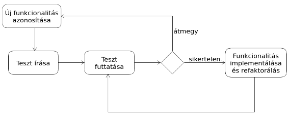

#### A TDD előnyei
**Megkönnyíti a kód írását:**
A TDD segíti a programozót abban, hogy tisztázza a gondolatait arról, hogy mit kellene, hogy csináljon egy kódrész. Egy teszt írásához a feladat megértése szükséges, a megértés pedig könnyebbé teszi a szükséges kód megírását.

**Kódlefedettség:**
Minden kódrésznek kell, hogy legyen tesztje.

**Könnyebb hibakeresés:**
Amikor egy teszt sikertelen, nyilvánvaló kell, hogy legyen a probléma forrása.

**Dokumentálás:**
A tesztek maguk is egyfajta dokumentációnak tekinthetők, mely leírja, hogy mit kellene, hogy csináljon a kód.

Leginkább új szoftverek kifejlesztéséhez alkalmas.

---
<div style='page-break-after: always;'></div>

## 3. Objektumorientált tervezési alapelvek
### Statikus kódelemzés fogalma, példák statikus kódelemző eszközökre
A statikus kódelemzés (static code analysis)
a programkód elemzésének folyamata, mely a
kód végrehajtása nélkül történik.
– Az elemezés irányulhat hibák észlelésére; annak
ellenőrzésére, hogy a kód megfelel-e egy kódolási
szabványnak, …
● Statikus kódelemző (eszköz) (static code
analyzer, static code analysis tool): statikus
kódelemzést végző automatikus eszköz.

C#:
– InferSharp (programozási nyelv: C#; licenc: MIT License)
https://github.com/microsoft/infersharp
– Roslyn Analyzers (programozási nyelv: C#; licenc: MIT License)
https://github.com/dotnet/roslyn-analyzers
– Roslynator (programozási nyelv: C#; licenc: Apache License
2.0) https://github.com/dotnet/roslynator
● C++:
– Cppcheck

ECMAScript/JavaScript:
– ESLint (programozási nyelv: JavaScript; licenc: MIT License)
https://eslint.org/ https://github.com/eslint/eslint
– JSHint (programozási nyelv: JavaScript; licenc: MIT License)
https://jshint.com/ https://github.com/jshint/jshint
– JSLint (programozási nyelv: JavaScript; licenc: Unlicense)
https://www.jslint.com/ https://github.com/jslint-org/jslint
– RSLint (programozási nyelv: Rust;

Java:
– Checkstyle (programozási nyelv: Java; licenc: LGPLv2.1)
https://checkstyle.org/ https://github.com/checkstyle/checkstyle
– Error Prone (programozási nyelv: Java; licenc: Apache License
2.0) https://errorprone.info/
https://github.com/google/error-prone
– NullAway (programozási nyelv: Java; licenc: MIT License)
https://github.com/uber/NullAway
– SpotBugs (programozási nyelv: Java

Python:
– Prospector (programozási nyelv: Python; licenc:
GPLv2) http://prospector.landscape.io/
https://github.com/landscapeio/prospector
– Pylint (programozási nyelv: Python

Több nyelvet támogató eszközök:
– Coala (programozási nyelv: Python; licenc: AGPLv3)
https://coala.io/ https://github.com/coala/coala
– Infer (programozási nyelv: OCaml; licenc: MIT License)
https://fbinfer.com/ https://github.com/facebook/infer
– PMD (programozási nyelv: Java; licenc: BSD License)
https://pmd.github.io/ https://github.com/pmd/pmd
– Semgrep (programozási nyelv: OCaml

További eszközökért lásd:
– Analysis Tools and Linters to Improve Code Quality
and Avoid Bugs

### A DRY elv
Ne ismételd magad (Don't Repeat Yourself)
– „Every piece of knowledge must have a single,
unambiguous, authoritative representation within a
system.”
– A tudás minden darabkájának egyetlen, egyértelmű,
hiteles reprezentációja kell, hogy legyen egy
rendszerben.
● Az ellenkezője a WET.
– „We enjoy typing”, „write everything twice”, „waste
everyone's time”, …

Az ismétlések fajtái:
– Kényszerített ismétlés (imposed duplication): a fejlesztők úgy érzik,
hogy nincs választásuk, a környezet láthatólag megköveteli az ismétlést.
– Nem szándékos ismétlés (inadvertent duplication): a fejlesztők nem
veszik észre, hogy információkat duplikálnak.
– Türelmetlen ismétlés (impatient duplication): a fejlesztők
lustaságából fakad, az ismétlés látszik a könnyebb útnak.
– Fejlesztők közötti ismétlés (interdeveloper duplication): egy
csapatban vagy különböző csapatokban többen duplikálnak egy
információt.
● Kapcsolódó fogalom: kódismétlés (code duplication, duplicate
code), copy-and-paste programming

A kódismétlés (duplicate code) azonos (vagy
nagyon hasonló) forráskódrész, mely egynél
többször fordul elő egy programban.
● Nem minden kódismétlés információ ismétlés!

PMD támogatás: Copy/Paste Detector (CPD)
– Finding duplicated code with CPD
https://docs.pmd-code.org/latest/pmd_userdocs_cpd.html
– Támogatott programozási nyelvek: C/C++, C#,
ECMAScript (JavaScript), Java, Kotlin, Python, Scala, …
● Lásd:
https://docs.pmd-code.org/latest/pmd_userdocs_cpd.html#supp
orted-languages
● IntelliJ IDEA:
– Analyze duplicates

A DRY elv megsértései nem mindig kódismétlés
formájában jelennek meg.
– A DRY elv az információk megismétléséről szól. A
tudás egy darabkája két teljesen eltérő módon is
kifejezhető két különböző helyen.
– Példa (Thomas & Hunt, 2019):

```java
class Line {
Point start;
Point end;
double length; // a DRY elv megsértése
}
```

Az elv megsértése kiküszöbölhető a length
adattag egy metódusra való kicserélésével:

```java
class Line {
Point start;
Point end;
double length() {
return start.distanceTo(end);
}
}
```

A jobb teljesítmény érdekében választható a DRY
elv megsértése.
● Ilyenkor az elv megszegését ajánlott a külvilág elől
elrejteni.

```java
class Line {
private Point start;
private Point end;
private double length;
public Line(Point start, Point end) {
this.start = start;
this.end = end;
calculateLength();
}
public void setStart(Point p) {
this.start = p;
calculateLength();
}
public void setEnd(Point p) {
this.end = p;
calculateLength();
}
public Point getStart() { return start; }
public Point getEnd() { return end; }
public double getLength() { return length; }
private void calculateLength() { this.length = start.distanceTo(end); }
}
```

Reprezentációs ismétlés (Thomas & Hunt,
2019):
– A kód gyakran függ a külvilágtól: például API-kon
keresztül más programkönyvtáraktól, külső
adatforrások adataitól, mely mindig a DRY elv
valamiféle megsértését vonja maga után: a kódnak
olyan tudással kell rendelkeznie, mely a külső
dologban is ott van.
● Ismernie kell az API-t, a sémát, vagy a hibakódok
jelentését.

Reprezentációs ismétlés (Thomas & Hunt,
2019):
– Ez az ismétlés elkerülhetetlen.
– Eszközök, melyek segítenek megbirkózni az ilyen
fajta ismétlésekkel:
● Sémákból kódot generáló eszközök (például JAXB, JPA)
● OpenAPI

### A KISS elv
Keep it simple, stupid
– 1960-as évek, amerikai haditengerészet.
– Kelly Johnson (1910–1990) repülőmérnöknek tulajdonítják a kifejezést.
● Az egyszerűségre való törekvés:
– Leonardo da Vinci (1452–1519): „Az egyszerűség a kifinomultság
csúcsa.”
– Ludwig Mies van der Rohe (1886–1969): „A kevesebb több.”
– Albert Einstein (1879–1955):
● „Everything should be made as simple as possible, but not simpler.”
● „Mindent olyan egyszerűen kell csinálni, amennyire csak lehetséges, de
semmivel sem egyszerűbben.

### A YAGNI elv
A „You Aren't Gonna Need It” („nem lesz rá
szükséged”) rövidítése.
● Az extrém programozás (XP) egy alapelve.

„Mindig akkor implementálj valamit, amikor
tényleg szükséged van rá, soha ne akkor,
amikor csak sejted, hogy kell.”

Egy olyan lehetőség kifejlesztésének költségei,
mely jelenleg nem szükséges

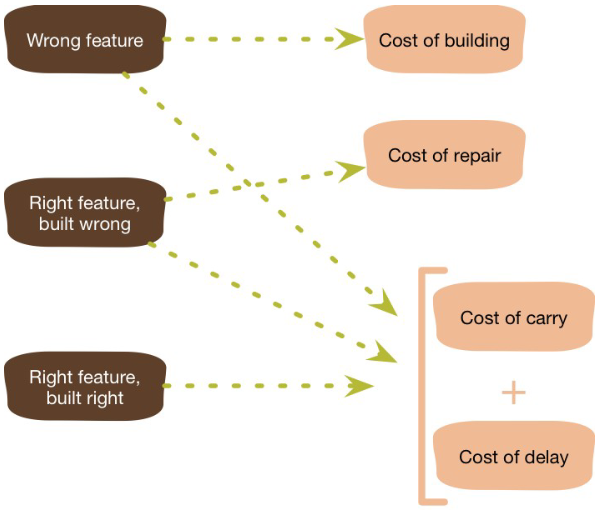

A YAGNI alapelv csak azon képességekre
vonatkozik, melyek egy feltételezett lehetőség
támogatásához kerülnek beépítésre a
szoftverbe, nem vonatkozik a szoftver
módosítását könnyítő törekvésekre.
● A YAGNI csak akkor járható stratégia, ha a kód
könnyen változtatható.

### Csatoltság, laza és szoros csatoltság
Csatoltság (coupling): egy szoftvermodul
függésének mértéke egy másik szoftvermodultól.
– Más szóval, a szoftvermodulok közötti csatoltság
annak mértéke, hogy mennyire szoros a kapcsolatuk.
– A csatoltság laza vagy szoros lehet.

Szoros csatoltság:
– A bonyolultságot növeli, mely megnehezíti a kód
módosítását, tehát a karbantarthatóságot csökkenti.
– Az újrafelhasználhatóságot is csökkenti.

Laza csatoltság:
– Lehetővé teszi a fejlesztők számára a nyitva zárt
elvnek megfelelő kód írását, azaz a kódot
kiterjeszthetővé teszi.
– Kiterjeszthetővé teszi a kódot, a kiterjeszthetőség
pedig karbantarthatóvá.
– Lehetővé teszi a párhuzamos fejlesztést.

### GoF alapelvek
A két GoF alapelv:
– Interfészre programozzunk, ne implementációra.
● „Program to an interface, not an implementation.”
● Lásd például a létrehozási mintákat.
– Részesítsük előnyben az objektum-összetételt
az öröklődéssel szemben.
● „Favor object composition over class inheritance.”

### SOLID alapelvek
Single Responsibility Principle (SRP) – Egyszeres felelősség elve
● Open/Closed Principle (OCP) – Nyitva zárt elv
● Liskov Substitution Principle (LSP) – Liskov-féle helyettesítési elv
● Interface Segregation Principle (ISP) – Interfész szétválasztási elv
● Dependency Inversion Principle (DIP) – Függőség megfordítási elv

#### egyszeres felelősség elve
Egy osztálynak csak egy oka legyen a változásra.

Egy felelősség egy ok a változásra.
● Minden felelősség a változás egy tengelye. Amikor a
követelmények változnak, a változás a felelősségben
történő változásként nyilvánul meg.
● Ha egy osztálynak egynél több felelőssége van, akkor
egynél több oka van a változásra.
● Egynél több felelősség esetén a felelősségek csatolttá
válnak. Egy felelősségben történő változások
gyengíthetik vagy gátolhatják az osztály azon
képességét, hogy eleget tegyen a többi felelősségének.

Példa az elv megsértésére:
– A Rectangle osztály két felelőssége:
● Egy téglalap geometriájának matematikai modellezése.
● Téglalap megjelenítése a grafikus felhasználói felületen.


Példa az elv megsértésére: (folytatás)
– Problémák:
● A számítógépes geometriai alkalmazásnak tartalmaznia
kell a grafikus felhasználói felületet.
● Ha a grafikus alkalmazás miatt változik a Rectangle
osztály, az szükségessé teheti a számítógépes
geometriai alkalmazás összeállításának, tesztelésének
és telepítésének megismétlését (rebuild, retest,
redeploy).

Az előbbi példa az elvnek megfelelő változata:

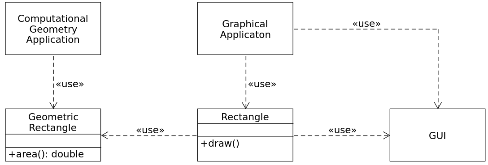

Az elv megfogalmazásának finomodása:
– „A class should have only one reason to change.”
● Robert C. Martin. Agile Software Development: Principles, Patterns,
and Practices. Pearson Education, 2002. p. 95.
– „… a class or module should have one, and only one,
reason to change.”
● Robert C. Martin. Clean Code: A Handbook of Agile Software
Craftsmanship. Prentice Hall, 2008. p. 138.
– „A module should be responsible to one, and only one, actor.”

A szoftverek aktorok kielégítése céljából
változnak.
– Az „aktor” kifejezést itt emberek (például
felhasználók) egy olyan csoportjára használjuk, akik
azt akarják, hogy a szoftver ugyanúgy változzon.
● Az elv tehet így fogalmazható újra:
– Egy modul egy, és csak egyetlen aktornak van
alárendelve.

Példa (Robert C. Martin):
– Az alábbi Employee osztály megszegi az
egyszeres felelősség elvét, mivel a három metódus
nagyon különböző aktoroknak van alávetve:
● calculatePay(): a bérosztály határozza meg
● reportHours(): a munkaügyi osztály határozza meg
● save(): az adatbázis adminisztrátorok határozzák meg

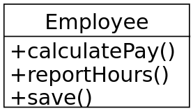

#### nyitva zárt elv
A szoftver entitások (osztályok, modulok,
függvények, …) legyenek nyitottak a bővítésre,
de zártak a módosításra.

Az elvnek megfelelő modulnak két fő jellemzője
van:
– Nyitott a bővítésre: azt jelenti, hogy a modul
viselkedése kiterjeszthető.
– Zárt a módosításra: azt jelenti, hogy a modul
viselkedésének kiterjesztése nem eredményezi a
modul forrás- vagy bináris kódjának változását.

Példa az elv megsértésére:
– A Client és a Server konkrét osztályok. A
Client osztály a Server osztályt használja. Ha
azt szeretnénk, hogy egy Client objektum egy
különböző szerver objektumot használjon, a
Client osztályban meg kell változtatni a szerver
osztály nevét.

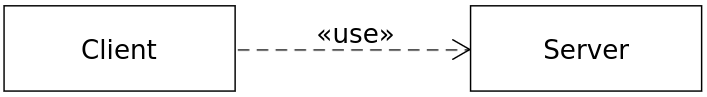

Az előbbi példa az elvnek megfelelő változata:

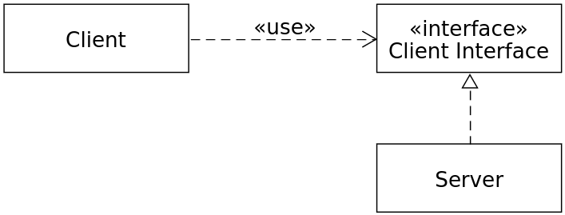

#### Liskov-féle helyettesítési elv
Ha az S típus a T típus altípusa, nem változhat
meg egy program működése, ha benne a T
típusú objektumokat S típusú objektumokkal
helyettesítjük.

#### interfész szétválasztási elv
Nem szabad arra kényszeríteni az osztályokat,
hogy olyan metódusoktól függjenek, melyeket nem
használnak.

Vastag interfész (fat interface) (Bjarne
Stroustrup)
https://www.stroustrup.com/glossary.html#Gfat-i
nterface
– „An interface with more member functions and
friends than are logically necessary.”
– Az ésszerűen szükségesnél több tagfüggvénnyel és
baráttal rendelkező interfész.

Az interfész szétválasztási elv a vastag interfészekkel
foglalkozik.
● A vastag interfészekkel rendelkező osztályok
interfészei nem koherensek, melyekben a
metódusokat olyan csoportokra lehet felosztani,
melyek különböző klienseket szolgálnak ki.
● Az ISP elismeri azt, hogy vannak olyan objektumok,
melyekhez nem koherens interfészek szükségesek,
de azt javasolja, hogy a kliensek ne egyetlen
osztályként ismerjék őket.

Interfész szennyezés (interface pollution):
– Egy interfész szennyezése szükségtelen
metódusokkal.

Amikor egy kliens egy olyan osztálytól függ,
melynek vannak olyan metódusai, melyeket a
kliens nem használ, más kliensek azonban
igen, akkor a többi kliens által az osztályra
kényszerített változások hatással lesznek arra a
kliense is.
● Ez a kliensek közötti nem szándékos
csatoltságot eredményez.

Példa: ATM (Robert C. Martin)

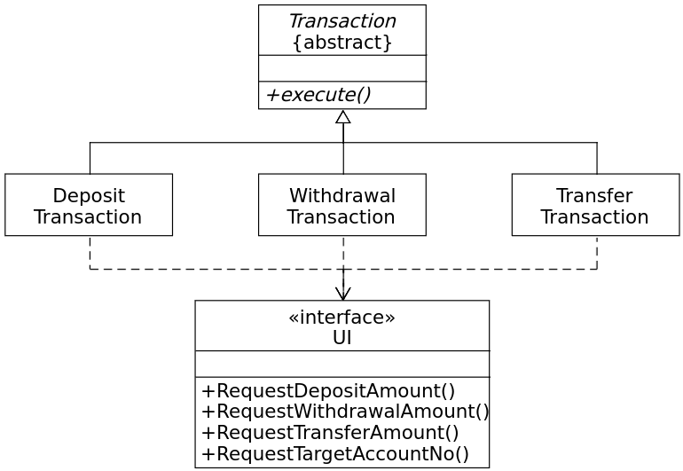

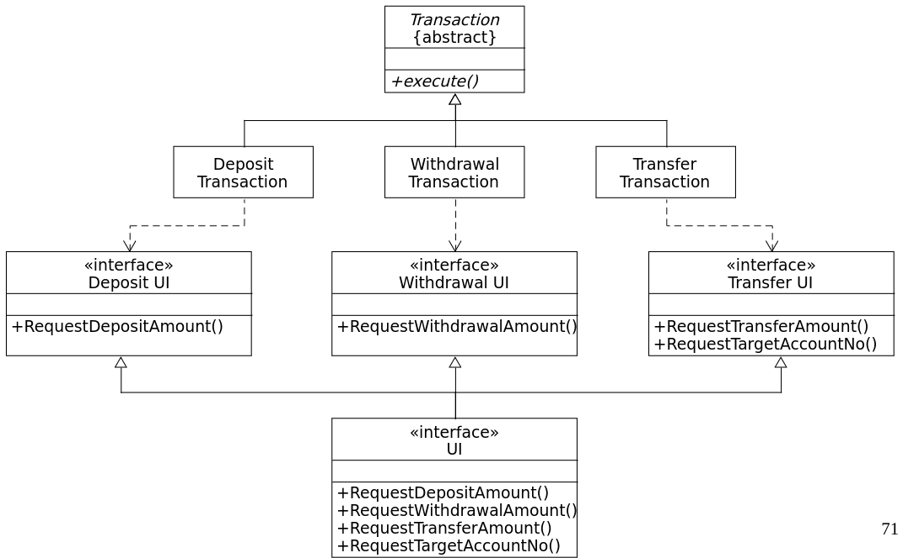

#### függőség megfordítási elv
Magas szintű modulok ne függjenek alacsony
szintű moduloktól. Mindkettő absztrakcióktól
függjön.
– Az absztrakciók ne függjenek a részletektől. A
részletek függjenek az absztrakcióktól.

Az elnevezés onnan jön, hogy a hagyományos
szoftverfejlesztési módszerek hajlamosak olyan
felépítésű szoftvereket létrehozni, melyekben a
magas szintű modulok függenek az alacsony
szintű moduloktól.

A magas szintű modulok tartalmazzák az alkalmazás
üzleti logikáját, ők adják az alkalmazás identitását.
Ha ezek a modulok alacsony szintű moduloktól
függenek, akkor az alacsony szintű modulokban
történő változásoknak közvetlen hatása lehet a
magas szintű modulokra, szükségessé tehetik azok
változását is.
● Ez abszurd! A magas szintű modulok azok, melyek
meg kellene, hogy határozzák az alacsony szintű
modulokat.

A magas szintű modulokat szeretnénk
újrafelhasználni. Az alacsony szintű modulok
újrafelhasználására elég jó megoldást jelentenek a
programkönyvtárak.
● Ha magas szintű modulok alacsony szintű moduloktól
függenek, akkor nagyon nehéz az újrafelhasználásuk
különféle helyzetekben.
● Ha azonban a magas szintű modulok függetlenek az
alacsony szintű moduloktól, akkor elég egyszerűen
újrafelhasználhatók.

Példa a rétegek architekturális minta
hagyományos alkalmazására:

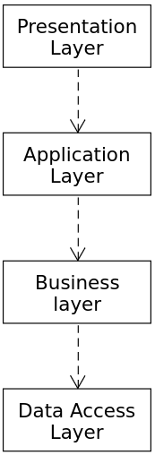

Az előbbi példa az elvnek megfelelő változata:
– Minden egyes magasabb szintű interfész deklarál
az általa igényelt szolgáltatásokhoz egy interfészt.
– Az alacsonyabb szintű rétegek realizálása ezekből
az interfészekből történik.
– Ilyen módon a felsőbb rétegek nem függenek az
alsóbb rétegektől, hanem pont fordítva.)

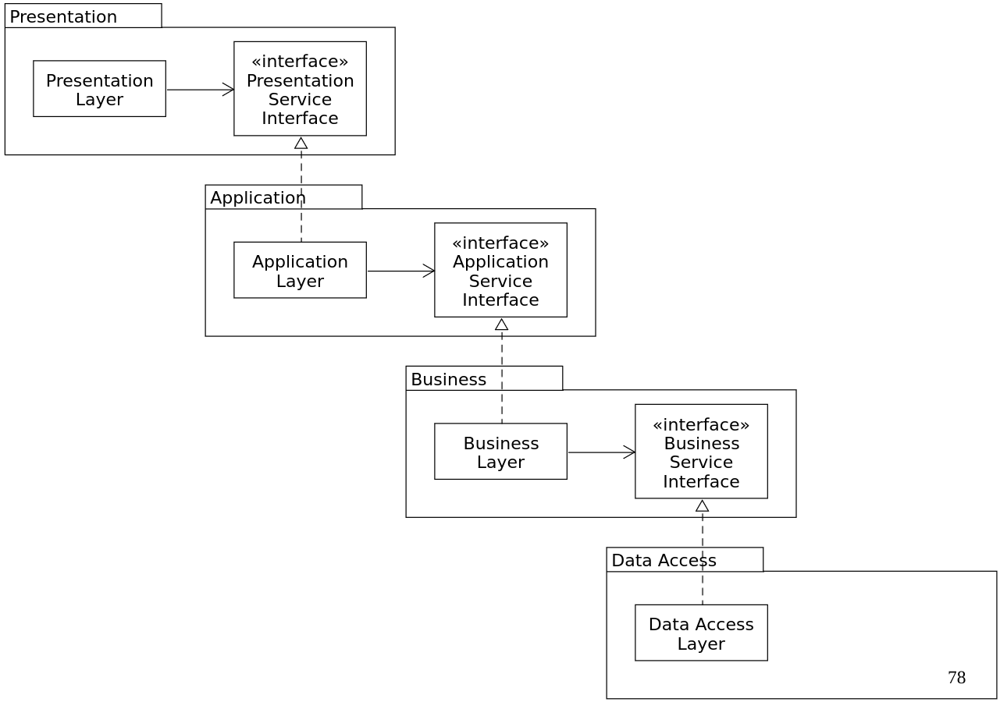

Az előbbi példa az elvnek megfelelő változata:
(folytatás)
– Nem csupán a függőségek kerültek megfordításra,
hanem az interfész tulajdonlás is (inversion of
ownership).
● Hollywood elv: Ne hívj, majd mi hívunk. (Don't call us,
we'll call you.)

Függés absztrakcióktól:
– Ne függjön a program konkrét osztályoktól, hanem inkább
csak absztrakt osztályoktól és interfészektől.
● Egyetlen változó se hivatkozzon konkrét osztályra.
● Egyetlen osztály se származzon konkrét osztályból.
● Egyetlen metódus se írjon felül valamely ősosztályában
implementált metódust.
– A fenti heurisztikát a legtöbb program legalább egyszer
megsérti.
– Nem túl gyakran változó konkrét osztályok esetén (például
String) megengedhető a függés.

Példa az elv megsértésére:

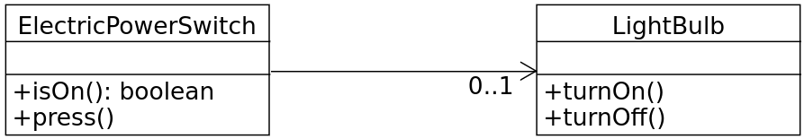

Az előbbi példa az elvnek megfelelő változata:

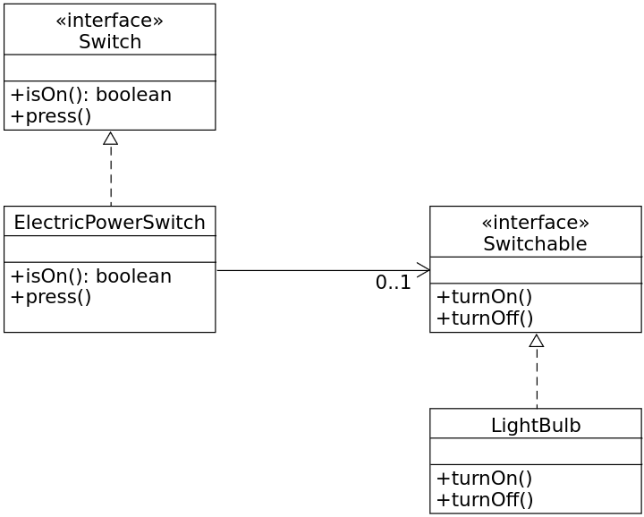

### Függőség befecskendezés
A függőség befecskendezés (DI – dependency
injection) kifejezés Martin Fowlertől származik.

A vezérlés megfordítása (IoC – inversion of control)
nevű architekturális minta alkalmazásának egy
speciális esete.

Definíció (Seemann):
– „Dependency Injection is a set of software design
principles and patterns that enable us to develop
loosely coupled code.”
– A függőség befecskendezés olyan szoftvertervezési
elvek és minták összessége, melyek lazán csatolt kód
fejlesztését teszik lehetővé.
● A lazán csatoltság kiterjeszthetővé teszi a kódot,
a kiterjeszthetőség pedig karbantarthatóvá.

Egy objektumra egy olyan szolgáltatásként
tekintünk, melyet más objektumok kliensként
használnak.
● Az objektumok közötti kliens-szolgáltató
kapcsolatot függésnek nevezzük. Ez a
kapcsolat tranzitív

Függőség (dependency): egy kliens által igényelt
szolgáltatást jelent, mely a feladatának ellátásához
szükséges.
● Függő (dependent): egy kliens objektum, melynek egy
függőségre vagy függőségekre van szüksége a
feladatának ellátásához.
● Objektum gráf (object graph): függő objektumok és
függőségeik egy összessége.
● Befecskendezés (injection): egy kliens függőségeinek
megadását jelenti.

DI konténer (DI container): függőség
befecskendezési funkcionalitást nyújtó
programkönyvtár.
– Az Inversion of Control (IoC) container kifejezést
is használják rájuk.
● A függőség befecskendezés alkalmazható DI
konténer nélkül.
● Tiszta DI: függőség befecskendezés
alkalmazásának gyakorlata DI konténer nélkül.

A függőség befecskendezés objektum gráfok
hatékony létrehozásával, ennek mintáival és
legjobb gyakorlataival foglalkozik.
● A DI keretrendszerek lehetővé teszik, hogy a
kliensek a függőségeik létrehozását és azok
befecskendezését külső kódra bízzák.

Példa: nincs függőség befecskendezés

```java
public interface SpellChecker {
boolean check(String text);
}
public class TextEditor {
private SpellChecker spellChecker;
public TextEditor() {
spellChecker = new HungarianSpellChecker();
}
// ...
}
```

Példa: függőség befecskendezés konstruktorral
(constructor injection):

```java
public class TextEditor {
private SpellChecker spellChecker;
public TextEditor(SpellChecker spellChecker) {
this.spellChecker = spellChecker;
}
// ...
}
```

Példa: függőség befecskendezés beállító
metódussal (setter injection):

```java
public class TextEditor {
private SpellChecker spellChecker;
public TextEditor() {}
public void setSpellChecker(SpellChecker spellChecker) {
this.spellChecker = spellChecker;
}
// ...
}
```

Példa: függőség befecskendezés interfésszel
(interface injection):

```java
public interface SpellCheckerSetter {
void setSpellChecker(SpellChecker spellChecker);
}
public class TextEditor implements SpellCheckerSetter {
private SpellChecker spellChecker;
public TextEditor() {}
@Override
public void setSpellChecker(SpellChecker spellChecker) {
this.spellChecker = spellChecker;
}
// ...
}
```

A függőség befecskendezés előnyei:
– Kiterjeszthetőség
– Karbantarthatóság
– Tesztelhetőség: a függőség befecskendezés
támogatja az egységtesztelést.
● Valós függőségek helyet a tesztelt rendszerbe
befecskendezhetők „teszt dublőrök” (test doubles).


---
<div style='page-break-after: always;'></div>

## 4. Minták a szoftverfejlesztésben
### Mi a minta?
### Architekturális minták, a modell-nézet vezérlő (MVC) architekturális minta
### Tervezési minták, tervezési minták osztályozása
#### Létrehozási minták: elvont gyár (abstract factory), egyke, építő, objektumkészlet (object pool )
#### Szerkezeti minták: díszítő, illesztő
#### Viselkedési minták: sablonfüggvény, megfigyelő

### Programozási idiómák/implementációs minták
### Antiminták, a massza és a spagetti kód antiminta

---
<div style='page-break-after: always;'></div>

## 5. Tiszta kód
### Milyen a tiszta kód?
### értelmes nevek
### Függvények
### Mi a baj a megjegyzésekkel? Jó és rossz megjegyzések fajtái
### Forráskód formázás: vízszintes és függőleges formázás, az újság metafora
### Hibakezelés, elenőrzött és nem ellenőrzött kivételek
### null átadása függvényeknek, null visszadása

---