<h1 style="text-align:center">Szoftverfejlesztés</h1>
<h2 style="text-align:center"> II. Zárthelyi Dolgozat</h2>

## Tartalom
- [Unified Modeling Language](#1-unified-modeling-language-uml)
  - [UML modellelemek](#uml-modellelemek-osztályozók-csomagok-függőségek-kulcsszavak-megjegyzések)
  - [Osztálydiagramok](#osztálydiagramok-osztálydiagramok-fajtái)
  - [Osztályok](#osztályok)
  - [Számosság](#számosság)
  - [Tulajdonságok](#tulajdonságok)
  - [Műveletek](#műveletek)
  - [Statikus attribútumok és műveletek](#statikus-attribútumok-és-műveletek)
  - [Absztrakt osztályok](#absztrakt-osztályok)
  - [Asszociációk](#asszociációk)
  - [Egész-rész kapcsolat](#egész-rész-kapcsolat)
  - [Általánosítás](#általánosítás)
  - [Interfészek](#interfészek)
- [Szoftvertesztelés](#2-szoftvertesztelés)
- [Objektumorientált tervezési alapelvek](#3-objektumorientált-tervezési-alapelvek)
- [Minták a szoftverfejlesztésben](#4-minták-a-szoftverfejlesztésben)
- [Tiszta kód](#5-tiszta-kód)

---
<div style='page-break-after: always;'></div>

## 1. Unified Modeling Language (UML)
###  UML modellelemek: osztályozók, csomagok, függőségek, kulcsszavak, megjegyzések
#### osztályozók
Az osztályozó egy modellelem, mely közös jellemzőkkel műveletekkel rendelkező példányok egy halmazát ábrázolja.
- **Hierarchiába** szervezhetők az általánosítás révén.
- **Specializációi:** *DataType*, *Association*, *Interface*, *Class*
- **Jelölésmód:** mint az osztályoké, a nevük megjelenítéséhez félkövér betűtípust kell használni.

<div style='page-break-after: always;'></div>

#### csomagok
A csomag egy modellelemek csoportosítására szolgáló konstrukció, mely egy névteret határoz meg a tagjai számára.
**Jelölésmód:** 
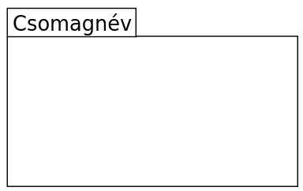
A tartalmazott elemekre csomagnév::elemnév formájú minősített nevekkel lehet hivatkozni (például ```pkg::Point```, ```pkg::Shape```).
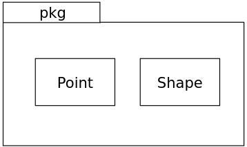 | 
 -|-|

<div style='page-break-after: always;'></div>

#### függőségek
Modellelemek közötti szolgáltató-kliens kapcsolatot jelent, ahol egy szolgáltató módosításának hatása lehet a kliens modellelemekre.
**Jelölésmód:** 
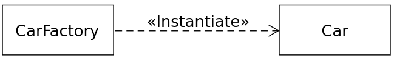
Két modellelem közötti szaggatott nyíl jelöli. A nyíl a függő (kliens) modellelemtől a szolgáltató modellelem felé mutat. A függőséghez megadható egy kulcsszó vagy sztereotípia.

#### kulcsszavak
Az UML jelölésmód szerves részét képző fenntartott szó.
Szöveges annotációként jelenik meg egy UML grafikus elemhez kapcsolva vagy egy UML diagram egy szövegsorának részeként.
- Minden egyes kulcsszóhoz elő van írva, hogy hol jelenhet meg.
- Lehetővé teszi azonos grafikus jelölésű UML fogalmak (metaosztályok) megkülönböztetését.
- Lásd például az osztályokat és interfészeket (```«interface »```).

Megadásuk francia idézőjelek, ```«``` és ```»``` karakterek között.

- Ha a használt betűkészletben nem állnak rendelkezésre a francia idézőjelek, akkor a ```>>``` és ```<<``` karakterekkel helyettesíthetők.
- Egy modellelemre több kulcsszó is vonatkozhat.
- A kulcsszavak felsorolhatók egymás után, mindegyik külön határolók közé zárva.
- Több kulcsszó is megadható a határolók között vessző karakterekkel elválasztva.

<div style='page-break-after: always;'></div>


#### megjegyzések
Nincs jelentése, a modell olvasója számára hordozhat hasznos információt.

**Jelölésmód:** 
- A jobb felső sarkában „szamárfüles” téglalap ábrázolja.
- A téglalap tartalmazza a megjegyzés törzsét.
- Szaggatott vonal kapcsolja a magyarázandó elem(ek)hez. 
- A vonal elhagyható, ha egyértelmű a környezetből vagy nem fontos a diagramon.

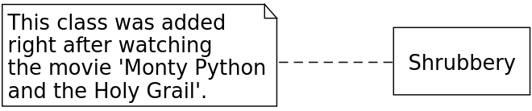

<div style='page-break-after: always;'></div>

### Osztálydiagramok, osztálydiagramok fajtái
#### Osztálydiagramok
Egy osztálydiagram az objektumok típusait írja le egy rendszerben és a köztük fennálló különféle statikus kapcsolatokat. Az osztálydiagramok mutatják az osztályok tulajdonságait és műveleteit is, valamint azokat a megszorításokat, melyek az objektumok összekapcsolására vonatkoznak.

#### Osztálydiagramok fajtái
**Elemzési:** Az elemzési szinten az osztályok az alkalmazási szakterület fogalmai, az osztálydiagram a szakterület felépítését modellezi.

**Tervezési:** Megjelennek az osztályokban a megvalósítás módjának technikai aspektusai.

**Megvalósítási:** Az osztályok egy implementációs nyelv (például *C++*, *Java*, …) konstrukcióival ekvivalensek.

<div style='page-break-after: always;'></div>

### Osztályok
**Jelölésmód:** 
|Név|
|-|
**Atribútumok**
**Műveletek**

### Láthatóság

Jelölés|Láthatóság
-|-
+|nyilvános
-|privát
#|védett
~|csomagszintű


### Számosság
Megszorítást fejez ki egy kollekció elemeinek számára.
- Az elemek száma nem lehet kisebb az alsó, illetve nagyobb az felső korlátnál.
  
**Jelölésmód:** 
```[alsó_korlát] [..] felső_korlát```
- Például ```1..2```
- A ```0..*``` számosság helyett használható a ```*``` jelölés.
  
Az alsó korlát **nemnegatív egész**, a felső korlát **nemnegatív egész** vagy a *"korlátlan"* jelentésű ```*```.
Ha az alsó és felső korlát egyenlő, akkor használható önmagában a felső korlát.
- Például ```1..1``` $\rightarrow$ ```1``` vagy ```5..5``` $\rightarrow$ ```5``` 

### Tulajdonságok
Egy tulajdonság egy attribútumot vagy egy asszociációvéget ábrázol.
**Jelölésmód:** 
```[^] [láthatóság] [/] név [: típus] [ számosság ] [= alapérték] [{ módosító [, módosító]* }]```

- A ```^``` azt jelzi, hogy a tulajdonság örökölt.
- A ```/``` azt jelzi, hogy a tulajdonság származtatott.
- A ```számosság``` elhagyásakor az alapértelmezés *1*.
- **Módosító:** például readOnly, ordered, unordered, unique,

### Műveletek
**Jelölésmód:**
```[^] [láthatóság] név ([paraméterlista]) [: típus] [ számosság ] [{ tulajdonság [, tulajdonság]* }]```
- **Tulajdonság:** *nonunique*, *ordered*, *query*, *redefines név*, *seq* / *sequence*, *unique*, *unordered*, *megszorítás*
- **query:** azt jelenti, hogy a művelet nem változtatja meg a rendszer állapotát.

### Statikus attribútumok és műveletek
A statikus attribútumokat és műveleteket **aláhúzás** jelöli.
- Példa:


<div style='page-break-after: always;'></div>

### Absztrakt osztályok
Nem példányosítható osztály (osztályozó).
**Jelölésmód:** 
- Szedjük az osztály (osztályozó) nevét dőlt betűvel és/vagy a név után vagy alatt adjuk meg az *{abstract}* szöveges annotációt.
- Az UML 2.5.1 nem rendelkezik az absztrakt műveletek jelölésmódjáról! 
**(Személyes vélemény: ez valószínűleg hiba.)**

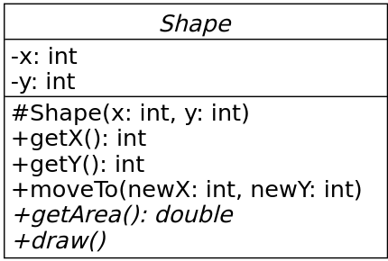

<div style='page-break-after: always;'></div>

### Asszociációk
Szemantikus viszonyt jelent, mely osztályozók példányai között állhat fenn.
- Azt fejezi ki az asszociáció, hogy kapcsolatok lehetnek olyan példányok között, melyek megfelelnek az asszociált típusoknak vagy implementálják azokat.
- Legalább két végük van.
- Két végű asszociáció: bináris asszociáció.
- Egy kapcsolat (*link*) egy asszociáció egy példánya.
- Azaz egy olyan *n*-es, mely minden véghez a vég típusának egy példányát tartalmazza.

**Jelölésmód:** 
- Bármely asszociáció ábrázolható egy csúcsára állított rombusszal, melyet minden egyes vég esetén egy folytonos vonal köt össze azzal az osztályozóval, mely a vég típusa. Kettőnél több végű asszociáció csak így ábrázolható.
- Egy bináris asszociációt általában két osztályozót összekötő folytonos vonal ábrázol, vagy egy osztályozót önmagával összekötő folytonos vonal.
- Az asszociáció szimbólumához megadható név (ne legyen túl közel egyik véghez sem).
- Folytonos vonallal ábrázolt bináris asszociáció neve mellett vagy helyén elhelyezhető egy tömör háromszög, mely a vonal mentén az egyik vég felé mutat és az olvasási irányt jelzi. *Ez a jelölés csupán dokumentációs célokat szolgál.*


**Asszociáció vég:** az asszociációt ábrázoló vonal és egy osztályozót ábrázoló ikon (gyakran egy doboz) kapcsolata.
A vonal végének közelében elhelyezhető (egyik sem kötelező):
- Név (gyakran szerepkörnek nevezik)
- Számosság (ha nincs megadva, akkor semmilyen feltevéssel nem élhetünk a számosságról)
- Módosító (lásd a tulajdonságoknál)
- Láthatóság

A vonal végén egy **nyílt nyílhegy** azt jelzi, hogy a vég navigálható, egy $\times$ pedig azt, hogy a vég nem navigálható

Egy asszociáció vég számosságának jelentése:
- A példányok számát adja meg a végen arra az esetre, amikor a többi (n - 1) vég mindegyikén egy- egy értéket rögzítünk.

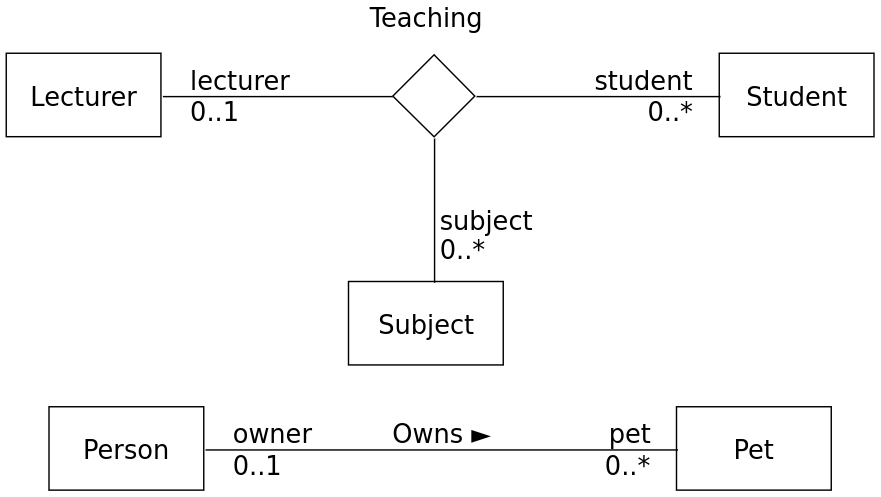

Az osztályozó és a vonal érintkezési pontjában elhelyezhető egy kis tömör kör (a továbbiakban pontnak nevezzük).
- A pont azt mutatja, hogy a modell tartalmaz egy tulajdonságot, melynek típusát a pont által érintett osztályozó ábrázolja. Ez a tulajdonság a másik végen lévő osztályozóhoz tartozik. Ebben az esetben szokás a tulajdonságot elhagyni az osztályozó attribútum rekeszéből.
- A pont hiánya azt jelzi, hogy a vég magához az asszociációhoz tartozik.

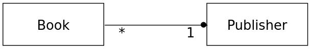

<div style='page-break-after: always;'></div>

A navigálhatóság azt jelenti, hogy a kapcsolatokban résztvevő példányok futásidőben hatékonyan érhetők el az asszociáció többi végén lévő példányokból.
- Implementáció-specifikus azt a mechanizmus, mely révén hatékony elérés történik.
- Az osztályokhoz tartozó asszociációvégek mindig navigálhatók, az asszociációkhoz tartozók lehetnek navigálhatók és nem navigálhatók.

-|-
-|- 
Mindkét vég navigálható.| 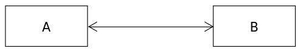
Egyik vég sem navigálható. | 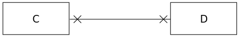
A navigálhatóság nem meghatározott.   | 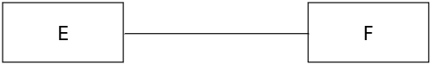
Az egyik vég navigálható, a másik nem. | 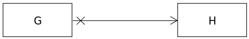
Az egyik vég navigálható, a másik nem. | 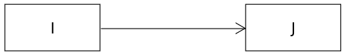

<div style='page-break-after: always;'></div>

### Egész-rész kapcsolat
A bináris asszociációk egész-rész kapcsolatot kifejező fajtái:
- **Aggregáció** (*shared aggregation*, *aggregation*): Egy rész objektum egyidejűleg több aggregációs objektumhoz is tartozhat, a részek és az aggregációs objektum egymástól függetlenül is létezhetnek.
- **Kompozíció** (*composite aggregation*, *composition*): Az aggregáció erősebb formája. Egy rész objektum legfeljebb egy kompozit objektumhoz tartozhat. A kompozit objektum törlésekor az összes rész objektum vele együtt törlődik.

Egy bináris asszociáció egyik vége jelölhető meg csak aggregációként vagy kompozícióként.

**Jelölésmód:** 
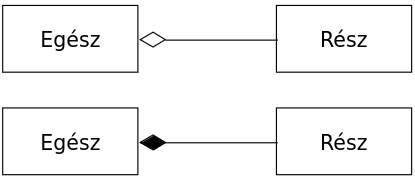

<div style='page-break-after: always;'></div>

**Példa aggregációra:**
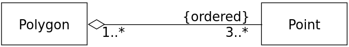

**Példa kompozícióra:**
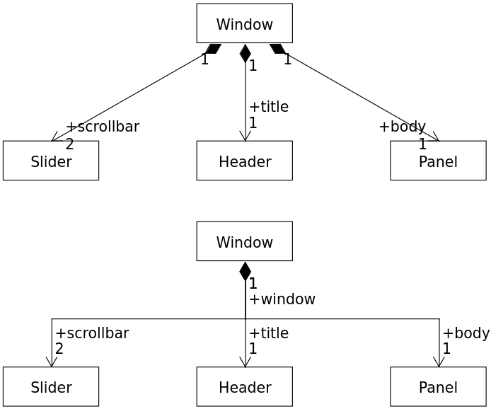

<div style='page-break-after: always;'></div>

### Általánosítás
Az általánosítás egy általánosítás/specializáció kapcsolatot határoz meg osztályozók között. Egy speciális osztályozót kapcsol össze egy általánosabb osztályozóval.
Az általánosítás/specializáció reláció tranzitív lezártja szerint értelmezzük egy osztályozó általánosításait és specializációit.
A közvetlen általánosításokat a speciális osztályozó szülőjének nevezzük, osztályok esetén ősosztálynak.

Egy osztályozó egy példánya minden általánosításának példánya.
A speciális osztályozó örökli az általános osztályozó bizonyos tagjait.
**Jelölésmód:** 
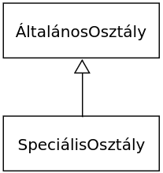

<div style='page-break-after: always;'></div>

**Példa:**
|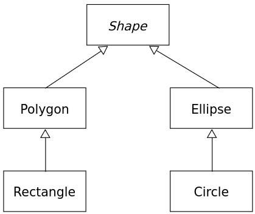|
|-|
|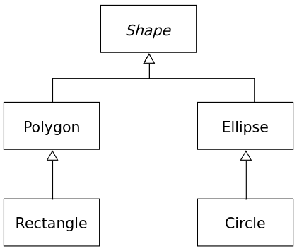|

<div style='page-break-after: always;'></div>

### Interfészek
Az interfész egy olyan fajta osztályozó, mely nyilvános jellemzőket és kötelezettségeket deklarál Az interfész egy szerződést határoz meg.
Az interfészek nem példányosíthatók. Osztályozók implementálják vagy az interfész specifikációnak megfelelő nyilvános felületet nyújtanak.

**Jelölésmód:** 

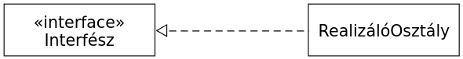

**Példa:**
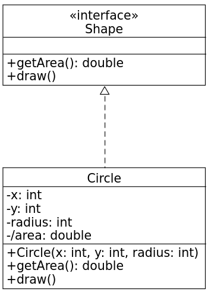


## 2. Szoftvertesztelés
### Mi a szoftvertesztelés?
### Verifikáció és validáció fogalma
### Hibát leíró szakkifejezések: tévedés/tévesztés, hiba, meghibásodás
### Tesztelési alapelvek
### Teszteset és tesztadat fogalma
### Tesztelési szintek: egységtesztelés, integrációs tesztelés, rendszertesztelés, elfogadási
### tesztelés (alfa és béta tesztelés)
### Teszttípusok: funkcionális tesztelés, nem funkcionális tesztelés, fehér dobozos tesz-
### telés, változással kapcsolatos tesztelés
### A jó egységtesztek ismertetőjegyei: FIRST
### Egységtesztek szervezése: az AAA minta
### JUnit: tesztosztályok és tesztmetódusok, teszt végrehajtási életciklus, teszteredmények
### Kódlefedettségi metrikák: utasítás lefedettség/sor lefedettség, ág lefedettség, mi az
### ésszerű lefedettségi szám?
### Mi a tesztvezérelt fejlesztés (TDD)?

---
<div style='page-break-after: always;'></div>

## 3. Objektumorientált tervezési alapelvek
### Statikus kódelemzés fogalma, példák statikus kódelemző eszközökre
### A DRY elv
### A KISS elv
### A YAGNI elv
### Csatoltság, laza és szoros csatoltság
### GoF alapelvek
### SOLID alapelvek: egyszeres felelősség elve, nyitva zárt elv, Liskov-féle helyettesítési
### elv, interfész szétválasztási elv, függőség megfordítási elv
### Függőség befecskendezés

---
<div style='page-break-after: always;'></div>

## 4. Minták a szoftverfejlesztésben
### Mi a minta?
### Architekturális minták, a modell-nézet vezérlő (MVC) architekturális minta
### Tervezési minták, tervezési minták osztályozása
#### Létrehozási minták: elvont gyár (abstract factory), egyke, építő, objektumkészlet (object pool )
#### Szerkezeti minták: díszítő, illesztő
#### Viselkedési minták: sablonfüggvény, megfigyelő

### Programozási idiómák/implementációs minták
### Antiminták, a massza és a spagetti kód antiminta

---
<div style='page-break-after: always;'></div>

## 5. Tiszta kód
### Milyen a tiszta kód?
### értelmes nevek
### Függvények
### Mi a baj a megjegyzésekkel? Jó és rossz megjegyzések fajtái
### Forráskód formázás: vízszintes és függőleges formázás, az újság metafora
### Hibakezelés, elenőrzött és nem ellenőrzött kivételek
### null átadása függvényeknek, null visszadása

---