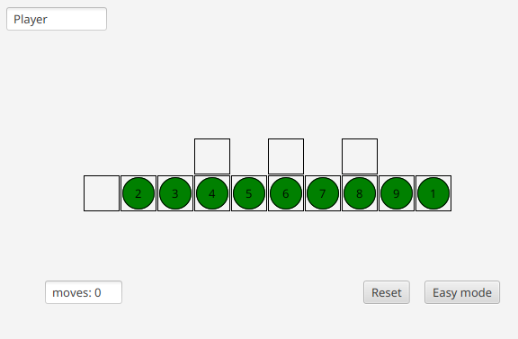

# Puzzle Game

The game consists of nine numbered tiles, that are placed on the board. Each tile can be moved to a four-adjacent empty position. Our task is to arrange the tiles in order: to get the number 1 to the leftmost position, while returning all the other tiles to their original place.

The moves to complete the puzzle are as follows:

Move (1,1) -> (1,0)\
Move (1,2) -> (1,1)\
Move (1,3) -> (1,2)\
Move (1,4) -> (1,3)\
Move (1,3) -> (0,3)\
Move (1,5) -> (1,4)\
Move (1,4) -> (1,3)\
Move (1,6) -> (1,5)\
Move (1,5) -> (1,4)\
Move (1,7) -> (1,6)\
Move (1,6) -> (1,5)\
Move (1,8) -> (1,7)\
Move (1,7) -> (0,7)\
Move (1,9) -> (1,8)\
Move (1,8) -> (1,7)\
Move (1,7) -> (1,6)\
Move (0,7) -> (1,7)\
Move (1,7) -> (1,8)\
Move (1,8) -> (1,9)\
Move (1,6) -> (1,7)\
Move (1,7) -> (0,7)\
Move (1,5) -> (1,6)\
Move (1,6) -> (1,7)\
Move (1,7) -> (1,8)\
Move (0,7) -> (1,7)\
Move (1,7) -> (1,6)\
Move (1,6) -> (1,5)\
Move (1,5) -> (0,5)\
Move (1,4) -> (1,5)\
Move (1,5) -> (1,6)\
Move (1,6) -> (1,7)\
Move (1,7) -> (0,7)\
Move (1,3) -> (1,4)\
Move (1,4) -> (1,5)\
Move (1,5) -> (1,6)\
Move (1,6) -> (1,7)\
Move (0,3) -> (1,3)\
Move (1,3) -> (1,4)\
Move (1,4) -> (1,5)\
Move (1,5) -> (1,6)\
Move (0,5) -> (1,5)\
Move (1,5) -> (1,4)\
Move (1,4) -> (1,3)\
Move (1,3) -> (0,3)\
Move (1,2) -> (1,3)\
Move (1,3) -> (1,4)\
Move (1,4) -> (1,5)\
Move (1,5) -> (0,5)\
Move (1,1) -> (1,2)\
Move (1,2) -> (1,3)\
Move (1,3) -> (1,4)\
Move (1,4) -> (1,5)\
Move (1,0) -> (1,1)\
Move (1,1) -> (1,2)\
Move (1,2) -> (1,3)\
Move (1,3) -> (1,4)\
Move (0,3) -> (1,3)\
Move (1,3) -> (1,2)\
Move (1,2) -> (1,1)\
Move (1,1) -> (1,0)\
Move (1,4) -> (1,3)\
Move (1,3) -> (1,2)\
Move (1,2) -> (1,1)\
Move (1,5) -> (1,4)\
Move (1,4) -> (1,3)\
Move (1,3) -> (1,2)\
Move (0,5) -> (1,5)\
Move (1,5) -> (1,4)\
Move (1,4) -> (1,3)\
Move (1,6) -> (1,5)\
Move (1,5) -> (1,4)\
Move (1,7) -> (1,6)\
Move (1,6) -> (1,5)\
Move (0,7) -> (1,7)\
Move (1,7) -> (1,6)\
Move (1,8) -> (1,7)\
Move (1,9) -> (1,8)
